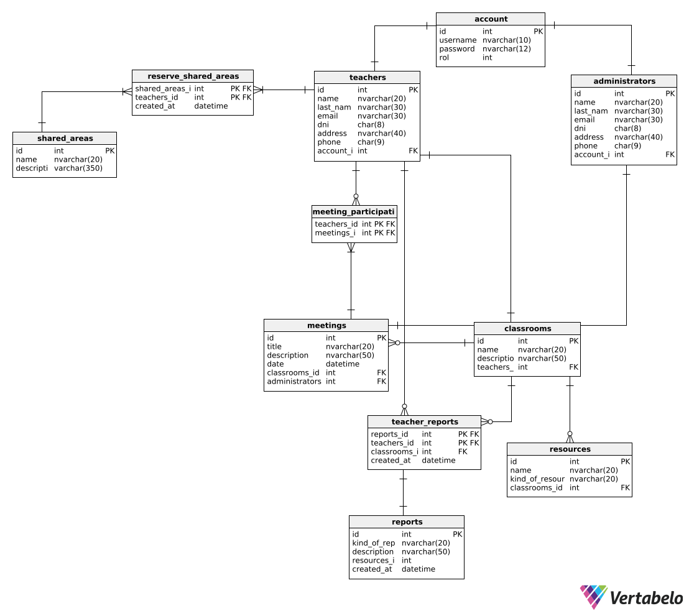

# Capítulo IV: Product Design

## 4.1. Style Guidelines.

Debido al enfoque de nuestra solución web en la gestión de espacios educativos y administrativos, es necesario que tenga un estilo profesional y organizado, que facilite la navegación y promueva la eficiencia en las tareas de los administradores y docentes.

### 4.1.1. General Style Guidelines.

#### Branding design

Para la creación del logo de nuestro producto EduSpace, se ha optado por un diseño moderno, utilizando una tipografía clara y legible acompañada por un icono que simboliza la educación, organización y gestión eficiente.


#### Color Palette

EduSpace se enfoca en mantener un estilo limpio y profesional, utilizando colores que transmiten confianza y profesionalismo. Estos colores facilitan la lectura y navegación, creando un ambiente visual que apoya la productividad y organización en la gestión educativa.


#### Icons

Dado que EduSpace está diseñado para administradores, docentes y personal de apoyo, hemos desarrollado una colección de íconos específicos para mejorar la interfaz del sistema. Estos íconos están destinados a hacer la navegación más intuitiva y alineada con los objetivos del servicio, proporcionando una experiencia visualmente coherente y relevante.


#### Typography

Para garantizar una apariencia uniforme en el desarrollo de nuestro aplicativo, utilizaremos la fuente Poppins. Elegimos Poppins por su legibilidad, espaciado equilibrado y diseño sin serifas, lo que proporciona una flexibilidad óptima y una experiencia de lectura clara y coherente en todas las plataformas de EduSpace.


#### Spacing

El espaciado de la plataforma web es importante debido a que no queremos abrumar a nuestros usuarios, ya que nuestra aplicación tiene como objetivo ofrecer una experiencia de usuario sencilla y agradable. Un diseño limpio y organizado mejora la usabilidad y reduce la carga cognitiva del usuario, permitiéndole interactuar de manera eficiente con las diferentes funciones y secciones de la aplicación.


#### Tono de comunicación y lenguaje

El tono de comunicación y lenguaje de EduSpace es profesional, claro y directo. Queremos que los usuarios se sientan cómodos al navegar por nuestra plataforma, por lo que utilizamos un lenguaje preciso y accesible que resuene con sus necesidades laborales. Nos dirigimos a ellos con un enfoque que respalda su trabajo, proporcionando la información y herramientas que necesitan para gestionar de manera efectiva sus responsabilidades.

### 4.1.2. Web Style Guidelines.

Para EduSpace, estamos desarrollando una plataforma web que implementará un diseño adaptable (Web Responsive Design) con el objetivo de optimizar la presentación de información en cualquier dispositivo. Esto asegurará que el contenido sea de fácil acceso y navegación, mejorando en última instancia la experiencia del usuario.

Hemos establecido un sistema en el que la información se organiza de manera jerárquica (Visual Hierarchy), particularmente en las secciones principales de la plataforma. Los elementos se disponen dando prioridad a la información más relevante, utilizando tamaños, colores y posiciones distintivas para resaltar los elementos clave.

También utilizaremos un sistema de categorización matricial para la gestión de recursos, permitiendo a los usuarios filtrar resultados según sus necesidades, como la disponibilidad de espacios o el estado de reportes, proporcionando una experiencia más eficiente y personalizada.

Como equipo, hemos optado por incorporar el patrón de diseño en forma de Z en nuestro sitio web. Esta técnica de diseño web es altamente efectiva para mejorar la experiencia del usuario, guiando su atención hacia los elementos clave y potenciando la eficacia del contenido en la página. Por lo general, colocamos el logotipo en la esquina superior izquierda, asegurándonos de que sea lo primero que llame la atención del usuario. Justo enfrente, en la esquina superior derecha, ubicamos la barra de navegación, acompañada de un llamado a la acción destacado.

### 4.1.3. Mobile Style Guidelines.

Debido a que nuestra solución móvil busca optimizar la gestión de espacios educativos y la comunicación interna, es fundamental que la aplicación tenga un diseño claro, consistente y adaptable a diferentes dispositivos. El estilo debe transmitir profesionalismo y orden, facilitar la navegación en pantallas pequeñas y permitir que administradores y docentes realicen sus tareas de manera rápida y eficiente.

#### 4.1.3.1. iOS Mobile Style Guidelines.

Para iOS, buscamos que la app se sienta natural dentro del ecosistema de Apple. Usamos UIColor.systemBackground para superficies, UIColor.label para texto y el mismo gradiente azul–verde, adaptado a Light y Dark Mode. Así logramos coherencia con Android sin perder la estética propia de iOS.

La tipografía es San Francisco (SF Pro) con soporte para Dynamic Type. Los títulos de la barra de navegación usan Title de 17pt, los de tarjetas usan Title 3 y el contenido principal usa Body de 17pt. Esto asegura que la app se lea bien en todos los tamaños de pantalla y respete los ajustes de accesibilidad del usuario.

Los íconos se basan en SF Symbols y se mantienen en el rango de 20 a 24pt para un aspecto consistente. Las tarjetas tienen esquinas redondeadas de 12pt y sombras muy sutiles, mientras que la lista de espacios se presenta en estilo Inset Grouped para sentirse nativa.

Las acciones principales no usan FAB como en Android; en su lugar, se utiliza un botón en la barra de navegación (por ejemplo, un ícono “+” en la parte superior derecha). Los formularios se presentan como Sheet o pantallas de tipo Form, y se cierran deslizando hacia abajo. Las animaciones usan transiciones EaseInOut o Spring, manteniendo la fluidez característica de iOS.

En accesibilidad, todas las áreas interactivas cumplen con el mínimo de 44pt, se incluyen descripciones para VoiceOver y se soporta Dynamic Type y Dark Mode de manera nativa.

#### 4.1.3.2. Android Mobile Style Guidelines.

En la versión Android de EduSpace, seguimos las recomendaciones de Material Design 3 para que la app se sienta nativa y familiar. Usamos un gradiente azul–verde como fondo principal, superficies blancas para tarjetas y modales, y texto en tonos oscuros para asegurar buena legibilidad. El color primario es azul (#1976D2) y aparece en botones y acciones importantes.

La tipografía está basada en la escala de Material 3: los títulos de la barra superior usan Title Large de 22sp, las tarjetas usan Title Medium de 16sp y el texto de botones es Label Large de 14sp. Todo el contenido es escalable para respetar los ajustes de accesibilidad del sistema.

Los íconos siguen el estilo de Material Symbols, con un tamaño de 24dp, y en el botón flotante (FAB) se usan de 36dp. Las tarjetas tienen bordes redondeados de 12dp y una ligera elevación para destacar del fondo. Los formularios usan campos OutlinedTextField, y el FAB circular de 56dp es el encargado de la acción principal de agregar espacios.

La navegación se organiza con un TopAppBar con ícono de menú que abre el drawer lateral, y las animaciones son suaves, de 200–300 ms, con las curvas de movimiento estándar de Material. Además, se incluyen gestos como deslizar para cerrar modales. En cuanto a accesibilidad, todas las áreas táctiles cumplen con el mínimo de 48dp y los colores respetan el contraste WCAG 2.1 AA.

## 4.2. Information Architecture.

En base a nuestra aplicación, hemos decidido que nuestro diseño y organización visual será jerárquico, para que los usuarios puedan distinguir claramente la importancia de cada funcionalidad de la app. Al mismo tiempo, utilizamos un sistema moderno y sencillo para atraer a los usuarios.

### 4.2.1. Organization Systems.

#### Landing Page

| Tópico   | Descripción                                                                                                                                                                                                                                                                                      |
| -------- | ------------------------------------------------------------------------------------------------------------------------------------------------------------------------------------------------------------------------------------------------------------------------------------------------ |
| Home     | La página de inicio muestra una vista general del servicio y destaca las características clave de EduSpace.                                                                                                                                                                                      |
| About Us | En esta sección, EduSpace explica nuestro compromiso con la gestión eficiente de espacios educativos. También proporcionamos ejemplos de la información detallada que la app web ofrece, como el control de inventario, la automatización de cálculos salariales, y la organización de recursos. |
| Packages | La página ofrece una descripción detallada de los planes disponibles: un plan para pequeñas infraestructuras y un plan premium para grandes infraestructuras, destacando las funcionalidades avanzadas de cada uno.                                                                              |
| Contact  | Esta sección proporciona información de contacto para soporte y consultas.                                                                                                                                                                                                                       |
| Sign In  | La página para que el usuario ingrese a su cuenta. Aquí se solicitan las credenciales de inicio de sesión y se ofrece la opción de recuperar la contraseña en caso de olvido.                                                                                                                    |
| Sign Up  | La página para que el usuario se registre en EduSpace. Incluye un formulario para ingresar información básica como nombre, correo electrónico y contraseña, así como la opción de aceptar los términos y condiciones del servicio.                                                               |

#### App Web

- Tabla de Organización para Administradores
  | Feature | Descripción |
  |------------------------------------------|---------------------------------------------------------------------------------------------------------------------------------------------------------------------------------------------------------------------------------------|
  | Home | Página principal con un resumen de datos clave, como informes recientes, estado de espacios, y notificaciones urgentes. |
  | Registro de Ambientes | Registro de espacios deportivos, aulas y otros ambientes, incluyendo detalles como el equipamiento y el docente responsable. |
  | Gestión de Cambios de Aula y Reuniones | Permite gestionar y registrar cambios de aula o reuniones, notificando a los docentes y otros usuarios afectados. |
  | Gestión de Datos de Trabajadores | Acceso y administración de la información de docentes, personal de limpieza y otros trabajadores, incluyendo datos personales y profesionales. |
  | Gestión del Personal a Cargo | Asignación y reasignación de personal responsable de cada espacio, con opciones para reasignar en caso de ausencias. |
  | Notificaciones | Sistema de notificaciones que alerta sobre cambios en los espacios, reportes pendientes, y actualizaciones importantes. |
  | Perfil | Acceso a la información personal y profesional del administrador, con opciones para editar datos y visualizar historial de salarios y bonificaciones. |
  | Cerrar Sesión | Opción para cerrar sesión de manera segura. |

- Tabla de Organización para Docentes
  | Feature | Descripción |
  |--------------------------------------------|----------------------------------------------------------------------------------------------------------------------------------------------------------------------------------------------------------------------------------|
  | Home | Página principal con un resumen de tareas, notificaciones, y un calendario de actividades asignadas. |
  | Notificaciones de Cambios de Aula o Reuniones | Alertas sobre cambios de aula o reuniones, incluyendo detalles del nuevo espacio, hora y participantes. |
  | Reserva de Espacios Deportivos y Ambientes | Sistema para reservar espacios deportivos y ambientes compartidos, con información sobre disponibilidad y reglas de uso. |
  | Reporte de Averías en Equipos | Herramienta para reportar averías o problemas con equipos o recursos del ambiente, con seguimiento del estado de resolución. |
  | Visualización de Espacios Disponibles | Consulta de los espacios libres, ocupados y sus fechas de disponibilidad, facilitando la planificación de actividades. |
  | Perfil | Información personal y profesional del docente, con opciones para editar datos y visualizar historial de salarios y otras compensaciones. |
  | Cerrar Sesión | Opción para cerrar sesión de manera segura. |

### 4.2.2. Labeling Systems.

En esta sección, se explica las estrategias empleadas para etiquetar y organizar la información dentro de la plataforma wev EduSpace, buscando mantener la simplicidad y evitar la confusión para los visitantes y usuarios. Las etiquetas se diseñan para ser claras y concisas, utilizando el mínimo número de palabras necesario para representar eficazmente los conjuntos de información y sus asociaciones.

#### Principios de Etiquetado:

- Claridad: Cada etiqueta debe ser fácilmente comprensible por todos los usuarios, independientemente de su rol (administrador o docente).
- Consistencia: Se mantiene un lenguaje uniforme en todas las secciones de la aplicación para evitar confusión.
- Brevedad: Las etiquetas se formulan con el menor número de palabras posibles sin perder claridad o precisión.

#### Etiquetas para Administradores:

- Home: Resumen y acceso rápido a funciones clave.
- Environments and Equipment: Registro y gestión de ambientes (aulas, deportivos, etc.).
- Classroom Changes and Meetings: Administración de cambios de aulas o reuniones.
- Personal Data: Gestión de datos y roles de trabajadores.
- Personnel Management: Asignación y reasignación de personal responsable de cada espacio.
- Notifications: Alertas y actualizaciones importantes.
- Profile: Información personal y profesional del administrador.
- Log Out: Opción para cerrar sesión.

  #### Etiquetas para Docentes:

- Home: Resumen de tareas y calendario de actividades.
- Notifications: Notificaciones sobre cambios de aula o reuniones.
- Reservations: Reserva de espacios deportivos y aulas.
- Breakdown Reports: Reporte de averías en equipos o recursos.
- Availability: Consulta de espacios disponibles y ocupados.
- Profile: Información personal y profesional del docente.
- Log Out: Opción para cerrar sesión.

Estas etiquetas están diseñadas para facilitar la navegación y comprensión de la plataforma, asegurando que los usuarios puedan acceder rápidamente a las funciones que necesitan, sin tener que interpretar términos complicados o ambiguos. La simplicidad en el etiquetado también ayuda a minimizar el tiempo de aprendizaje y maximiza la eficiencia en el uso de la aplicación.

### 4.2.3. SEO Tags and Meta Tags

Las meta etiquetas nos permiten codificar y especificar metadatos en una página web. Aunque no son visibles para los usuarios, los navegadores y rastreadores web las leen. Estas etiquetas facilitan el análisis de archivos HTML y ayudan en el mantenimiento del contenido. Además, influyen en el posicionamiento de nuestra página en los motores de búsqueda

#### Etiquetas SEO y Meta

**Título de la página:**

```html
<title>EduSpace</title>
```

**Meta descripción:**

```html
<meta
  name="description"
  content="Platform that simplifies the management of educational infrastructures."
/>
```

**Meta palabras clave:**

```html
<meta
  name="keywords"
  content="Management, platform, optimization, automation, coordination, inventory, reservation, infrastructure, communication"
/>
```

**Meta autor y copyright:**

```html
<meta name="author" content="Los ProDevs" />
<meta name="copyright" content="Copyright EduSpace team" />
```

### 4.2.4. Searching Systems.

EduSpace, el sistema de filtrado ha sido diseñado para proporcionar una experiencia eficiente y fluida a la hora de gestionar reservas de espacios educativos y equipamiento, sin abrumar a los usuarios con el volumen de información disponible.

#### **Opciones de Búsqueda Ofrecidas**

- **Cátegorias de Búsqueda**

Los usuarios pueden navegar por categorías predefinidas según su rol. Para los docentes, las opciones incluyen la búsqueda por "Día", "Hora", y "Lugar", permitiendo encontrar rápidamente aulas disponibles o recursos para sus clases. Estas categorías están organizadas de forma clara, al estilo de un buscador de Google, facilitando el acceso directo a la información más relevante.

Para los administradores, se ofrecen filtros adicionales para la búsqueda de equipamiento y ambientes (como aulas o espacios deportivos), con etiquetas que permiten explorar el inventario de manera eficiente. En el caso de ambientes deportivos, los administradores también tienen la opción de filtrar por tipos específicos como "Voleibol", "Fútbol" o "Básquet".

- **Búsqueda avanzada con filtros**

**Docentes:**

- Día y hora de la reserva.
- Lugar de la búsqueda (aulas, espacios comunes).

**Administradores:**

- Equipamiento: tipo de recursos disponibles en cada aula o ambiente.
- Ambientes: aulas, oficinas, espacios deportivos.
- Ambientes deportivos: tipo de espacio deportivo como voleibol, fútbol, básquet.

#### **Visualización de los Datos Después de la Búsqueda**

**Resultados en forma de Tarjetas**

Los resultados se muestran en tarjetas visualmente organizadas que contienen:

- Nombre del ambiente o del equipo disponible.
- Una imagen del aula, equipo o espacio deportivo.
- Detalles clave como capacidad, disponibilidad de recursos o estado de mantenimiento.

#### **Orden de los Resultados**

Los resultados están ordenados por:

- Relevancia: según los filtros seleccionados por el usuario.
- Disponibilidad: los ambientes y equipamientos disponibles primero.

En conjunto, estas herramientas permiten que el proceso de búsqueda en EduSpace sea intuitivo, rápido y enfocado en satisfacer las necesidades tanto de docentes como de administradores.

### 4.2.5. Navigation Systems.

Menú Principal: El menú principal contiene las opciones más importantes de navegación como "Home", "Reservas", "Perfil" y el ícono de "inventario". Dicho menú permite un acceso rápido y directo a las secciones clave desde cualquier página.

Categoría de Ambientes: Los espacios se dividen en varias categorías como "Aulas", "Oficinas", "Ambientes Deportivos". Cada uno está representado con intuitivos íconos, facilitando la navegación para los usuarios.

Visualización de Espacios y Equipamiento: Los espacios y equipos están organizados en tarjetas por filas, con la información necesaria para el usuario como el nombre, la imagen del espacio o equipo, y un botón de "Reservar" o "Solicitar" para hacer una reserva o solicitud de uso de recursos.

## 4.3. Landing Page UI Design.

EduSpace ha sido diseñado con un enfoque en la simplicidad, claridad y facilidad de navegación para el usuario. A continuación, se detalla cómo se han implementado las decisiones de diseño y la arquitectura de contenido para ofrecer una experiencia intuitiva y fluida a los usuarios:

### 4.3.1. Landing Page Wireframe.

En esta sección se mostrará una representación de la landing page para Desktop Web Browser y Web Mobile Browser

**Landing Page para Desktop Web Browser:**


**Web Mobile Browser**


### 4.3.2. Landing Page Mock-up.

En esta sección se presentará una representación de la landing page tanto para Desktop Web Browser y Web Mobile Browser

**Landing Page para Desktop Web Browser:**


**Web Mobile Browser**


## 4.4. Mobile Applications UX/UI Design.

### 4.4.1. Mobile Applications Wireframes.

### 4.4.2. Mobile Applications Wireflow Diagrams.

### 4.4.3. Mobile Applications Mock-ups.

### 4.4.4. Mobile Applications User Flow Diagrams.

## 4.5. Mobile Applications Prototyping.

### 4.5.1. Android Mobile Applications Prototyping.

### 4.5.2. iOS Mobile Applications Prototyping.

## 4.6. Web Applications UX/UI Design.

El diseño de la experiencia de usuario (UX) y la interfaz de usuario (UI) de EduSpace ha sido desarrollado meticulosamente para ofrecer una plataforma eficiente y fácil de usar tanto para administradores como para docentes. En esta etapa, nos hemos centrado en asegurar una navegación intuitiva, mejorar la accesibilidad y organizar los elementos visuales de manera que simplifiquen la interacción con las múltiples funciones de la plataforma. La elaboración de mockups y wireframes se encuentra en el siguiente link: https://www.figma.com/design/Q3cqQ43xjgSDNbMcEt9jFp/Untitled?node-id=1-906&t=Emd2juyWQeysGjnS-1

### 4.6.1. Web Applications Wireframes.

En esta sección se presentan los wireframes iniciales de la aplicación web de EduSpace, los cuales actúan como una referencia visual para la estructura y el diseño de los elementos en la interfaz. Estos prototipos brindan una visión detallada sobre la disposición de los componentes principales y las interacciones del usuario en distintas pantallas.


### 4.6.2. Web Applications Wireflow Diagrams.

Los diagramas de Wireflow para EduSpace muestran los flujos de navegación y la estructura de la plataforma, visualizando cómo los docentes y administradores interactúan con las diferentes funcionalidades de la aplicación. Estos diagramas son clave para identificar posibles problemas de usabilidad y asegurar que la experiencia del usuario sea coherente, eficiente y adaptable a las necesidades específicas de cada perfil.

El siguiente diagrama de EduSpace muestra los diferentes flujos para los docentes, que necesitan reservar rápidamente aulas o recursos según su disponibilidad, y para los administradores, que gestionan equipamiento, aulas y espacios deportivos de manera eficiente.


### 4.6.3. Web Applications Mock-ups.

A continuación se exhiben los mock-ups de la aplicación web de EduSpace, que ilustran el diseño visual detallado de las pantallas principales. Estos diseños reflejan la apariencia definitiva de las interfaces para los usuarios, incluyendo el proceso de registro e inicio de sesión, así como los paneles tanto para administradores como para docentes.

**Sign Up and Sign In**


**Dashboard Admin**


**Dashboard Admin**


### 4.6.4. Web Applications User Flow Diagrams.

El diagrama de flujo de usuario de EduSpace ilustra los pasos que los docentes y administradores realizan al interactuar con la plataforma para gestionar reservas, recursos, y espacios educativos. Este flujo de usuario nos permite identificar posibles mejoras en la experiencia de uso, asegurando una navegación eficiente y sin obstáculos.

- **Flujo de Usuario: Página de Inicio**


- **Flujo para Docentes**


- **Flujo para Administrador**


## 4.7. Web Applications Prototyping.

Hemos diseñado un prototipo de website para ofrecer un adelanto de lo que será nuestro sitio web.

https://www.figma.com/proto/nLhruFv9tjQadbH3U4TwWg/Wireflow?node-id=2001-921&node-type=CANVAS&t=oK6XExwxQSqcalWk-1&scaling=scale-down&content-scaling=fixed&page-id=1%3A906&starting-point-node-id=2001%3A921&show-proto-sidebar=1


## 4.8. Domain-Driven Software Architecture.

### 4.8.1. Software Architecture Context Diagram.

El diagrama de contexto muestra una vista de alto nivel de las relaciones entre el sistema de software EduSpace, los usuarios, y otros sistemas externos.


### 4.8.2. Software Architecture Container Diagrams.

El diagrama de contenedores muestra una vista de alto nivel de las relaciones entre las aplicaciones, fuentes de datos, y construcción de la Aplicación Web EduSpace.


### 4.8.3. Software Architecture Components Diagrams.

Los diagramas de componentes muestra una vista de las relaciones de los componentes principales de la Aplicación, estos se detallan a nivel de implementación de los respectivos módulos del programa.


## 4.9. Software Object-Oriented Design.

### 4.9.1. Class Diagrams.

#### Bounded Context: IAM (Identity and Access Management)


#### Bounded Context: Profile Management


#### Bounded Context: Reservation Scheduling Management


#### Bounded Context: Space and Resource Management


#### Bounded Context: Breakdown Management


### 4.9.2. Class Dictionary.

#### Bounded Context: IAM (Identity and Access Management)

| Nombre de la Clase  | Descripción                                                                                        | Atributos Principales                                                       | Métodos Principales                                                                               |
| ------------------- | -------------------------------------------------------------------------------------------------- | --------------------------------------------------------------------------- | ------------------------------------------------------------------------------------------------- |
| Account (Aggregate) | Representa la cuenta de un usuario, que contiene sus credenciales y el rol asignado en el sistema. | - Id: int<br>- Username: string<br>- PasswordHash: string<br>- Role: ERoles | + UpdateUsername(username): Account<br>+ UpdatePasswordHash(hash): Account<br>+ GetRole(): string |
| ERoles (Enum)       | Enumeración que define los roles de usuario válidos dentro del sistema (RoleAdmin, RoleTeacher).   | (Valores de la enumeración)                                                 | (No aplica)                                                                                       |

#### Bounded Context: Profile Management

| Nombre de la Clase                           | Descripción                                                                                         | Atributos Principales                                                                                                       | Métodos Principales                                                               |
| -------------------------------------------- | --------------------------------------------------------------------------------------------------- | --------------------------------------------------------------------------------------------------------------------------- | --------------------------------------------------------------------------------- |
| **Profile (Clase Base)**                     | Clase abstracta base para todos los perfiles del sistema. Contiene la información común.            | - Id: int<br>- ProfileName: ProfileName<br>- ProfilePrivateInformation: ProfilePrivateInformation<br>- AccountId: AccountId | + ProfileFullName(): string<br>+ ProfileEmail(): string<br>+ ProfileDni(): string |
| **TeacherProfile**                           | Representa el perfil de un profesor. Hereda de Profile y añade información específica del profesor. | - AdministratorId: int                                                                                                      | (Hereda los métodos de Profile)                                                   |
| **AdminProfile**                             | Representa el perfil de un administrador. Hereda de Profile.                                        | (No tiene atributos propios)                                                                                                | (Hereda los métodos de Profile)                                                   |
| **ProfileName (Value Object)**               | Objeto de Valor que representa el nombre completo de un perfil, asegurando su consistencia.         | - FirstName: string<br>- LastName: string                                                                                   | + FullName(): string                                                              |
| **ProfilePrivateInformation (Value Object)** | Objeto de Valor que agrupa la información de contacto y personal de un perfil.                      | - Email: string<br>- Dni: string<br>- Address: string<br>- Phone: string                                                    | + ObtainEmail(): string<br>+ ObtainDni(): string                                  |
| **AccountId (Value Object)**                 | Objeto de Valor que representa el identificador único de la cuenta (Account) asociada al perfil.    | - Value: int                                                                                                                | constructores                                                                     |

#### Bounded Context: Reservation Scheduling Management

| Nombre de la Clase                 | Descripción                                                                                | Atributos Principales                                                                                                                                                                                                                                     | Métodos Principales                                                                              |
| ---------------------------------- | ------------------------------------------------------------------------------------------ | --------------------------------------------------------------------------------------------------------------------------------------------------------------------------------------------------------------------------------------------------------- | ------------------------------------------------------------------------------------------------ |
| **Meeting (Aggregate)**            | Representa el agregado principal para la programación de una reunión o evento en un salón. | - Id: int<br>- Title: string<br>- Description: string<br>- Date: DateOnly<br>- StartTime: TimeOnly<br>- EndTime: TimeOnly<br>- AdministratorId: AdministratorId<br>- ClassroomId: ClassroomId<br>- MeetingParticipants: ICollection&lt;MeetingSession&gt; | + UpdateTitle(title): void<br>+ UpdateDate(date): void<br>+ AddTeacherToMeeting(meetingId): void |
| **MeetingSession (Entity)**        | Entidad que representa la relación entre una reunión y un profesor participante.           | - MeetingId: int<br>- TeacherId: int                                                                                                                                                                                                                      | (Constructores)                                                                                  |
| **AdministratorId (Value Object)** | Objeto de Valor que encapsula el identificador de un administrador.                        | - Id: int                                                                                                                                                                                                                                                 | (Constructor)                                                                                    |
| **ClassroomId (Value Object)**     | Objeto de Valor que encapsula el identificador de un salón de clases.                      | - Id: int                                                                                                                                                                                                                                                 | (Constructor)                                                                                    |
| **TeacherId (Value Object)**       | Objeto de Valor que encapsula el identificador de un profesor.                             | - TeacherIdentifier: int                                                                                                                                                                                                                                  | (Constructor)                                                                                    |
| **MeetingDate (Value Object)**     | Objeto de Valor que agrupa la fecha y horas de una reunión, asegurando su consistencia.    | - Date: DateOnly<br>- Start: TimeOnly<br>- End: TimeOnly                                                                                                                                                                                                  | (Constructor)                                                                                    |

#### Bounded Context: Space and Resource Management

| Nombre de la Clase           | Descripción                                                                                              | Atributos Principales                                                                                                      | Métodos Principales                                                                             |
| ---------------------------- | -------------------------------------------------------------------------------------------------------- | -------------------------------------------------------------------------------------------------------------------------- | ----------------------------------------------------------------------------------------------- |
| **Classroom (Aggregate)**    | Representa un salón de clases, que es el contenedor principal de recursos y está asignado a un profesor. | - Id: int<br>- Name: string<br>- Description: string<br>- TeacherId: TeacherId<br>- Resources: ICollection&lt;Resource&gt; | + UpdateName(name): void<br>+ UpdateDescription(desc): void<br>+ UpdateTeacherId(id): void      |
| **Resource (Aggregate)**     | Representa un objeto o material físico que se encuentra dentro de un salón de clases.                    | - Id: int<br>- Name: string<br>- KindOfResource: string<br>- ClassroomId: int                                              | + UpdateName(name): void<br>+ UpdateKindOfResource(kind): void<br>+ UpdateClassroomId(id): void |
| **SharedArea (Aggregate)**   | Representa un área común que puede ser reservada, con una capacidad y descripción definidas.             | - Id: int<br>- Name: string<br>- Capacity: int<br>- Description: string                                                    | + UpdateName(name): void<br>+ UpdateDescription(desc): void<br>+ UpdateCapacity(cap): void      |
| **TeacherId (Value Object)** | Objeto de Valor que encapsula el identificador de un profesor, asegurando su consistencia.               | - TeacherIdentifier: int                                                                                                   | (Constructor)                                                                                   |

#### Bounded Context: Breakdown Management

| Nombre de la Clase              | Descripción                                                                                                     | Atributos Principales                                                                                                                       | Métodos Principales                                                                        |
| ------------------------------- | --------------------------------------------------------------------------------------------------------------- | ------------------------------------------------------------------------------------------------------------------------------------------- | ------------------------------------------------------------------------------------------ |
| **Report (Aggregate)**          | Representa un informe de incidencia o avería (breakdown) sobre un recurso específico.                           | - Id: int<br>- KindOfReport: string<br>- Description: string<br>- ResourceId: ResourceId<br>- CreatedAt: DateTime<br>- Status: ReportStatus | (Constructores para la creación del objeto)                                                |
| **ReportStatus (Value Object)** | Objeto de Valor que representa los posibles estados de un informe, asegurando que solo se usen valores válidos. | - Value: string                                                                                                                             | + EnProceso(): ReportStatus<br>+ Completado(): ReportStatus<br>+ Cancelado(): ReportStatus |
| **ResourceId (Value Object)**   | Objeto de Valor que encapsula el identificador de un recurso, asegurando que sea un valor válido (mayor a 0).   | - Id: int                                                                                                                                   | (Constructor con validación)                                                               |

## 4.10. Database Design.

### 4.10.1. Relational/Non-Relational Database Diagram.

El diagrama de base de datos relacional muestra las tablas y sus relaciones en la base de datos de EduSpace.


