# Capítulo V: Product Implementation

## 5.1. Software Configuration Management

A continuación, presentaremos el proceso por el cual organizamos, gestionamos y controlamos los cambios en el desarrollo de este proyecto.

### 5.1.1. Software Development Environment Configuration

Requirements Management

1. Trello: Es una herramienta utilizada para gestionar el flujo de trabajo de proyectos principalmente basados en marcos de
   trabajos ágiles. Será empleado para visualizar y actualizar el estado actual de las tareas e historias de usuario
   pertenecientes al sprint a desarrollar.  
   Ruta de referencia: https://trello.com/es

Product UX/UI Design

1. Figma: Plataforma de elaboración de prototipos y edición gráfica, principalmente utilizado para el diseño digital. En el
   caso del proyecto, será utilizado para el prototipado de la aplicación y sus versiones de Desktop y Mobile Web Browser.

   Ruta de referencia: https://www.figma.com/login

2. Lucidchart: Aplicación para diagramar flujos. Será empleado para el diseño de wireflows, user-flows y el diagrama de
   clases asociado a la aplicación.

   Ruta de referencia: https://www.lucidchart.com/

Software Development

1. WebStorm: Entorno de desarrollo integrado elegido por su soporte completo para tecnologías web como JavaScript, HTML, CSS y frameworks como React y Angular. Ofrece refactorización avanzada, depuración, integración con Git y la posibilidad de agregar plugins. Es compatible con varios sistemas operativos, facilitando la colaboración en equipo.

   Ruta de referencia: https://www.jetbrains.com/webstorm/
   <br>

2. HTML5: HyperText Markup Language, o por sus siglas HTML, es un lenguaje de etiquetado para páginas web. Será
   empleado en el desarrollo del proyecto para la presentación del contenido en la aplicación.

   Ruta de referencia: https://www.w3schools.com/html/html5_syntax.asp  
   <br>

3. CSS: Cascading Style Sheets es un lenguaje que maneja el diseño y presentación de las páginas web, el cual va de la mano
   con HTML.

   Ruta de referencia: https://google.github.io/styleguide/htmlcssguide.html
   <br>
   <br>

4. JavaScript: Es un lenguaje de programación interpretado y orientado a objetos. Se utilizará para elaborar la interfaz de
   usuario dentro de la aplicación.

   Ruta de referencia: https://developer.mozilla.org/es/docs/Web/JavaScript

 <br>

5. Git: Una herramienta de control de versiones que facilita el registro y la gestión de las distintas versiones del programa. Su propósito es mantener un historial de cambios y simplificar la corrección de errores. Los integrantes del equipo
   accederán a través de la línea de comandos en sus sistemas locales.

Ruta de referencia: https://git-scm.com/
<br>
<br>
Software Documentation and Project Management 6. Github: Una plataforma en la nube que hospedará los repositorios de código del proyecto. Permitirá la colaboración en
tiempo real y la revisión de contribuciones de cada miembro del equipo. Los integrantes del equipo podrán acceder a través de sus navegadores web.

Ruta de referencia: https://github.com/

<br>

Software Deployment

1. Github Pages: GitHub Pages es un servicio de alojamiento web que permite a los usuarios crear y publicar sitios web estáticos directamente desde sus repositorios de GitHub. Es especialmente útil para proyectos personales, portafolios, documentación de proyectos o blogs.

Ruta de referencia: https://pages.github.com/

2. Vercel: es una plataforma que optimiza el proceso de desarrollo y despliegue de aplicaciones web, especialmente con frameworks como Next.js y React. Proporciona un entorno colaborativo que agiliza los despliegues rápidos y genera previsualizaciones automáticas con cada commit, lo que facilita la revisión de modificaciones antes de su publicación.

Ruta de referencia: https://vercel.com/

### 5.1.2. Source Code Management

El proyecto seguirá las convenciones del flujo de trabajo establecido por el modelo GitFlow para el control de versiones, empleando GitHub como plataforma y sistema de control de versiones. A continuación, se describirá la implementación de GitFlow como un flujo de trabajo para el control de versiones, junto con el enlace del Landing Page.

Repositorio de GitHub:

- Enlace para acceder a la organización en GitHub: https://github.com/ExperimentDesign
- Enlace para acceder al repositorio de la landing Page: https://github.com/ExperimentDesign/landing-page
- Enlace para acceder al repositorio del reporte: https://github.com/ExperimentDesign/report
- Enlace para acceder al repositorio de la App Web: https://github.com/ExperimentDesign/eduspace-frontend-app-web
- Enlace para acceder al repositorio de la App Móvil: https://github.com/ExperimentDesign/eduspace-mobile
- Enlace para acceder al repositorio del back end: https://github.com/ExperimentDesign/eduspace-platform

Flujo de trabajo GitFlow

El flujo de trabajo a ser implementado para el desarrollo del proyecto se basará en el modelo propuesto por Vincent Driessen en "A successful Git branching model".


Estructura de branches (Ramas):

1. Main branch (Rama principal): Esta rama servirá como la principal para la aplicación, alojando versiones estables y finales del desarrollo. Únicamente se aceptarán cambios que hayan sido previamente probados y verificados en los features y de ahí en Developer.
2. Develop branch (Rama de desarrollo): El propósito de esta rama es facilitar los avances del proyecto en equipo y mantener los archivos centrales del desarrollo continuo.
3. Feature branch(Ramas de funcionalidad): Cada capitulo desarrollado por el equipo, o separada del enfoque actual del desarrollo, tendrá su propia rama. Una vez que una funcionalidad esté completamente trabajada, se fusionará con la rama de desarrollo del proyecto. Las convenciones para nombrar las ramas de funcionalidad seguirán un patrón descriptivo y único, por ejemplo, "feature/chapter-#".

### 5.1.3. Source Code Style Guide & Conventions

#### HTML

Algunas de las prácticas que deben seguirse para alcanzar un código coherente, sostenible y ordenado son las siguientes:

1. Cerrar todos los elementos HTML: Por ejemplo, `<p>Esto es un párrafo.</p>`.
2. Siempre declarar el tipo de documento en la primera línea del documento, para HTML es `<!DOCTYPE html>`.
3. Escribir en una línea los comentarios cortos.
4. Utilizar comillas en caso de que los atributos contengan espacios entre sí.
5. Procurar especificar el texto `alt` y las dimensiones `width` y `height` de las imágenes, ya que de esta manera se facilitará la disponibilidad del contenido. Por ejemplo:
6. Se nos recomienda no usar el espacio al momento de utilizar los signos porque es más fácil de leerlo de esta forma.

Referencia: [HTML5 Syntax](https://www.w3schools.com/html/html5_syntax.asp)

#### CSS

Entre las prácticas empleadas se menciona:

1. Se nos recomienda tener una sangría por 2 espacios a la vez, no debemos utilizar tabulaciones ni mezclarlas tabulaciones con espacios para la sangría.
2. Todo el código debe estar en minúscula.
3. Eliminar los espacios en blanco.
4. Usar comentarios para explicar el código.
5. Utilizar nombres de clase significativos o genéricos, nombres que reflejen el propósito de su elemento.

Referencia: [Google HTML/CSS Style Guide](https://google.github.io/styleguide/htmlcssguide.html)

#### JavaScript

Algunas de las mejores prácticas para programar incluyen:

1. Utilizar nombres de variables claros: Es importante que los nombres reflejen el propósito de la variable.
2. Ser consistente con las comillas: Elegir entre comillas simples o dobles y mantener esa elección a lo largo del código.
3. Incluir comentarios explicativos: Usar comentarios para aclarar bloques de código, especialmente en secciones complejas, facilita la comprensión.
4. Minimizar el uso de variables globales: Limitar el ámbito de las variables para evitar conflictos y mejorar la mantenibilidad del código.
5. Encapsular lógica en funciones: Mantener el código modular y reutilizable mediante el uso de funciones.
6. Seguir un estilo de codificación uniforme: Mantener un formato consistente mejora la legibilidad del código.

Referencia: [JavaScript Best Practices](https://www.w3schools.com/js/DEFAULT.asp)

#### Vue.js

Para asegurar que el código en Vue.js sea claro y eficiente, se recomiendan las siguientes prácticas:

1. Estructura de carpetas organizada: Mantener una estructura clara para components, pages, model y services.
2. Crear componentes reutilizables: Diseñar componentes que puedan ser utilizados en diversas partes de la aplicación.
3. Separar lógica de negocio de la vista: Utilizar métodos y propiedades computadas para mantener la lógica separada de la presentación.
4. Emplear Vue Router para la navegación: Usar Vue Router para gestionar eficazmente la navegación entre vistas.
5. Documentar componentes: Incluir comentarios y documentación sobre props, eventos y métodos dentro de los componentes.

Referencia: [Vue.js Guide](https://vuejs.org/guide/introduction)

#### Flutter

Para mantener un código limpio y eficiente en Flutter, se sugieren las siguientes prácticas:

1. Estructura de carpetas organizada: Mantener una estructura clara para lib, test y assets.
2. Utilizar widgets reutilizables: Diseñar widgets que puedan ser utilizados en diversas partes de la aplicación.
3. Separar lógica de negocio de la vista: Utilizar providers o blocs para mantener la lógica separada de la presentación.
4. Emplear rutas nombradas para la navegación: Usar rutas nombradas para gestionar eficazmente la navegación entre vistas.
5. Documentar widgets: Incluir comentarios y documentación sobre props, eventos y métodos dentro de los widgets.

Referencia: [Flutter Documentation](https://flutter.dev/docs)

#### C# (Domain-Driven Design)

Para asegurar que el código en C# siga los principios de Domain-Driven Design (DDD), se recomiendan las siguientes prácticas:

1. Utilizar nombres de dominio significativos: Los nombres de las clases, métodos y variables deben reflejar el lenguaje del dominio.
2. Mantener la lógica de negocio en el dominio: La lógica de negocio debe residir en el modelo de dominio y no en la infraestructura o en la interfaz de usuario.
3. Usar agregados para gestionar la consistencia: Los agregados son entidades que se agrupan para garantizar la consistencia de los cambios en el modelo.
4. Implementar repositorios para el acceso a datos: Los repositorios son responsables de la persistencia y recuperación de los agregados.
5. Aplicar patrones de diseño adecuados: Utilizar patrones de diseño como CQRS, Event Sourcing y DDD para estructurar el código de manera efectiva.
   Referencia: [Domain-Driven Design](https://www.domainlanguage.com/ddd/reference/)

### 5.1.4. Software Deployment Configuration

#### Landing Page Deployment

La landing page del proyecto se ha desplegado utilizando GitHub Pages, lo que permite alojar el sitio web de manera gratuita y sencilla directamente desde el repositorio de GitHub:


Ruta de referencia: https://experimentdesign.github.io/landing-page/

#### Web Application Deployment

la aplicación web del proyecto se ha desplegado utilizando netlify, lo que permite alojar el sitio web de manera gratuita y sencilla directamente desde el repositorio de GitHub:


Ruta de referencia: https://eduspacewebapp.netlify.app/

#### Backend Deployment

El backend del proyecto se ha desplegado utilizando Railway, lo que permite alojar el sitio web de manera gratuita y sencilla directamente desde el repositorio de GitHub:


#### Database Deployment

La base de datos del proyecto se ha desplegado utilizando Aiven, lo que permite crear un servicio de base de datos gestionado en la nube:


## 5.2. Product Implementation & Deployment

### 5.2.1. Sprint Backlogs

#### Sprint 1

##### Sprint Planning

Para este primer sprint nos enfocaremos en los tasks para la
elaboración del producto. Nos dividiremos entre nosotros cada
una de las tareas identificadas para el sprint.

| Sprint #                        | Sprint 1                                                                                                                                                                                                                                                                                                                     |
| ------------------------------- | ---------------------------------------------------------------------------------------------------------------------------------------------------------------------------------------------------------------------------------------------------------------------------------------------------------------------------- |
| Sprint Planning Background      |                                                                                                                                                                                                                                                                                                                              |
| Date                            | 30/08/2025                                                                                                                                                                                                                                                                                                                   |
| Time                            | 06:00 PM                                                                                                                                                                                                                                                                                                                     |
| Location                        | Servidor de Discord del Equipo                                                                                                                                                                                                                                                                                               |
| Prepared By                     | Andres Torres                                                                                                                                                                                                                                                                                                                |
| Attendees (to planning meeting) | Andres Torres / Piero Velarde / Marllely Arias / Luciana Sanchez / Alejandro Mendoza                                                                                                                                                                                                                                         |
| Sprint 1 Review Summary         | En esta primera seccion se planteo el desarrollo para el proyecto                                                                                                                                                                                                                                                            |
| Sprint 1 Retrospective Summary  | En esta seccion todos los integrantes mencionaron tener aciertos en partes del codigo y en otras partes poder mejorar sus habilidades realizando la Landing Page, la aplicacion web, aplicacion movil y la API RESTful.                                                                                                      |
| Sprint Goal & User Stories      |                                                                                                                                                                                                                                                                                                                              |
| Sprint 1 Goal                   | Desarrollar, desplegar y hacer visible la landing page, aplicacion web, aplicacion movil y la API RESTful, integrando todos sus componentes clave y garantizando una apariencia coherente con los mockups de la aplicación. El éxito se logrará cuando la página esté completamente funcional y accesible para los usuarios. |
| Sprint 1 Velocity               | 42 Velocity                                                                                                                                                                                                                                                                                                                  |
| Sum of Story Points             | 42 Story Points.                                                                                                                                                                                                                                                                                                             |

##### Sprint Backlog 1

| User Story Id | User Story Title                | Work-Item/Task Id                                         | Work-Item/Task Title                                                                                                                                                  | Description                      | Estimation | Assigned To       | Status |
| ------------- | ------------------------------- | --------------------------------------------------------- | --------------------------------------------------------------------------------------------------------------------------------------------------------------------- | -------------------------------- | ---------- | ----------------- | ------ |
| Orden         | User Story / Technical Story Id | Título                                                    | Descripción                                                                                                                                                           | Story Points (1 / 2 / 3 / 5 / 8) | Estimation | Assigned To       | Status |
| 1             | US02                            | Encontrar información del propósito de la aplicación      | Como visitante, quiero saber sobre el propósito de la aplicación para entender qué beneficios y funcionalidades ofrece y decidir si es adecuada para mis necesidades. | 2                                | 1          | Andres Torres     | Done   |
| 2             | US03                            | Visualización de imágenes y gráficos relevantes           | Como visitante, quiero que las imágenes y gráficos en la landing page sean de alta calidad y relevantes para captar mi interés.                                       | 2                                | 2          | Luciana Sanchez   | Done   |
| 3             | US04                            | Tipografía cómoda y agradable estéticamente               | Como visitante, quiero que la tipografía en la landing page sea legible y estéticamente agradable para facilitar la lectura y la navegación.                          | 1                                | 1          | Piero Velarde     | Done   |
| 4             | US01                            | Accesibilidad de la aplicación en diferentes dispositivos | Como visitante, quiero que la aplicación se adapte a diferentes dispositivos para que pueda acceder a la plataforma desde cualquier lugar y en cualquier momento.     | 5                                | 2          | Alejandro Mendoza | Done   |
| 5             | US08                            | Registro de información personal del docente              | Como administrador, quiero registrar la información personal del docente, para tener una base de datos actualizada y poder gestionar al personal de manera eficiente. | 3                                | 3          | Andres Torres     | Done   |
| 6             | US09                            | Registro de información de acceso del docente             | Como administrador, quiero registrar la información de acceso del docente, para que puedan iniciar sesión en la plataforma web sin problemas.                         | 3                                | 3          | Andres Torres     | Done   |
| 7             | US10                            | Registro de salones                                       | Como administrador, quiero registrar los salones de la institución, para que puedan ser gestionados y asignados en la plataforma web de manera efectiva.              | 8                                | 3          | Andres Torres     | Done   |
| 8             | US11                            | Registro de espacios compartidos                          | Como administrador, quiero registrar los espacios compartidos, para que puedan ser gestionados y reservados en la plataforma web.                                     | 8                                | 3          | Andres Torres     | Done   |
| 9             | US14                            | Registro de la hora y lugar de la reunión                 | Como administrador, quiero registrar la hora y lugar de la reunión, para asegurar que todos los participantes tengan la información correcta sobre la reunión.        | 5                                | 3          | Andres Torres     | Done   |
| 10            | US19                            | Registrar docente encargado de un ambiente                | Como administrador, deseo registrar qué docente está encargado de cada ambiente, para asignar responsabilidades y mejorar la gestión de los espacios.                 | 5                                | 3          | Andres Torres     | Done   |

#### Sprint 2

##### Sprint Planning 2

| Sprint #                         | Sprint 2                                                                                                                                                                                                                                                                                                                                                                                                                                                                                                                        |
| -------------------------------- | ------------------------------------------------------------------------------------------------------------------------------------------------------------------------------------------------------------------------------------------------------------------------------------------------------------------------------------------------------------------------------------------------------------------------------------------------------------------------------------------------------------------------------- |
| **Sprint Planning Background**   |                                                                                                                                                                                                                                                                                                                                                                                                                                                                                                                                 |
| Date                             | 06/10/2025                                                                                                                                                                                                                                                                                                                                                                                                                                                                                                                      |
| Time                             | 07:00 PM                                                                                                                                                                                                                                                                                                                                                                                                                                                                                                                        |
| Location                         | Servidor de Discord del Equipo                                                                                                                                                                                                                                                                                                                                                                                                                                                                                                  |
| Prepared By                      | Andres Torres                                                                                                                                                                                                                                                                                                                                                                                                                                                                                                                   |
| Attendees (to planning meeting)  | Andres Torres / Piero Velarde / Marllely Arias / Luciana Sanchez / Alejandro Mendoza                                                                                                                                                                                                                                                                                                                                                                                                                                            |
| **Sprint 2 Goal & User Stories** |                                                                                                                                                                                                                                                                                                                                                                                                                                                                                                                                 |
| Sprint 2 Goal                    | Completar la implementación de todas las funcionalidades restantes del sistema incluyendo: autenticación completa (sign-up y sign-in), gestión de perfiles vía API, actualización de docentes encargados, gestión completa de recursos, sistema de reuniones con invitados, módulo de reservas de espacios compartidos con validación de disponibilidad, y sistema de reportes de averías. Integrar completamente el frontend con el backend, documentar todos los endpoints en Swagger y asegurar el despliegue en producción. |
| Sprint 2 Velocity                | 116 Velocity                                                                                                                                                                                                                                                                                                                                                                                                                                                                                                                    |
| Sum of Story Points              | 116 Story Points                                                                                                                                                                                                                                                                                                                                                                                                                                                                                                                |

##### Sprint Backlog 2

| User Story Id | User Story Title                                                | Work-Item/Task Id | Work-Item/Task Title                                      | Description                                                                                                                                                                    | Estimation (horas) | Assigned To   | Status |
| ------------- | --------------------------------------------------------------- | ----------------- | --------------------------------------------------------- | ------------------------------------------------------------------------------------------------------------------------------------------------------------------------------ | ------------------ | ------------- | ------ |
| TS03          | Registro y autenticación de usuarios a través de un RESTful API | T01               | Implementar sistema de autenticación JWT                  | Como desarrollador, quiero implementar el registro (sign-up) y el inicio de sesión (sign-in) a través de una API para que los usuarios se autentiquen de manera segura.        | 6                  | Andres Torres | Done   |
| US05          | Registro como Administrador                                     | T02               | Implementar formulario de registro de administrador       | Como administrador, quiero registrarme en la aplicación web para hacer uso de las características disponibles.                                                                 | 3                  | Andres Torres | Done   |
| US06          | Inicio de sesión como profesor                                  | T03               | Implementar vista de login para profesores                | Como profesor, quiero iniciar sesión en la aplicación para acceder a las funcionalidades específicas para docentes.                                                            | 2                  | Andres Torres | Done   |
| US07          | Inicio de sesión administrador                                  | T04               | Implementar vista de login para administradores           | Como administrador, quiero iniciar sesión en la aplicación para gestionar la administración de ambientes y recursos.                                                           | 2                  | Andres Torres | Done   |
| TS01          | Añadir un perfil de administrador a través de un RESTful API    | T05               | Implementar endpoint POST /api/v1/administrator-profiles  | Como desarrollador, quiero que se pueda añadir el perfil de un administrador a través de un API para que pueda gestionar la plataforma.                                        | 4                  | Andres Torres | Done   |
| TS02          | Añadir un perfil de docente a través de un RESTful API          | T06               | Implementar endpoint POST /api/v1/teacher-profiles        | Como desarrollador, quiero que se pueda añadir el perfil de un docente a través de un API para que pueda interactuar con la plataforma.                                        | 4                  | Andres Torres | Done   |
| TS04          | Gestionar información de salones de clase vía API               | T07               | Implementar endpoints CRUD completos para salones         | Como desarrollador, quiero implementar endpoints para añadir y gestionar la información de los salones a través de una API RESTful.                                            | 6                  | Andres Torres | Done   |
| TS09          | Actualizar docente encargado del aula vía API                   | T08               | Implementar endpoint PUT /api/v1/classrooms/{id}          | Como desarrollador, quiero implementar la característica de actualizar al docente encargado del aula a través de una API RESTful.                                              | 3                  | Andres Torres | Done   |
| US18          | Registrar docente encargado de un salón de clase                | T09               | Implementar asignación de docente responsable en frontend | Como administrador, deseo registrar qué docente está encargado de cada salón de clase para asignar responsabilidades y mejorar la gestión de los espacios.                     | 4                  | Andres Torres | Done   |
| TS06          | Gestionar recursos de un salón vía API                          | T10               | Implementar endpoints para gestión de recursos            | Como desarrollador, quiero implementar endpoints para añadir recursos a un salón de clase a través de una API RESTful.                                                         | 4                  | Andres Torres | Done   |
| US13          | Registro de recursos                                            | T11               | Implementar formulario de registro de recursos            | Como administrador, quiero registrar los recursos de los salones de clase para mantener un inventario actualizado y optimizar la gestión de los recursos disponibles.          | 4                  | Andres Torres | Done   |
| TS05          | Gestionar información de espacios compartidos vía API           | T12               | Implementar endpoints CRUD para espacios compartidos      | Como desarrollador, quiero implementar endpoints para añadir la información de los espacios compartidos a través de una API RESTful.                                           | 6                  | Andres Torres | Done   |
| TS07          | Gestionar información de una reunión vía API                    | T13               | Implementar endpoint POST /api/v1/meetings                | Como desarrollador, quiero implementar endpoints para añadir la información de una reunión a través de una API RESTful.                                                        | 4                  | Andres Torres | Done   |
| TS10          | Actualizar información de la reunión vía API                    | T14               | Implementar endpoint PUT /api/v1/meetings/{id}            | Como desarrollador, quiero implementar la característica de actualizar la información de la reunión a través de una API RESTful.                                               | 3                  | Andres Torres | Done   |
| TS08          | Añadir invitados a una reunión vía API                          | T15               | Implementar endpoint POST para participantes              | Como desarrollador, quiero implementar la característica de añadir invitados a una reunión a través de una API RESTful.                                                        | 3                  | Andres Torres | Done   |
| US15          | Registro de invitados de la reunión                             | T16               | Implementar selector de invitados en frontend             | Como administrador, quiero invitar a docentes a la reunión para asegurarme de que los participantes necesarios estén presentes.                                                | 2                  | Andres Torres | Done   |
| US20          | Visualización de reuniones en el panel principal                | T17               | Implementar vista de reuniones en dashboard docente       | Como docente, quiero ver en el panel principal las reuniones en las que he sido llamado para estar informado y poder asistir puntualmente.                                     | 3                  | Andres Torres | Done   |
| TS11          | Obtener información de la disponibilidad de espacios vía API    | T18               | Implementar endpoint GET /api/v1/reservations             | Como desarrollador, quiero implementar la opción para obtener la lista de reservas y espacios para que el frontend determine la disponibilidad.                                | 4                  | Andres Torres | Done   |
| US21          | Visualización de espacios compartidos                           | T19               | Implementar vista de espacios disponibles                 | Como docente, quiero visualizar los espacios disponibles para poder planificar actividades, reuniones o clases adicionales.                                                    | 4                  | Andres Torres | Done   |
| TS12          | Añadir reserva a un espacio compartido vía API                  | T20               | Implementar endpoint POST /api/v1/reservations            | Como desarrollador, quiero implementar la opción para añadir una reserva a un espacio compartido a través de una API RESTful.                                                  | 4                  | Andres Torres | Done   |
| US22          | Reserva de espacios compartidos                                 | T21               | Implementar formulario de reserva en frontend             | Como docente, quiero reservar un espacio para asegurar su disponibilidad y organizar actividades o reuniones.                                                                  | 6                  | Andres Torres | Done   |
| US12          | Registro de horarios para reserva de espacios compartidos       | T22               | Implementar selector de horarios para reservas            | Como docente, quiero registrar el horario en el cual quiero reservar un espacio compartido para asegurar su disponibilidad en el momento deseado.                              | 4                  | Andres Torres | Done   |
| TS13          | Añadir un reporte de avería vía API                             | T23               | Implementar endpoint POST /api/v1/reports                 | Como desarrollador, quiero implementar la característica de añadir la información de un reporte a través de una API RESTful.                                                   | 3                  | Andres Torres | Done   |
| US16          | Visualización de reportes en el panel principal                 | T24               | Implementar vista de reportes en dashboard admin          | Como administrador, quiero ver los reportes que han creado los profesores en el panel principal para estar al tanto de los problemas o incidencias reportados por el personal. | 2                  | Andres Torres | Done   |

### 5.2.2. Implemented Landing Page Evidence

Se implementó una landing page funcional orientada a captar a nuestros usuarios y presentar los servicios que ofrece la plataforma de la plataforma.

#### Sección Home:


#### Sección About Us:


#### Sección Package:


#### Sección Contact:

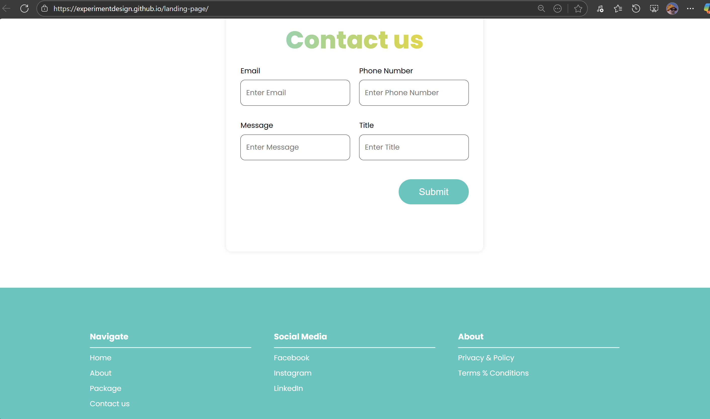

La landing page de EduSpace está accesible a través del siguiente enlace: https://experimentdesign.github.io/landing-page/

### 5.2.3. Implemented Frontend-Web Application Evidence

Se implementó una aplicación web funcional que permite a los usuarios interactuar con la plataforma y acceder a sus funcionalidades principales.

#### Vista Login:

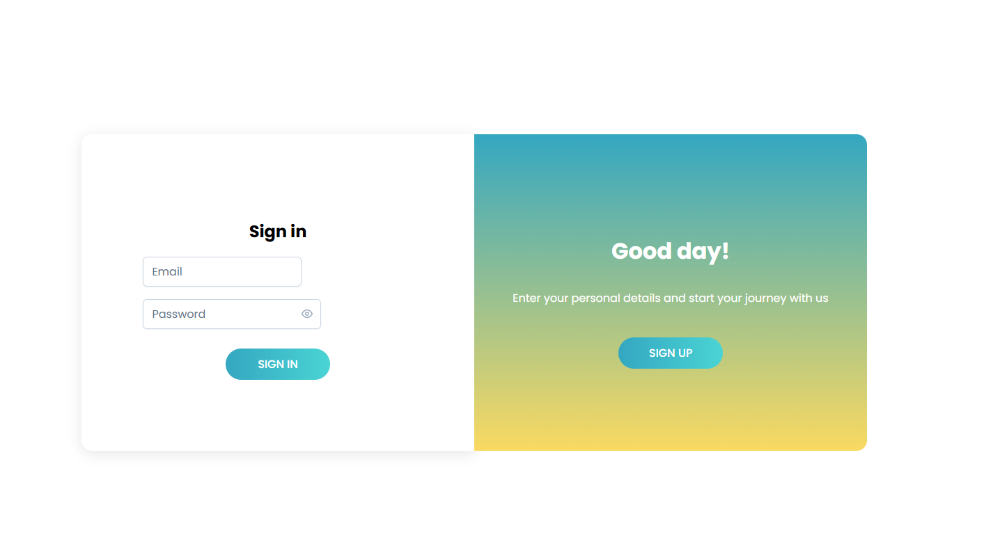

#### Vista Register:


#### Vista Dashboard Admin:


#### Vista Classrooms and Shared Areas:

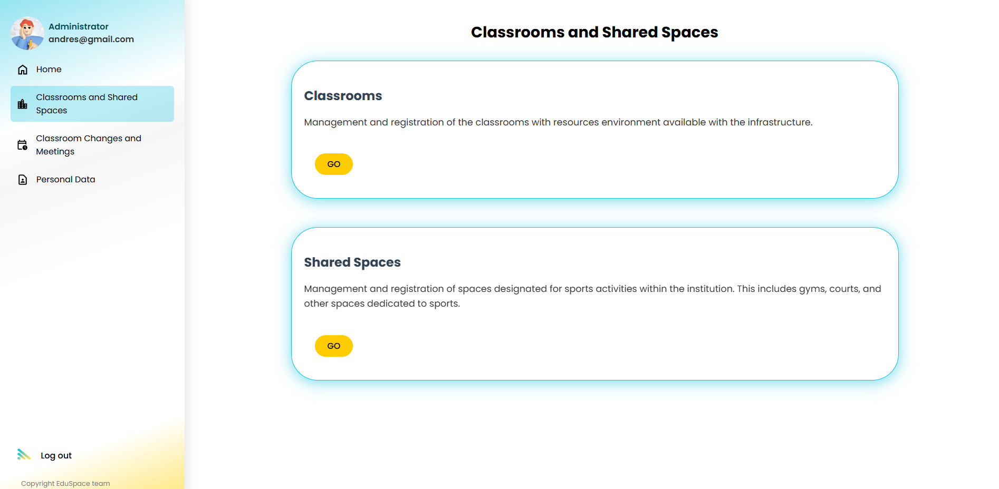

#### Vista Meetings:


#### Vista Personal Data:

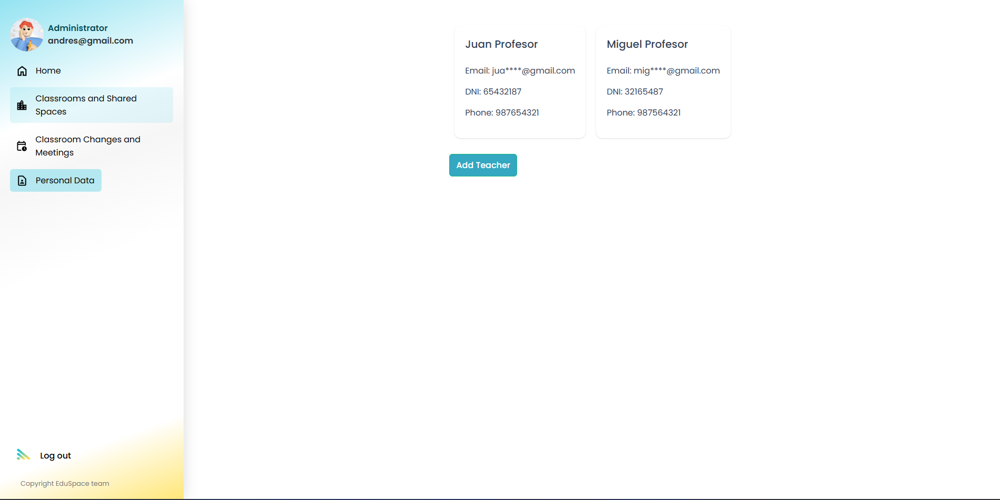

#### Vista Dashboard Teachers:


#### Vista Notifications:


#### Vista Reports:


#### Vista Spaces:

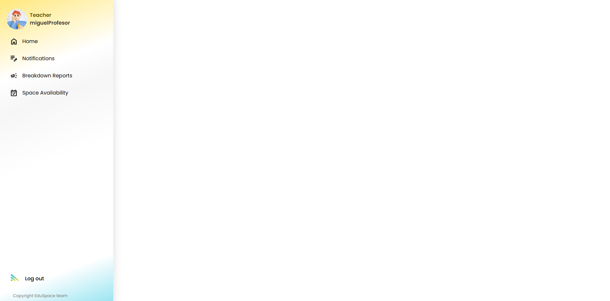

### 5.2.4. Acuerdo de Servicio - SaaS

#### TÉRMINOS Y CONDICIONES DE SERVICIO - EDUSPACE

**Última actualización:** 06 de septiembre de 2025

##### 1. ACEPTACIÓN DE LOS TÉRMINOS

Bienvenido a EduSpace. Estos Términos y Condiciones de Servicio (en adelante, los "Términos") constituyen un acuerdo legal vinculante entre usted (el "Usuario" o "Cliente") y EduSpace (el "Servicio", "nosotros" o "nuestra plataforma"), operado por el equipo de desarrollo Los ProDevs.

Al acceder, registrarse o utilizar la plataforma EduSpace, usted acepta estar legalmente obligado por estos Términos. Si no está de acuerdo con alguna disposición de estos Términos, no deberá utilizar nuestros servicios.

**Estos términos se aplican a:**

- El sitio web accesible en https://experimentdesign.github.io/landing-page/
- La aplicación web de EduSpace
- Las aplicaciones móviles de EduSpace (Android e iOS)
- Todos los servicios, funcionalidades y contenidos proporcionados a través de estas plataformas

##### 2. DESCRIPCIÓN DEL SERVICIO

EduSpace es una plataforma SaaS (Software as a Service) diseñada para optimizar la gestión integral de espacios educativos en instituciones como universidades, colegios, institutos y otras organizaciones educativas.

**2.1. Funcionalidades principales:**

El servicio ofrece las siguientes características:

- **Gestión de Espacios Educativos:** Registro y administración de aulas, laboratorios, espacios deportivos y áreas comunes
- **Gestión de Recursos:** Control de inventario de equipamiento y recursos disponibles en cada espacio
- **Gestión de Personal:** Administración de datos de docentes y personal administrativo, incluyendo asignación de responsabilidades
- **Sistema de Reservas:** Reserva y programación de espacios compartidos con validación de disponibilidad en tiempo real
- **Gestión de Reuniones:** Programación de reuniones con invitación de participantes y notificaciones automáticas
- **Sistema de Reportes:** Registro y seguimiento de averías e incidencias en recursos y espacios
- **Panel de Control:** Dashboards personalizados según el rol del usuario (Administrador o Docente)

**2.2. Tipos de Usuarios:**

La plataforma distingue entre dos tipos de usuarios con diferentes niveles de acceso:

- **Administradores:** Personal autorizado de la institución educativa con acceso completo para gestionar espacios, recursos, personal y configuraciones del sistema
- **Docentes:** Personal docente con acceso a funcionalidades de consulta, reserva de espacios y registro de reportes

**2.3. Naturaleza del Servicio:**

EduSpace es proporcionado como un servicio en la nube. Nos reservamos el derecho de:

- Modificar, mejorar o descontinuar características del servicio previo aviso
- Realizar mantenimientos programados que puedan afectar temporalmente la disponibilidad
- Actualizar la plataforma para mejorar la seguridad, funcionalidad y experiencia del usuario

##### 3. REGISTRO Y CUENTAS DE USUARIO

**3.1. Requisitos de Registro:**

Para utilizar EduSpace, la institución educativa debe:

- Proporcionar información completa, precisa y actualizada durante el proceso de registro
- Designar un Administrador principal con correo electrónico institucional válido
- Aceptar estos Términos y Condiciones y nuestra Política de Privacidad

**3.2. Responsabilidades del Usuario:**

El Usuario se compromete a:

- Mantener la confidencialidad de sus credenciales de acceso (nombre de usuario y contraseña)
- Notificar inmediatamente a EduSpace sobre cualquier uso no autorizado de su cuenta
- Utilizar el servicio únicamente para los fines educativos y administrativos para los que fue diseñado
- No compartir sus credenciales con terceros no autorizados
- Actualizar su información de perfil cuando sea necesario

**3.3. Prohibiciones:**

Está estrictamente prohibido:

- Crear cuentas utilizando información falsa o perteneciente a terceros
- Utilizar bots, scripts o sistemas automatizados para acceder al servicio sin autorización expresa
- Intentar acceder a áreas restringidas del sistema o a cuentas de otros usuarios
- Realizar ingeniería inversa, descompilar o desensamblar cualquier parte del software

##### 4. DERECHOS Y OBLIGACIONES DEL USUARIO

**4.1. Derechos del Usuario:**

Como usuario de EduSpace, usted tiene derecho a:

- Acceder al servicio de acuerdo con el plan de suscripción contratado
- Recibir soporte técnico según lo establecido en su plan
- Exportar sus datos almacenados en la plataforma
- Solicitar la eliminación de su cuenta y datos asociados
- Recibir notificaciones sobre cambios sustanciales en estos Términos
- Acceder a actualizaciones y mejoras del servicio incluidas en su plan

**4.2. Obligaciones del Usuario:**

El Usuario se obliga a:

- Utilizar el servicio de manera responsable y ética
- Respetar los derechos de propiedad intelectual de EduSpace y terceros
- No utilizar el servicio para actividades ilegales, fraudulentas o que violen derechos de terceros
- Mantener actualizada la información de contacto y facturación
- Cumplir con las leyes de protección de datos aplicables en su jurisdicción
- Realizar copias de seguridad periódicas de información crítica cuando sea apropiado
- No sobrecargar intencionalmente los servidores con solicitudes excesivas

**4.3. Uso Aceptable:**

El Usuario acepta utilizar EduSpace exclusivamente para:

- Gestión administrativa de espacios educativos de su institución
- Coordinación de actividades académicas y administrativas legítimas
- Comunicación profesional entre personal educativo
- Optimización de recursos y espacios institucionales

**4.4. Conductas Prohibidas:**

Está prohibido utilizar EduSpace para:

- Hostigar, acosar o amenazar a otros usuarios
- Distribuir contenido ilegal, difamatorio, obsceno o inapropiado
- Infringir derechos de propiedad intelectual de terceros
- Realizar actividades que comprometan la seguridad del servicio
- Suplantar la identidad de otras personas o instituciones
- Recopilar información de otros usuarios sin su consentimiento

##### 5. DERECHOS Y OBLIGACIONES DE EDUSPACE

**5.1. Derechos de EduSpace:**

Nos reservamos el derecho de:

- Modificar o descontinuar características del servicio con previo aviso
- Suspender o terminar cuentas que violen estos Términos
- Monitorear el uso del servicio para detectar violaciones de seguridad o términos
- Actualizar estos Términos según sea necesario
- Establecer límites de uso razonables para garantizar el servicio óptimo a todos los usuarios

**5.2. Obligaciones de EduSpace:**

Nos comprometemos a:

- Mantener la disponibilidad del servicio con un objetivo de uptime del 99.5% (excluyendo mantenimientos programados)
- Proteger los datos de usuarios mediante medidas de seguridad apropiadas
- Notificar a los usuarios sobre cambios significativos en el servicio
- Proporcionar soporte técnico según el plan contratado
- Respetar la privacidad de los usuarios conforme a nuestra Política de Privacidad
- Mantener copias de seguridad de los datos almacenados
- Procesar los datos personales conforme a las leyes aplicables de protección de datos

**5.3. Limitaciones de Servicio:**

EduSpace no garantiza:

- Funcionamiento ininterrumpido o libre de errores del servicio
- Que el servicio satisfará todos los requisitos específicos de cada institución
- Que los resultados obtenidos serán exactos o confiables en todas las circunstancias
- Compatibilidad con todos los dispositivos, navegadores o sistemas operativos

##### 6. PRIVACIDAD Y PROTECCIÓN DE DATOS

**6.1. Compromiso con la Privacidad:**

EduSpace se compromete a proteger la privacidad y los datos personales de sus usuarios conforme a:

- Las leyes aplicables de protección de datos (incluyendo GDPR cuando sea aplicable)
- Nuestra Política de Privacidad detallada, disponible en el sitio web
- Las mejores prácticas de seguridad de la industria

**6.2. Datos Recopilados:**

La plataforma recopila y procesa:

- Datos de identificación (nombre, apellidos, DNI, correo electrónico)
- Datos de contacto (teléfono, dirección)
- Datos profesionales (cargo, área de trabajo, institución)
- Datos de uso del servicio (logs de acceso, actividad en la plataforma)
- Datos generados por el usuario (reservas, reportes, reuniones)

**6.3. Uso de Datos:**

Los datos se utilizan exclusivamente para:

- Proporcionar y mejorar el servicio
- Gestionar cuentas y autenticación de usuarios
- Comunicar información relevante sobre el servicio
- Cumplir con obligaciones legales
- Analizar el uso del servicio para mejoras (datos anonimizados)

**6.4. Derechos del Usuario sobre sus Datos:**

Los usuarios tienen derecho a:

- Acceder a sus datos personales almacenados
- Rectificar datos inexactos o incompletos
- Solicitar la eliminación de sus datos (derecho al olvido)
- Oponerse al procesamiento de sus datos en ciertos casos
- Solicitar la portabilidad de sus datos
- Retirar el consentimiento cuando sea la base legal del procesamiento

**6.5. Seguridad de Datos:**

Implementamos medidas de seguridad incluyendo:

- Encriptación de datos en tránsito (SSL/TLS)
- Encriptación de contraseñas mediante hashing seguro
- Controles de acceso basados en roles
- Monitoreo de seguridad y detección de intrusiones
- Copias de seguridad regulares
- Auditorías de seguridad periódicas

**6.6. Retención de Datos:**

Los datos personales se conservarán mientras:

- La cuenta esté activa
- Sea necesario para proporcionar el servicio
- Sea requerido por obligaciones legales
- Existan reclamaciones legales pendientes

Tras la eliminación de una cuenta, los datos serán borrados permanentemente en un plazo máximo de 90 días, excepto cuando la ley requiera su conservación.

##### 7. PROPIEDAD INTELECTUAL

**7.1. Propiedad de EduSpace:**

Todo el contenido, diseño, código, marca, logos y materiales de EduSpace son propiedad exclusiva de Los ProDevs o sus licenciantes, y están protegidos por:

- Leyes de derechos de autor
- Leyes de marcas registradas
- Leyes de secretos comerciales
- Otras leyes de propiedad intelectual aplicables

**7.2. Licencia de Uso:**

EduSpace otorga al Usuario una licencia limitada, no exclusiva, no transferible y revocable para:

- Acceder y utilizar el servicio conforme a estos Términos
- Utilizar la plataforma únicamente para los fines educativos y administrativos establecidos

Esta licencia no incluye derecho a:

- Sublicenciar, vender, alquilar o transferir el acceso al servicio
- Modificar, adaptar o crear obras derivadas del software
- Realizar ingeniería inversa del código fuente
- Utilizar el servicio para desarrollar productos competidores

**7.3. Contenido Generado por el Usuario:**

El Usuario retiene todos los derechos sobre los datos y contenido que carga en la plataforma. Sin embargo, otorga a EduSpace una licencia limitada para:

- Almacenar y procesar dicho contenido para proporcionar el servicio
- Realizar copias de seguridad
- Realizar análisis agregados y anonimizados para mejorar el servicio

**7.4. Marca EduSpace:**

El nombre "EduSpace", el logotipo y otras marcas son propiedad de Los ProDevs. No se permite su uso sin autorización escrita previa.

##### 8. PLANES DE SUSCRIPCIÓN Y FACTURACIÓN

**8.1. Modelos de Suscripción:**

EduSpace ofrece diferentes planes de suscripción adaptados a las necesidades de las instituciones:

- **Plan Básico:** Para instituciones pequeñas con infraestructura limitada
- **Plan Premium:** Para instituciones grandes con infraestructuras complejas y necesidades avanzadas

Los detalles específicos de cada plan (funcionalidades, límites de uso, precio) están disponibles en nuestra página de precios.

**8.2. Facturación y Pagos:**

- Las suscripciones se facturan de forma mensual o anual según el plan seleccionado
- Los pagos deben realizarse por adelantado
- Las tarifas están sujetas a cambios con previo aviso de 30 días
- Los métodos de pago aceptados incluyen: tarjetas de crédito, débito y transferencia bancaria
- Las facturas se enviarán al correo electrónico de facturación registrado

**8.3. Renovación Automática:**

Las suscripciones se renuevan automáticamente al final de cada período de facturación, a menos que:

- El Usuario cancele la suscripción antes del período de renovación
- EduSpace suspenda o termine la cuenta

**8.4. Política de Reembolsos:**

- Los pagos son generalmente no reembolsables
- En caso de problemas técnicos graves que impidan el uso del servicio, se evaluará cada caso individualmente
- Los reembolsos, si se aprueban, se procesarán dentro de 30 días hábiles

**8.5. Impuestos:**

Los precios indicados pueden no incluir impuestos aplicables (IVA, IGV u otros). El Usuario es responsable de todos los impuestos asociados con la suscripción, excepto aquellos basados en los ingresos de EduSpace.

**8.6. Morosidad:**

- El incumplimiento en los pagos puede resultar en la suspensión inmediata del servicio
- Se aplicará un período de gracia de 15 días antes de la suspensión
- Tras 60 días de morosidad, la cuenta y los datos asociados pueden ser eliminados permanentemente

##### 9. CANCELACIÓN Y TERMINACIÓN DEL SERVICIO

**9.1. Cancelación por el Usuario:**

El Usuario puede cancelar su suscripción en cualquier momento:

- Desde la configuración de su cuenta
- Contactando al soporte de EduSpace
- La cancelación será efectiva al final del período de facturación actual
- No se realizarán reembolsos por el tiempo restante del período pagado

**9.2. Terminación por EduSpace:**

Nos reservamos el derecho de suspender o terminar cuentas inmediatamente, sin previo aviso, en caso de:

- Violación de estos Términos y Condiciones
- Actividad fraudulenta o ilegal
- Uso del servicio que ponga en riesgo la seguridad o integridad de la plataforma
- Falta de pago persistente
- Solicitud de autoridades gubernamentales o cumplimiento de leyes

**9.3. Efectos de la Terminación:**

Al terminar la relación:

- El acceso del Usuario al servicio cesará inmediatamente
- Los datos del Usuario serán eliminados conforme a nuestra política de retención de datos
- El Usuario tendrá 30 días para exportar sus datos antes de la eliminación permanente
- Todas las obligaciones financieras pendientes se mantendrán vigentes

**9.4. Supervivencia de Cláusulas:**

Las siguientes secciones sobrevivirán a la terminación de este acuerdo:

- Propiedad Intelectual
- Limitaciones de Responsabilidad
- Indemnización
- Ley Aplicable y Jurisdicción

##### 10. LIMITACIÓN DE RESPONSABILIDAD

**10.1. Exclusión de Garantías:**

EL SERVICIO SE PROPORCIONA "TAL CUAL" Y "SEGÚN DISPONIBILIDAD", SIN GARANTÍAS DE NINGÚN TIPO, YA SEAN EXPRESAS O IMPLÍCITAS, INCLUYENDO PERO NO LIMITADO A:

- Garantías de comerciabilidad
- Adecuación para un propósito particular
- No infracción de derechos de terceros
- Disponibilidad ininterrumpida o libre de errores
- Exactitud o confiabilidad de los resultados

**10.2. Limitación de Responsabilidad:**

EN LA MÁXIMA MEDIDA PERMITIDA POR LA LEY, EDUSPACE Y SUS DESARROLLADORES NO SERÁN RESPONSABLES POR:

- Daños indirectos, incidentales, especiales, consecuentes o punitivos
- Pérdida de beneficios, ingresos, datos o uso del servicio
- Interrupción del negocio o pérdida de oportunidades
- Daños resultantes de errores, omisiones o inexactitudes en el servicio
- Daños causados por virus, malware o elementos dañinos
- Acciones de terceros o usuarios del servicio

La responsabilidad total de EduSpace, por cualquier reclamación relacionada con el servicio, no excederá el monto pagado por el Usuario en los 12 meses anteriores a la reclamación.

**10.3. Responsabilidad del Usuario:**

El Usuario es el único responsable de:

- El uso que haga del servicio
- La veracidad y legalidad de los datos que cargue
- El cumplimiento de las leyes aplicables en su jurisdicción
- La seguridad de sus propias credenciales de acceso
- Las decisiones tomadas basándose en la información del servicio

**10.4. Fuerza Mayor:**

EduSpace no será responsable por incumplimientos causados por circunstancias fuera de nuestro control razonable, incluyendo:

- Desastres naturales
- Guerras, terrorismo o disturbios civiles
- Fallos en infraestructuras de terceros (proveedores de hosting, internet, etc.)
- Ataques cibernéticos masivos
- Cambios en legislación que impidan la operación del servicio
- Pandemias u otras emergencias sanitarias

##### 11. INDEMNIZACIÓN

El Usuario acepta indemnizar, defender y mantener indemne a EduSpace, sus desarrolladores, empleados, contratistas y afiliados de y contra todas las reclamaciones, responsabilidades, daños, pérdidas y gastos (incluyendo honorarios legales razonables) que surjan de o estén relacionados con:

- El uso o mal uso del servicio por parte del Usuario
- La violación de estos Términos por parte del Usuario
- La violación de derechos de terceros por parte del Usuario
- Contenido o datos cargados por el Usuario en la plataforma
- Acciones tomadas basándose en información del servicio

Esta obligación de indemnización sobrevivirá a la terminación de este acuerdo.

##### 12. MODIFICACIONES A LOS TÉRMINOS

**12.1. Derecho de Modificación:**

EduSpace se reserva el derecho de modificar estos Términos en cualquier momento. Los cambios pueden realizarse por razones incluyendo, pero no limitadas a:

- Cambios en la funcionalidad del servicio
- Requisitos legales o regulatorios
- Mejoras en la seguridad
- Mejores prácticas de la industria

**12.2. Notificación de Cambios:**

Los cambios sustanciales serán notificados a los usuarios mediante:

- Correo electrónico a la dirección registrada
- Notificación destacada en la plataforma
- Actualización de la fecha de "Última actualización" en este documento

La notificación se realizará con al menos 30 días de anticipación para cambios significativos.

**12.3. Aceptación de Cambios:**

El uso continuado del servicio después de la fecha de entrada en vigor de los cambios constituye la aceptación de los nuevos términos. Si no está de acuerdo con los cambios, deberá:

- Cesar el uso del servicio
- Cancelar su suscripción antes de la fecha de entrada en vigor

##### 13. RESOLUCIÓN DE DISPUTAS

**13.1. Negociación Amistosa:**

En caso de cualquier disputa, controversia o reclamación relacionada con estos Términos o el uso del servicio, las partes acuerdan intentar resolver el conflicto mediante negociación de buena fe durante un período mínimo de 30 días.

**13.2. Arbitraje:**

Si la negociación no resuelve la disputa, las partes acuerdan someter el asunto a arbitraje vinculante conforme a las reglas de arbitraje aplicables en la jurisdicción correspondiente.

**13.3. Acciones Legales Individuales:**

El Usuario acepta que cualquier acción legal debe presentarse en su capacidad individual y no como parte de una acción colectiva o representativa.

##### 14. DISPOSICIONES GENERALES

**14.1. Acuerdo Completo:**

Estos Términos, junto con la Política de Privacidad y cualquier otro documento legal referenciado, constituyen el acuerdo completo entre el Usuario y EduSpace, y reemplazan todos los acuerdos anteriores, ya sean escritos u orales.

**14.2. Divisibilidad:**

Si alguna disposición de estos Términos se considera inválida o inaplicable por un tribunal competente, las disposiciones restantes permanecerán en pleno vigor y efecto.

**14.3. Renuncia:**

La falta de EduSpace para hacer cumplir cualquier derecho o disposición de estos Términos no constituirá una renuncia a ese derecho o disposición.

**14.4. Cesión:**

El Usuario no puede ceder o transferir estos Términos ni sus derechos u obligaciones sin el consentimiento previo por escrito de EduSpace. EduSpace puede ceder estos Términos sin restricción.

**14.5. Relación de las Partes:**

Estos Términos no crean ninguna asociación, empresa conjunta, relación de empleo o agencia entre el Usuario y EduSpace.

**14.6. Avisos:**

Todos los avisos requeridos bajo estos Términos deben enviarse por escrito a:

- Para el Usuario: al correo electrónico registrado en la cuenta

**14.7. Idioma:**

Estos Términos están redactados en español. En caso de traducción a otros idiomas, la versión en español prevalecerá en caso de conflicto.

##### 15. LEY APLICABLE Y JURISDICCIÓN

**15.1. Ley Aplicable:**

Estos Términos se regirán e interpretarán de acuerdo con las leyes de la República del Perú, sin dar efecto a sus disposiciones sobre conflictos de leyes.

**15.2. Jurisdicción:**

Las partes se someten irrevocablemente a la jurisdicción exclusiva de los tribunales de Lima, Perú, para la resolución de cualquier disputa relacionada con estos Términos o el uso del servicio.

**15.3. Cumplimiento Legal:**

EduSpace se compromete a cumplir con:

- La Ley N° 29733 - Ley de Protección de Datos Personales del Perú
- El Reglamento General de Protección de Datos (GDPR) cuando sea aplicable
- Otras leyes aplicables en las jurisdicciones donde operamos

##### 16. PRINCIPIOS ÉTICOS Y PROFESIONALES

En cumplimiento con los códigos de ética de ACM/IEEE y del Colegio de Ingenieros del Perú (CIP), EduSpace se compromete a:

**16.1. Responsabilidad Profesional:**

- Desarrollar software seguro, confiable y de alta calidad
- Mantener estándares profesionales en el diseño, implementación y mantenimiento del servicio
- Actualizar y mejorar continuamente nuestras prácticas de desarrollo

**16.2. Interés Público:**

- Priorizar el bienestar público y la seguridad en todas nuestras decisiones
- Contribuir positivamente al sector educativo
- Promover la accesibilidad y la inclusión en el diseño de nuestro servicio

**16.3. Integridad y Honestidad:**

- Ser transparentes sobre las capacidades y limitaciones del servicio
- Comunicar claramente riesgos y problemas a los usuarios
- Actuar con honestidad en todas nuestras interacciones comerciales

**16.4. Confidencialidad:**

- Respetar la confidencialidad de la información de los usuarios
- No divulgar información confidencial sin autorización
- Proteger los datos con medidas de seguridad apropiadas

**16.5. Competencia Profesional:**

- Mantener y mejorar nuestras competencias técnicas
- Aceptar únicamente trabajos para los que estemos calificados
- Mantenernos actualizados con los avances tecnológicos y mejores prácticas

**16.6. No Discriminación:**

- Diseñar el servicio para ser accesible a personas de diversos orígenes
- No discriminar por razones de raza, religión, género, edad, discapacidad u orientación sexual
- Promover la diversidad e inclusión en nuestra plataforma

**16.7. Sostenibilidad:**

- Considerar el impacto ambiental de nuestras operaciones
- Optimizar el uso de recursos computacionales
- Promover prácticas sostenibles en la gestión de espacios educativos

##### 17. CONTACTO Y SOPORTE

Para cualquier pregunta, inquietud o solicitud relacionada con estos Términos y Condiciones o el servicio EduSpace, puede contactarnos a través de:

**Sitio web:** https://experimentdesign.github.io/landing-page/

**Horario de atención:** Lunes a Viernes, 9:00 AM - 6:00 PM (Hora de Perú)

**Soporte técnico:** Disponible según el plan de suscripción contratado

---

**Declaración de Conformidad:**

Estos Términos y Condiciones han sido elaborados conforme a:

- El Código de Ética y Conducta Profesional de ACM (Association for Computing Machinery)
- El Código de Ética de Ingeniería de Software de IEEE-CS/ACM
- El Código de Ética del Colegio de Ingenieros del Perú (CIP)
- Las mejores prácticas de la industria de SaaS
- Las leyes de protección de datos aplicables

Al aceptar estos términos, usted reconoce que ha leído, comprendido y acepta estar legalmente obligado por todas las disposiciones aquí establecidas.

### 5.2.5. Implemented Native-Mobile Application Evidence

Se implementó una aplicación Mobile funcional que permite a los usuarios de android e IOS interactuar con la plataforma y acceder a sus funcionalidades principales.

#### Vista Login:


#### Vista Home:


#### Vista Menú desplegable:


#### Vista Salones:


#### Vista Espacios:


#### Vista Gestión de profesores:


#### Vista Reuniones:


### 5.2.6. Implemented RESTful API and/or Serverless Backend Evidence

#### Classrooms

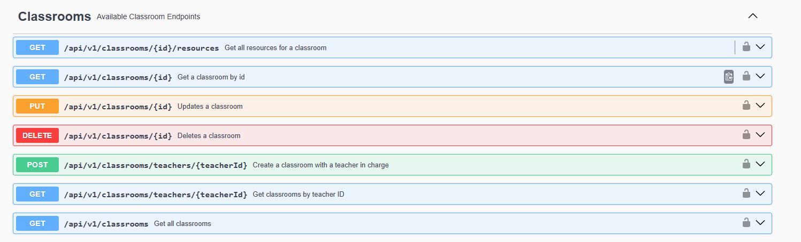

#### Shared Area

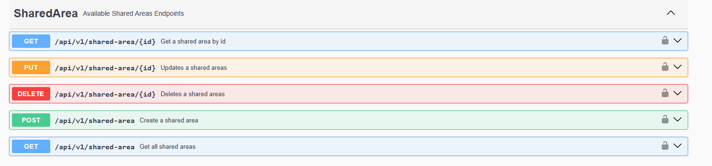

#### Meeting Participants

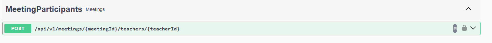

#### Authentication


#### Administrator profile


#### Resources


#### Meetings

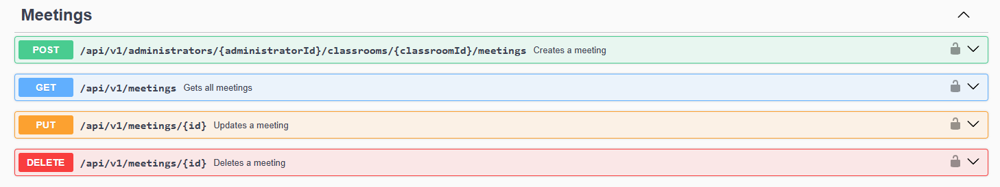

#### Reports


#### Reservations

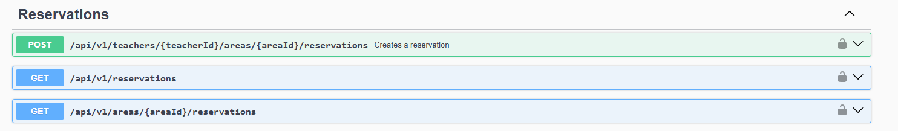

#### Teacher Profile

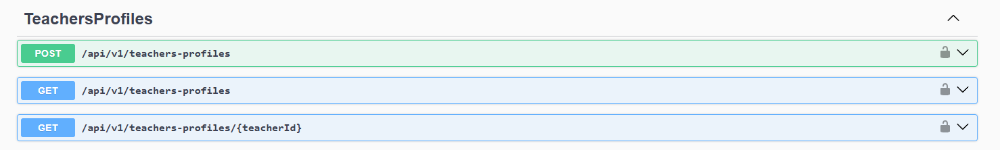

### 5.2.7. RESTful API documentation

# Documentación de la API RESTful - EduSpace

## Tabla de Endpoints

| **Módulo**                                        | **Endpoint**                                                                 | **Método** | **Descripción**                                     | **Request Body**               | **Response**                         |
| ------------------------------------------------- | ---------------------------------------------------------------------------- | ---------- | --------------------------------------------------- | ------------------------------ | ------------------------------------ |
| **Breakdown Management - Reports**                |
|                                                   | `/api/v1/Reports`                                                            | POST       | Crea un reporte para un recurso específico          | `CreateReportResource`         | `ReportResource` (201)               |
|                                                   | `/api/v1/Reports`                                                            | GET        | Obtiene todos los reportes                          | -                              | `ReportResource[]` (200)             |
|                                                   | `/api/v1/Reports/resources/{resourceId}`                                     | GET        | Obtiene todos los reportes de un recurso específico | -                              | `ReportResource[]` (200)             |
| **IAM - Authentication**                          |
|                                                   | `/api/v1/Authentication/sign-up`                                             | POST       | Registra un nuevo usuario                           | `SignUpResource`               | `{ message: string }` (200)          |
|                                                   | `/api/v1/Authentication/sign-in`                                             | POST       | Autentica un usuario y retorna un token             | `SignInResource`               | `AuthenticatedAccountResource` (200) |
| **Profiles - Administrator**                      |
|                                                   | `/api/v1/administrator-profiles`                                             | POST       | Crea un perfil de administrador                     | `CreateAdminProfileResource`   | `AdminProfileResource` (200)         |
|                                                   | `/api/v1/administrator-profiles`                                             | GET        | Obtiene todos los perfiles de administrador         | -                              | `AdminProfileResource[]` (200)       |
|                                                   | `/api/v1/administrator-profiles/{administratorId}`                           | GET        | Obtiene un perfil de administrador por ID           | -                              | `AdminProfileResource` (200/404)     |
| **Profiles - Teachers**                           |
|                                                   | `/api/v1/teachers-profiles`                                                  | POST       | Crea un perfil de profesor                          | `CreateTeacherProfileResource` | `TeacherProfileResource` (200)       |
|                                                   | `/api/v1/teachers-profiles`                                                  | GET        | Obtiene todos los perfiles de profesores            | -                              | `TeacherProfileResource[]` (200)     |
|                                                   | `/api/v1/teachers-profiles/{teacherId}`                                      | GET        | Obtiene un perfil de profesor por ID                | -                              | `TeacherProfileResource` (200/404)   |
| **Reservation Scheduling - Meetings**             |
|                                                   | `/api/v1/administrators/{administratorId}/classrooms/{classroomId}/meetings` | POST       | Crea una reunión                                    | `CreateMeetingResource`        | `MeetingResource` (200)              |
|                                                   | `/api/v1/meetings`                                                           | GET        | Obtiene todas las reuniones                         | -                              | `MeetingResource[]` (200)            |
|                                                   | `/api/v1/meetings/{id}`                                                      | PUT        | Actualiza una reunión                               | `UpdateMeetingResource`        | `MeetingResource` (200/404)          |
|                                                   | `/api/v1/meetings/{id}`                                                      | DELETE     | Elimina una reunión                                 | -                              | `string` (200/404)                   |
| **Reservation Scheduling - Meeting Participants** |
|                                                   | `/api/v1/meetings/{meetingId}/teachers/{teacherId}`                          | POST       | Agrega un profesor a una reunión                    | -                              | `string` (200)                       |
| **Reservations**                                  |
|                                                   | `/api/v1/teachers/{teacherId}/areas/{areaId}/reservations`                   | POST       | Crea una reservación                                | `CreateReservationResource`    | `ReservationResource` (200)          |
|                                                   | `/api/v1/reservations`                                                       | GET        | Obtiene todas las reservaciones                     | -                              | `ReservationResource[]` (200)        |
|                                                   | `/api/v1/areas/{areaId}/reservations`                                        | GET        | Obtiene todas las reservaciones de un área          | -                              | `ReservationResource[]` (200)        |
| **Spaces & Resource Management - Classrooms**     |
|                                                   | `/api/v1/Classrooms/teachers/{teacherId}`                                    | POST       | Crea un aula                                        | `CreateClassroomResource`      | `ClassroomResource` (201)            |
|                                                   | `/api/v1/Classrooms`                                                         | GET        | Obtiene todas las aulas                             | -                              | `ClassroomResource[]` (200)          |
|                                                   | `/api/v1/Classrooms/{id}`                                                    | GET        | Obtiene un aula por ID                              | -                              | `ClassroomResource` (200/404)        |
|                                                   | `/api/v1/Classrooms/teachers/{teacherId}`                                    | GET        | Obtiene todas las aulas de un profesor              | -                              | `ClassroomResource[]` (200)          |
|                                                   | `/api/v1/Classrooms/{id}`                                                    | PUT        | Actualiza un aula                                   | `UpdateClassroomResource`      | `ClassroomResource` (200/404)        |
|                                                   | `/api/v1/Classrooms/{id}`                                                    | DELETE     | Elimina un aula                                     | -                              | `string` (200/404)                   |
| **Spaces & Resource Management - Resources**      |
|                                                   | `/api/v1/classrooms/{classroomId}/resources`                                 | POST       | Crea un recurso en un aula                          | `CreateResourceResource`       | `ResourceResource` (201)             |
|                                                   | `/api/v1/classrooms/{classroomId}/resources`                                 | GET        | Obtiene todos los recursos de un aula               | -                              | `ResourceResource[]` (200)           |
|                                                   | `/api/v1/classrooms/{classroomId}/resources/{resourceId}`                    | GET        | Obtiene un recurso por ID                           | -                              | `ResourceResource` (200/404)         |
|                                                   | `/api/v1/classrooms/{classroomId}/resources/{resourceId}`                    | PUT        | Actualiza un recurso                                | `UpdateResourceResource`       | `ResourceResource` (200)             |
|                                                   | `/api/v1/classrooms/{classroomId}/resources/{resourceId}`                    | DELETE     | Elimina un recurso                                  | -                              | (204)                                |
| **Spaces & Resource Management - Shared Areas**   |
|                                                   | `/api/v1/shared-area`                                                        | POST       | Crea un área compartida                             | `CreateSharedAreaResource`     | `SharedAreaResource` (201)           |
|                                                   | `/api/v1/shared-area`                                                        | GET        | Obtiene todas las áreas compartidas                 | -                              | `SharedAreaResource[]` (200)         |
|                                                   | `/api/v1/shared-area/{id}`                                                   | GET        | Obtiene un área compartida por ID                   | -                              | `SharedAreaResource` (200/404)       |
|                                                   | `/api/v1/shared-area/{id}`                                                   | PUT        | Actualiza un área compartida                        | `UpdateSharedAreaResource`     | `SharedAreaResource` (200/404)       |
|                                                   | `/api/v1/shared-area/{id}`                                                   | DELETE     | Elimina un área compartida                          | -                              | `string` (200/404)                   |

## Modelos de Request/Response

### Breakdown Management

**CreateReportResource**

```json
{
  "kindOfReport": "string",
  "description": "string",
  "resourceId": "integer",
  "createdAt": "datetime"
}
```

**ReportResource**

```json
{
  "id": "integer",
  "kindOfReport": "string",
  "description": "string",
  "resourceId": "integer",
  "createdAt": "datetime",
  "status": "string"
}
```

### IAM - Authentication

**SignUpResource**

```json
{
  "username": "string",
  "password": "string",
  "role": "string"
}
```

**SignInResource**

```json
{
  "username": "string",
  "password": "string"
}
```

**AuthenticatedAccountResource**

```json
{
  "id": "integer",
  "username": "string",
  "role": "string",
  "token": "string"
}
```

### Profiles

**CreateAdminProfileResource**

```json
{
  "firstName": "string",
  "lastName": "string",
  "email": "string",
  "dni": "string",
  "address": "string",
  "phone": "string",
  "username": "string",
  "password": "string"
}
```

**AdminProfileResource**

```json
{
  "id": "integer",
  "firstName": "string",
  "lastName": "string",
  "email": "string",
  "dni": "string",
  "address": "string",
  "phone": "string"
}
```

**CreateTeacherProfileResource**

```json
{
  "firstName": "string",
  "lastName": "string",
  "email": "string",
  "dni": "string",
  "address": "string",
  "phone": "string",
  "administratorId": "integer",
  "username": "string",
  "password": "string"
}
```

**TeacherProfileResource**

```json
{
  "id": "integer",
  "firstName": "string",
  "lastName": "string",
  "email": "string",
  "dni": "string",
  "address": "string",
  "phone": "string"
}
```

### Reservation Scheduling

**CreateMeetingResource**

```json
{
  "title": "string",
  "description": "string",
  "date": "DateOnly",
  "start": "TimeOnly",
  "end": "TimeOnly"
}
```

**UpdateMeetingResource**

```json
{
  "meetingId": "integer",
  "title": "string",
  "description": "string",
  "date": "DateOnly",
  "start": "TimeOnly",
  "end": "TimeOnly",
  "administratorId": "integer",
  "classroomId": "integer"
}
```

**MeetingResource**

```json
{
  "meetingId": "integer",
  "title": "string",
  "description": "string",
  "date": "DateOnly",
  "start": "TimeOnly",
  "end": "TimeOnly",
  "administratorId": {
    "administratorIdentifier": "integer"
  },
  "classroomId": {
    "classroomIdentifier": "integer"
  },
  "teachers": [
    {
      "id": "integer",
      "firstName": "string",
      "lastName": "string"
    }
  ]
}
```

### Reservations

**CreateReservationResource**

```json
{
  "title": "string",
  "start": "datetime",
  "end": "datetime"
}
```

**ReservationResource**

```json
{
  "id": "integer",
  "start": "datetime",
  "end": "datetime",
  "title": "string",
  "areaId": "integer"
}
```

### Spaces & Resource Management

**CreateClassroomResource**

```json
{
  "name": "string",
  "description": "string"
}
```

**UpdateClassroomResource**

```json
{
  "id": "integer",
  "name": "string",
  "description": "string",
  "teacherId": "integer"
}
```

**ClassroomResource**

```json
{
  "id": "integer",
  "name": "string",
  "description": "string",
  "teacherId": "integer"
}
```

**CreateResourceResource**

```json
{
  "name": "string",
  "kindOfResource": "string"
}
```

**UpdateResourceResource**

```json
{
  "id": "integer",
  "name": "string",
  "kindOfResource": "string",
  "classroomId": "integer"
}
```

**ResourceResource**

```json
{
  "id": "integer",
  "name": "string",
  "kindOfResource": "string",
  "classroom": {
    "id": "integer",
    "name": "string",
    "description": "string",
    "teacherId": "integer"
  }
}
```

**CreateSharedAreaResource**

```json
{
  "name": "string",
  "capacity": "integer",
  "description": "string"
}
```

**UpdateSharedAreaResource**

```json
{
  "id": "integer",
  "name": "string",
  "capacity": "integer",
  "description": "string"
}
```

**SharedAreaResource**

```json
{
  "id": "integer",
  "name": "string",
  "capacity": "integer",
  "description": "string"
}
```

## Notas Importantes

1. **Autenticación**: La mayoría de los endpoints requieren autenticación mediante JWT token en el header `Authorization: Bearer {token}`, excepto `/sign-in` que tiene el atributo `[AllowAnonymous]`.

2. **Roles**: Existen dos roles en el sistema:

   - `RoleAdmin`: Para administradores
   - `RoleTeacher`: Para profesores

3. **Validaciones de negocio**:

   - Las reservaciones no pueden ser mayores a 2 horas
   - Las reservaciones deben estar entre las 7am y 8pm
   - Los reportes tienen estados: "in progress" y "completed"

4. **Relaciones**:
   - Un Teacher Profile pertenece a un Administrator
   - Un Classroom pertenece a un Teacher
   - Un Resource pertenece a un Classroom
   - Una Meeting tiene un Administrator y un Classroom
   - Una Reservation tiene un Teacher y un Area

### 5.2.8. Team Collaboration Insights

Para el desarrollo de este primer sprint, todos los miembros del equipo desarrollaron y colaboraron de manera activa y continua. De tal modo, se muestra como evidencia los insights de cada miembro del equipo.

Colaboraciones de cada miembro del equipo:

| Alumno                             | Actividad                                                           |
| ---------------------------------- | ------------------------------------------------------------------- |
| Andres Alberto Torres Garcia       | Implementación del encabezado y vista Brief Introduction y About Us |
| Piero Alberto Velarde Luyo         | Implementación de la sección tools y vista de Planes                |
| Marllely Anahi Arias Segil         | Implementación de la vista Dashboard Admin y Education              |
| Luciana Celeste Sanchez Silva      | Implementación de la vista Valoraciones y Vista de Planes           |
| Alejandro Franklin Mendoza Vergara | Implementación de la sección Contact Us y Footer                    |

Commits:


## 5.3. Video About-the-Product

Link del video: [Video about the product](https://youtu.be/tAP6TujgwuA)
