# Capítulo V: Product Implementation

## 5.1. Software Configuration Management

A continuación, presentaremos el proceso por el cual organizamos, gestionamos y controlamos los cambios en el desarrollo de este proyecto.

### 5.1.1. Software Development Environment Configuration

Requirements Management

1. Trello: Es una herramienta utilizada para gestionar el flujo de trabajo de proyectos principalmente basados en marcos de
   trabajos ágiles. Será empleado para visualizar y actualizar el estado actual de las tareas e historias de usuario
   pertenecientes al sprint a desarrollar.  
   Ruta de referencia: https://trello.com/es

Product UX/UI Design

1. Figma: Plataforma de elaboración de prototipos y edición gráfica, principalmente utilizado para el diseño digital. En el
   caso del proyecto, será utilizado para el prototipado de la aplicación y sus versiones de Desktop y Mobile Web Browser.

   Ruta de referencia: https://www.figma.com/login

2. Lucidchart: Aplicación para diagramar flujos. Será empleado para el diseño de wireflows, user-flows y el diagrama de
   clases asociado a la aplicación.

   Ruta de referencia: https://www.lucidchart.com/

Software Development

1. WebStorm: Entorno de desarrollo integrado elegido por su soporte completo para tecnologías web como JavaScript, HTML, CSS y frameworks como React y Angular. Ofrece refactorización avanzada, depuración, integración con Git y la posibilidad de agregar plugins. Es compatible con varios sistemas operativos, facilitando la colaboración en equipo.

   Ruta de referencia: https://www.jetbrains.com/webstorm/
    

2. HTML5: HyperText Markup Language, o por sus siglas HTML, es un lenguaje de etiquetado para páginas web. Será
   empleado en el desarrollo del proyecto para la presentación del contenido en la aplicación.

   Ruta de referencia: https://www.w3schools.com/html/html5_syntax.asp  
    

3. CSS: Cascading Style Sheets es un lenguaje que maneja el diseño y presentación de las páginas web, el cual va de la mano
   con HTML.

   Ruta de referencia: https://google.github.io/styleguide/htmlcssguide.html
    
    

4. JavaScript: Es un lenguaje de programación interpretado y orientado a objetos. Se utilizará para elaborar la interfaz de
   usuario dentro de la aplicación.

   Ruta de referencia: https://developer.mozilla.org/es/docs/Web/JavaScript

  

5. Git: Una herramienta de control de versiones que facilita el registro y la gestión de las distintas versiones del programa. Su propósito es mantener un historial de cambios y simplificar la corrección de errores. Los integrantes del equipo
   accederán a través de la línea de comandos en sus sistemas locales.

Ruta de referencia: https://git-scm.com/
 
 
Software Documentation and Project Management 6. Github: Una plataforma en la nube que hospedará los repositorios de código del proyecto. Permitirá la colaboración en
tiempo real y la revisión de contribuciones de cada miembro del equipo. Los integrantes del equipo podrán acceder a través de sus navegadores web.

Ruta de referencia: https://github.com/

 

Software Deployment

1. Github Pages: GitHub Pages es un servicio de alojamiento web que permite a los usuarios crear y publicar sitios web estáticos directamente desde sus repositorios de GitHub. Es especialmente útil para proyectos personales, portafolios, documentación de proyectos o blogs.

Ruta de referencia: https://pages.github.com/

2. Vercel: es una plataforma que optimiza el proceso de desarrollo y despliegue de aplicaciones web, especialmente con frameworks como Next.js y React. Proporciona un entorno colaborativo que agiliza los despliegues rápidos y genera previsualizaciones automáticas con cada commit, lo que facilita la revisión de modificaciones antes de su publicación.

Ruta de referencia: https://vercel.com/

### 5.1.2. Source Code Management

El proyecto seguirá las convenciones del flujo de trabajo establecido por el modelo GitFlow para el control de versiones, empleando GitHub como plataforma y sistema de control de versiones. A continuación, se describirá la implementación de GitFlow como un flujo de trabajo para el control de versiones, junto con el enlace del Landing Page.

Repositorio de GitHub:

- Enlace para acceder a la organización en GitHub: https://github.com/ExperimentDesign
- Enlace para acceder al repositorio de la landing Page: https://github.com/ExperimentDesign/landing-page
- Enlace para acceder al repositorio del reporte: https://github.com/ExperimentDesign/report
- Enlace para acceder al repositorio de la App Web: https://github.com/ExperimentDesign/eduspace-frontend-app-web
- Enlace para acceder al repositorio de la App Móvil: https://github.com/ExperimentDesign/eduspace-mobile
- Enlace para acceder al repositorio del back end: https://github.com/ExperimentDesign/eduspace-platform

Flujo de trabajo GitFlow

El flujo de trabajo a ser implementado para el desarrollo del proyecto se basará en el modelo propuesto por Vincent Driessen en "A successful Git branching model".

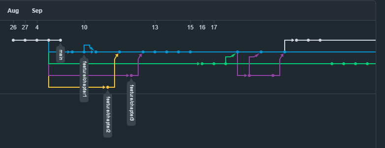
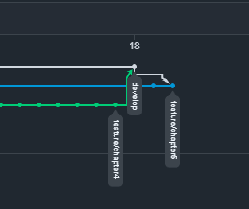

Estructura de branches (Ramas):

1. Main branch (Rama principal): Esta rama servirá como la principal para la aplicación, alojando versiones estables y finales del desarrollo. Únicamente se aceptarán cambios que hayan sido previamente probados y verificados en los features y de ahí en Developer.
2. Develop branch (Rama de desarrollo): El propósito de esta rama es facilitar los avances del proyecto en equipo y mantener los archivos centrales del desarrollo continuo.
3. Feature branch(Ramas de funcionalidad): Cada capitulo desarrollado por el equipo, o separada del enfoque actual del desarrollo, tendrá su propia rama. Una vez que una funcionalidad esté completamente trabajada, se fusionará con la rama de desarrollo del proyecto. Las convenciones para nombrar las ramas de funcionalidad seguirán un patrón descriptivo y único, por ejemplo, "feature/chapter-#".

### 5.1.3. Source Code Style Guide & Conventions

#### HTML

Algunas de las prácticas que deben seguirse para alcanzar un código coherente, sostenible y ordenado son las siguientes:

1. Cerrar todos los elementos HTML: Por ejemplo, `
Esto es un párrafo.
`.
2. Siempre declarar el tipo de documento en la primera línea del documento, para HTML es `<!DOCTYPE html>`.
3. Escribir en una línea los comentarios cortos.
4. Utilizar comillas en caso de que los atributos contengan espacios entre sí.
5. Procurar especificar el texto `alt` y las dimensiones `width` y `height` de las imágenes, ya que de esta manera se facilitará la disponibilidad del contenido. Por ejemplo:
6. Se nos recomienda no usar el espacio al momento de utilizar los signos porque es más fácil de leerlo de esta forma.

Referencia: [HTML5 Syntax](https://www.w3schools.com/html/html5_syntax.asp)

#### CSS

Entre las prácticas empleadas se menciona:

1. Se nos recomienda tener una sangría por 2 espacios a la vez, no debemos utilizar tabulaciones ni mezclarlas tabulaciones con espacios para la sangría.
2. Todo el código debe estar en minúscula.
3. Eliminar los espacios en blanco.
4. Usar comentarios para explicar el código.
5. Utilizar nombres de clase significativos o genéricos, nombres que reflejen el propósito de su elemento.

Referencia: [Google HTML/CSS Style Guide](https://google.github.io/styleguide/htmlcssguide.html)

#### JavaScript

Algunas de las mejores prácticas para programar incluyen:

1. Utilizar nombres de variables claros: Es importante que los nombres reflejen el propósito de la variable.
2. Ser consistente con las comillas: Elegir entre comillas simples o dobles y mantener esa elección a lo largo del código.
3. Incluir comentarios explicativos: Usar comentarios para aclarar bloques de código, especialmente en secciones complejas, facilita la comprensión.
4. Minimizar el uso de variables globales: Limitar el ámbito de las variables para evitar conflictos y mejorar la mantenibilidad del código.
5. Encapsular lógica en funciones: Mantener el código modular y reutilizable mediante el uso de funciones.
6. Seguir un estilo de codificación uniforme: Mantener un formato consistente mejora la legibilidad del código.

Referencia: [JavaScript Best Practices](https://www.w3schools.com/js/DEFAULT.asp)

#### Vue.js

Para asegurar que el código en Vue.js sea claro y eficiente, se recomiendan las siguientes prácticas:

1. Estructura de carpetas organizada: Mantener una estructura clara para components, pages, model y services.
2. Crear componentes reutilizables: Diseñar componentes que puedan ser utilizados en diversas partes de la aplicación.
3. Separar lógica de negocio de la vista: Utilizar métodos y propiedades computadas para mantener la lógica separada de la presentación.
4. Emplear Vue Router para la navegación: Usar Vue Router para gestionar eficazmente la navegación entre vistas.
5. Documentar componentes: Incluir comentarios y documentación sobre props, eventos y métodos dentro de los componentes.

Referencia: [Vue.js Guide](https://vuejs.org/guide/introduction)

#### Flutter

Para mantener un código limpio y eficiente en Flutter, se sugieren las siguientes prácticas:

1. Estructura de carpetas organizada: Mantener una estructura clara para lib, test y assets.
2. Utilizar widgets reutilizables: Diseñar widgets que puedan ser utilizados en diversas partes de la aplicación.
3. Separar lógica de negocio de la vista: Utilizar providers o blocs para mantener la lógica separada de la presentación.
4. Emplear rutas nombradas para la navegación: Usar rutas nombradas para gestionar eficazmente la navegación entre vistas.
5. Documentar widgets: Incluir comentarios y documentación sobre props, eventos y métodos dentro de los widgets.

Referencia: [Flutter Documentation](https://flutter.dev/docs)

#### C# (Domain-Driven Design)

Para asegurar que el código en C# siga los principios de Domain-Driven Design (DDD), se recomiendan las siguientes prácticas:

1. Utilizar nombres de dominio significativos: Los nombres de las clases, métodos y variables deben reflejar el lenguaje del dominio.
2. Mantener la lógica de negocio en el dominio: La lógica de negocio debe residir en el modelo de dominio y no en la infraestructura o en la interfaz de usuario.
3. Usar agregados para gestionar la consistencia: Los agregados son entidades que se agrupan para garantizar la consistencia de los cambios en el modelo.
4. Implementar repositorios para el acceso a datos: Los repositorios son responsables de la persistencia y recuperación de los agregados.
5. Aplicar patrones de diseño adecuados: Utilizar patrones de diseño como CQRS, Event Sourcing y DDD para estructurar el código de manera efectiva.
   Referencia: [Domain-Driven Design](https://www.domainlanguage.com/ddd/reference/)

### 5.1.4. Software Deployment Configuration

#### Landing Page Deployment

La landing page del proyecto se ha desplegado utilizando GitHub Pages, lo que permite alojar el sitio web de manera gratuita y sencilla directamente desde el repositorio de GitHub:

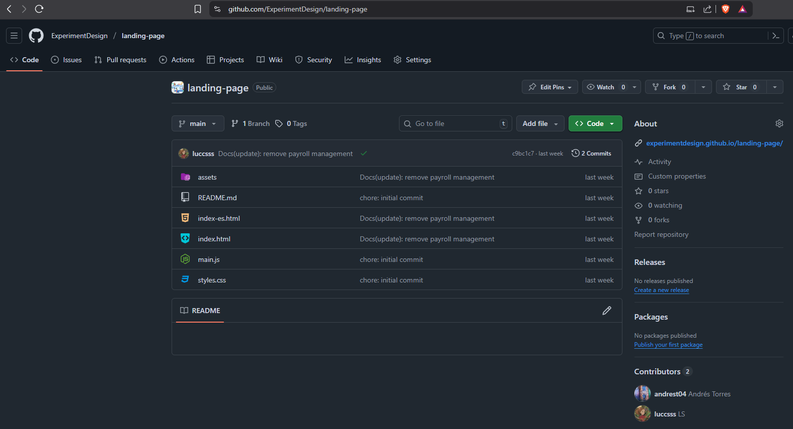
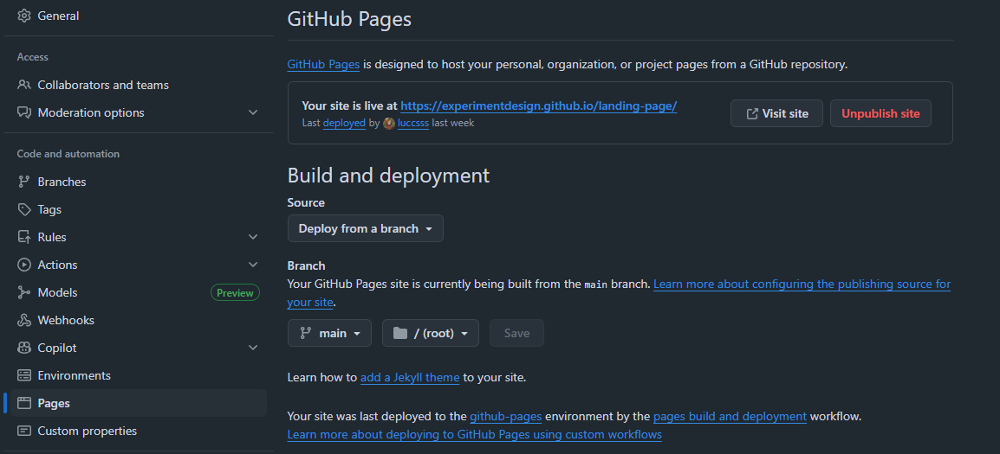

Ruta de referencia: https://experimentdesign.github.io/landing-page/

#### Web Application Deployment

la aplicación web del proyecto se ha desplegado utilizando netlify, lo que permite alojar el sitio web de manera gratuita y sencilla directamente desde el repositorio de GitHub:

Ruta de referencia: https://eduspacewebapp.netlify.app/

#### Backend Deployment

El backend del proyecto se ha desplegado utilizando Railway, lo que permite alojar el sitio web de manera gratuita y sencilla directamente desde el repositorio de GitHub:

#### Database Deployment

La base de datos del proyecto se ha desplegado utilizando Aiven, lo que permite crear un servicio de base de datos gestionado en la nube:

## 5.2. Product Implementation & Deployment

### 5.2.1. Sprint Backlogs

#### Sprint 1

##### Sprint Planning

Para este primer sprint nos enfocaremos en los tasks para la
elaboración del producto. Nos dividiremos entre nosotros cada
una de las tareas identificadas para el sprint.

| Sprint #                        | Sprint 1                                                                                                                                                                                                                                                                                                                     |
| ------------------------------- | ---------------------------------------------------------------------------------------------------------------------------------------------------------------------------------------------------------------------------------------------------------------------------------------------------------------------------- |
| Sprint Planning Background      |                                                                                                                                                                                                                                                                                                                              |
| Date                            | 30/08/2025                                                                                                                                                                                                                                                                                                                   |
| Time                            | 06:00 PM                                                                                                                                                                                                                                                                                                                     |
| Location                        | Servidor de Discord del Equipo                                                                                                                                                                                                                                                                                               |
| Prepared By                     | Andres Torres                                                                                                                                                                                                                                                                                                                |
| Attendees (to planning meeting) | Andres Torres / Piero Velarde / Marllely Arias / Luciana Sanchez / Alejandro Mendoza                                                                                                                                                                                                                                         |
| Sprint 1 Review Summary         | En esta primera seccion se planteo el desarrollo para el proyecto                                                                                                                                                                                                                                                            |
| Sprint 1 Retrospective Summary  | En esta seccion todos los integrantes mencionaron tener aciertos en partes del codigo y en otras partes poder mejorar sus habilidades realizando la Landing Page, la aplicacion web, aplicacion movil y la API RESTful.                                                                                                      |
| Sprint Goal & User Stories      |                                                                                                                                                                                                                                                                                                                              |
| Sprint 1 Goal                   | Desarrollar, desplegar y hacer visible la landing page, aplicacion web, aplicacion movil y la API RESTful, integrando todos sus componentes clave y garantizando una apariencia coherente con los mockups de la aplicación. El éxito se logrará cuando la página esté completamente funcional y accesible para los usuarios. |
| Sprint 1 Velocity               | 42 Velocity                                                                                                                                                                                                                                                                                                                  |
| Sum of Story Points             | 42 Story Points.                                                                                                                                                                                                                                                                                                             |

##### Sprint Backlog 1

| User Story Id | User Story Title                | Work-Item/Task Id                                         | Work-Item/Task Title                                                                                                                                                  | Description                      | Estimation | Assigned To       | Status |
| ------------- | ------------------------------- | --------------------------------------------------------- | --------------------------------------------------------------------------------------------------------------------------------------------------------------------- | -------------------------------- | ---------- | ----------------- | ------ |
| Orden         | User Story / Technical Story Id | Título                                                    | Descripción                                                                                                                                                           | Story Points (1 / 2 / 3 / 5 / 8) | Estimation | Assigned To       | Status |
| 1             | US02                            | Encontrar información del propósito de la aplicación      | Como visitante, quiero saber sobre el propósito de la aplicación para entender qué beneficios y funcionalidades ofrece y decidir si es adecuada para mis necesidades. | 2                                | 1          | Andres Torres     | Done   |
| 2             | US03                            | Visualización de imágenes y gráficos relevantes           | Como visitante, quiero que las imágenes y gráficos en la landing page sean de alta calidad y relevantes para captar mi interés.                                       | 2                                | 2          | Luciana Sanchez   | Done   |
| 3             | US04                            | Tipografía cómoda y agradable estéticamente               | Como visitante, quiero que la tipografía en la landing page sea legible y estéticamente agradable para facilitar la lectura y la navegación.                          | 1                                | 1          | Piero Velarde     | Done   |
| 4             | US01                            | Accesibilidad de la aplicación en diferentes dispositivos | Como visitante, quiero que la aplicación se adapte a diferentes dispositivos para que pueda acceder a la plataforma desde cualquier lugar y en cualquier momento.     | 5                                | 2          | Alejandro Mendoza | Done   |
| 5             | US08                            | Registro de información personal del docente              | Como administrador, quiero registrar la información personal del docente, para tener una base de datos actualizada y poder gestionar al personal de manera eficiente. | 3                                | 3          | Andres Torres     | Done   |
| 6             | US09                            | Registro de información de acceso del docente             | Como administrador, quiero registrar la información de acceso del docente, para que puedan iniciar sesión en la plataforma web sin problemas.                         | 3                                | 3          | Andres Torres     | Done   |
| 7             | US10                            | Registro de salones                                       | Como administrador, quiero registrar los salones de la institución, para que puedan ser gestionados y asignados en la plataforma web de manera efectiva.              | 8                                | 3          | Andres Torres     | Done   |
| 8             | US11                            | Registro de espacios compartidos                          | Como administrador, quiero registrar los espacios compartidos, para que puedan ser gestionados y reservados en la plataforma web.                                     | 8                                | 3          | Andres Torres     | Done   |
| 9             | US14                            | Registro de la hora y lugar de la reunión                 | Como administrador, quiero registrar la hora y lugar de la reunión, para asegurar que todos los participantes tengan la información correcta sobre la reunión.        | 5                                | 3          | Andres Torres     | Done   |
| 10            | US19                            | Registrar docente encargado de un ambiente                | Como administrador, deseo registrar qué docente está encargado de cada ambiente, para asignar responsabilidades y mejorar la gestión de los espacios.                 | 5                                | 3          | Andres Torres     | Done   |

#### Sprint 2

##### Sprint Planning 2

| Sprint #                         | Sprint 2                                                                                                                                                                                                                                                                                                                                                                                                                                                                                                                        |
| -------------------------------- | ------------------------------------------------------------------------------------------------------------------------------------------------------------------------------------------------------------------------------------------------------------------------------------------------------------------------------------------------------------------------------------------------------------------------------------------------------------------------------------------------------------------------------- |
| **Sprint Planning Background**   |                                                                                                                                                                                                                                                                                                                                                                                                                                                                                                                                 |
| Date                             | 06/10/2025                                                                                                                                                                                                                                                                                                                                                                                                                                                                                                                      |
| Time                             | 07:00 PM                                                                                                                                                                                                                                                                                                                                                                                                                                                                                                                        |
| Location                         | Servidor de Discord del Equipo                                                                                                                                                                                                                                                                                                                                                                                                                                                                                                  |
| Prepared By                      | Andres Torres                                                                                                                                                                                                                                                                                                                                                                                                                                                                                                                   |
| Attendees (to planning meeting)  | Andres Torres / Piero Velarde / Marllely Arias / Luciana Sanchez / Alejandro Mendoza                                                                                                                                                                                                                                                                                                                                                                                                                                            |
| **Sprint 2 Goal & User Stories** |                                                                                                                                                                                                                                                                                                                                                                                                                                                                                                                                 |
| Sprint 2 Goal                    | Completar la implementación de todas las funcionalidades restantes del sistema incluyendo: autenticación completa (sign-up y sign-in), gestión de perfiles vía API, actualización de docentes encargados, gestión completa de recursos, sistema de reuniones con invitados, módulo de reservas de espacios compartidos con validación de disponibilidad, y sistema de reportes de averías. Integrar completamente el frontend con el backend, documentar todos los endpoints en Swagger y asegurar el despliegue en producción. |
| Sprint 2 Velocity                | 116 Velocity                                                                                                                                                                                                                                                                                                                                                                                                                                                                                                                    |
| Sum of Story Points              | 116 Story Points                                                                                                                                                                                                                                                                                                                                                                                                                                                                                                                |

##### Sprint Backlog 2

| User Story Id | User Story Title                                                | Work-Item/Task Id | Work-Item/Task Title                                      | Description                                                                                                                                                                    | Estimation (horas) | Assigned To   | Status |
| ------------- | --------------------------------------------------------------- | ----------------- | --------------------------------------------------------- | ------------------------------------------------------------------------------------------------------------------------------------------------------------------------------ | ------------------ | ------------- | ------ |
| TS03          | Registro y autenticación de usuarios a través de un RESTful API | T01               | Implementar sistema de autenticación JWT                  | Como desarrollador, quiero implementar el registro (sign-up) y el inicio de sesión (sign-in) a través de una API para que los usuarios se autentiquen de manera segura.        | 6                  | Andres Torres | Done   |
| US05          | Registro como Administrador                                     | T02               | Implementar formulario de registro de administrador       | Como administrador, quiero registrarme en la aplicación web para hacer uso de las características disponibles.                                                                 | 3                  | Andres Torres | Done   |
| US06          | Inicio de sesión como profesor                                  | T03               | Implementar vista de login para profesores                | Como profesor, quiero iniciar sesión en la aplicación para acceder a las funcionalidades específicas para docentes.                                                            | 2                  | Andres Torres | Done   |
| US07          | Inicio de sesión administrador                                  | T04               | Implementar vista de login para administradores           | Como administrador, quiero iniciar sesión en la aplicación para gestionar la administración de ambientes y recursos.                                                           | 2                  | Andres Torres | Done   |
| TS01          | Añadir un perfil de administrador a través de un RESTful API    | T05               | Implementar endpoint POST /api/v1/administrator-profiles  | Como desarrollador, quiero que se pueda añadir el perfil de un administrador a través de un API para que pueda gestionar la plataforma.                                        | 4                  | Andres Torres | Done   |
| TS02          | Añadir un perfil de docente a través de un RESTful API          | T06               | Implementar endpoint POST /api/v1/teacher-profiles        | Como desarrollador, quiero que se pueda añadir el perfil de un docente a través de un API para que pueda interactuar con la plataforma.                                        | 4                  | Andres Torres | Done   |
| TS04          | Gestionar información de salones de clase vía API               | T07               | Implementar endpoints CRUD completos para salones         | Como desarrollador, quiero implementar endpoints para añadir y gestionar la información de los salones a través de una API RESTful.                                            | 6                  | Andres Torres | Done   |
| TS09          | Actualizar docente encargado del aula vía API                   | T08               | Implementar endpoint PUT /api/v1/classrooms/{id}          | Como desarrollador, quiero implementar la característica de actualizar al docente encargado del aula a través de una API RESTful.                                              | 3                  | Andres Torres | Done   |
| US18          | Registrar docente encargado de un salón de clase                | T09               | Implementar asignación de docente responsable en frontend | Como administrador, deseo registrar qué docente está encargado de cada salón de clase para asignar responsabilidades y mejorar la gestión de los espacios.                     | 4                  | Andres Torres | Done   |
| TS06          | Gestionar recursos de un salón vía API                          | T10               | Implementar endpoints para gestión de recursos            | Como desarrollador, quiero implementar endpoints para añadir recursos a un salón de clase a través de una API RESTful.                                                         | 4                  | Andres Torres | Done   |
| US13          | Registro de recursos                                            | T11               | Implementar formulario de registro de recursos            | Como administrador, quiero registrar los recursos de los salones de clase para mantener un inventario actualizado y optimizar la gestión de los recursos disponibles.          | 4                  | Andres Torres | Done   |
| TS05          | Gestionar información de espacios compartidos vía API           | T12               | Implementar endpoints CRUD para espacios compartidos      | Como desarrollador, quiero implementar endpoints para añadir la información de los espacios compartidos a través de una API RESTful.                                           | 6                  | Andres Torres | Done   |
| TS07          | Gestionar información de una reunión vía API                    | T13               | Implementar endpoint POST /api/v1/meetings                | Como desarrollador, quiero implementar endpoints para añadir la información de una reunión a través de una API RESTful.                                                        | 4                  | Andres Torres | Done   |
| TS10          | Actualizar información de la reunión vía API                    | T14               | Implementar endpoint PUT /api/v1/meetings/{id}            | Como desarrollador, quiero implementar la característica de actualizar la información de la reunión a través de una API RESTful.                                               | 3                  | Andres Torres | Done   |
| TS08          | Añadir invitados a una reunión vía API                          | T15               | Implementar endpoint POST para participantes              | Como desarrollador, quiero implementar la característica de añadir invitados a una reunión a través de una API RESTful.                                                        | 3                  | Andres Torres | Done   |
| US15          | Registro de invitados de la reunión                             | T16               | Implementar selector de invitados en frontend             | Como administrador, quiero invitar a docentes a la reunión para asegurarme de que los participantes necesarios estén presentes.                                                | 2                  | Andres Torres | Done   |
| US20          | Visualización de reuniones en el panel principal                | T17               | Implementar vista de reuniones en dashboard docente       | Como docente, quiero ver en el panel principal las reuniones en las que he sido llamado para estar informado y poder asistir puntualmente.                                     | 3                  | Andres Torres | Done   |
| TS11          | Obtener información de la disponibilidad de espacios vía API    | T18               | Implementar endpoint GET /api/v1/reservations             | Como desarrollador, quiero implementar la opción para obtener la lista de reservas y espacios para que el frontend determine la disponibilidad.                                | 4                  | Andres Torres | Done   |
| US21          | Visualización de espacios compartidos                           | T19               | Implementar vista de espacios disponibles                 | Como docente, quiero visualizar los espacios disponibles para poder planificar actividades, reuniones o clases adicionales.                                                    | 4                  | Andres Torres | Done   |
| TS12          | Añadir reserva a un espacio compartido vía API                  | T20               | Implementar endpoint POST /api/v1/reservations            | Como desarrollador, quiero implementar la opción para añadir una reserva a un espacio compartido a través de una API RESTful.                                                  | 4                  | Andres Torres | Done   |
| US22          | Reserva de espacios compartidos                                 | T21               | Implementar formulario de reserva en frontend             | Como docente, quiero reservar un espacio para asegurar su disponibilidad y organizar actividades o reuniones.                                                                  | 6                  | Andres Torres | Done   |
| US12          | Registro de horarios para reserva de espacios compartidos       | T22               | Implementar selector de horarios para reservas            | Como docente, quiero registrar el horario en el cual quiero reservar un espacio compartido para asegurar su disponibilidad en el momento deseado.                              | 4                  | Andres Torres | Done   |
| TS13          | Añadir un reporte de avería vía API                             | T23               | Implementar endpoint POST /api/v1/reports                 | Como desarrollador, quiero implementar la característica de añadir la información de un reporte a través de una API RESTful.                                                   | 3                  | Andres Torres | Done   |
| US16          | Visualización de reportes en el panel principal                 | T24               | Implementar vista de reportes en dashboard admin          | Como administrador, quiero ver los reportes que han creado los profesores en el panel principal para estar al tanto de los problemas o incidencias reportados por el personal. | 2                  | Andres Torres | Done   |

### 5.2.2. Implemented Landing Page Evidence

Se implementó una landing page funcional orientada a captar a nuestros usuarios y presentar los servicios que ofrece la plataforma de la plataforma.

#### Sección Home:

#### Sección About Us:

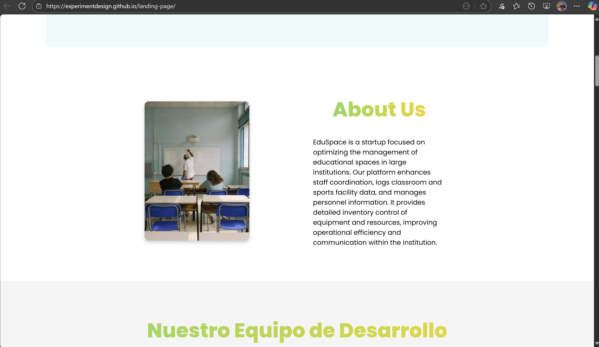

#### Sección Package:

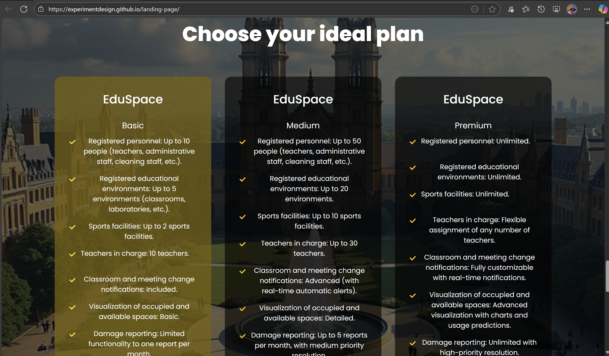

#### Sección Contact:

La landing page de EduSpace está accesible a través del siguiente enlace: https://experimentdesign.github.io/landing-page/

### 5.2.3. Implemented Frontend-Web Application Evidence

Se implementó una aplicación web funcional que permite a los usuarios interactuar con la plataforma y acceder a sus funcionalidades principales.

#### Vista Login:

#### Vista Register:

#### Vista Dashboard Admin:

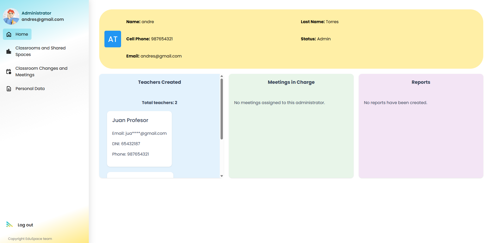

#### Vista Classrooms and Shared Areas:

#### Vista Meetings:

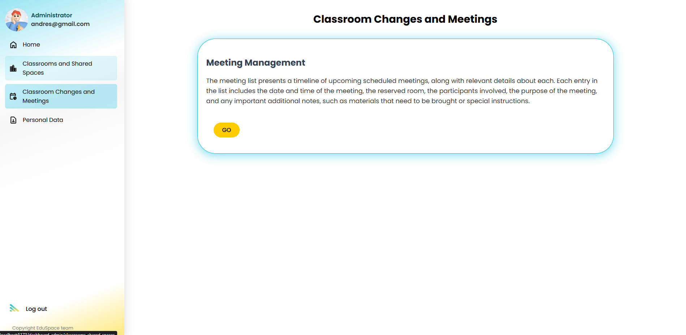

#### Vista Personal Data:

#### Vista Dashboard Teachers:

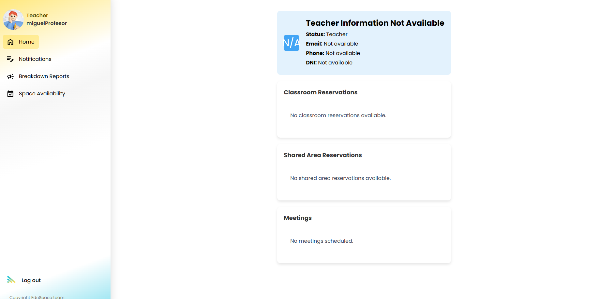

#### Vista Notifications:

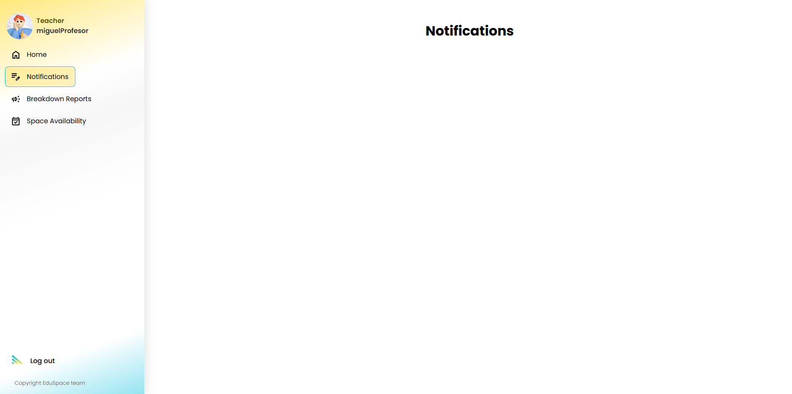

#### Vista Reports:

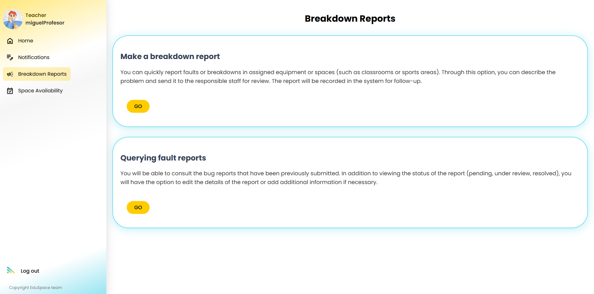

#### Vista Spaces:

### 5.2.4. Acuerdo de Servicio - SaaS

### 5.2.5. Implemented Native-Mobile Application Evidence

Se implementó una aplicación Mobile funcional que permite a los usuarios de android e IOS interactuar con la plataforma y acceder a sus funcionalidades principales.

#### Vista Login:

#### Vista Home:

#### Vista Menú desplegable:

#### Vista Salones:

#### Vista Espacios:

#### Vista Gestión de profesores:

#### Vista Reuniones:

### 5.2.6. Implemented RESTful API and/or Serverless Backend Evidence

#### Administrator profile

#### Authentication

#### Classrooms

#### Meeting Participants

#### Meetings

#### Reports

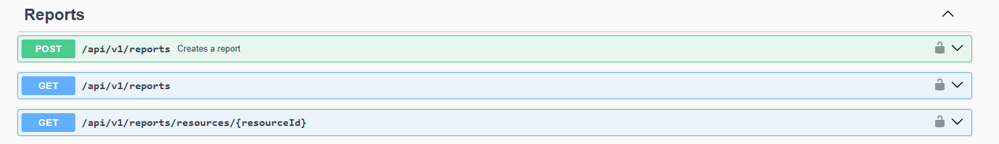

#### Reservations

#### Resources

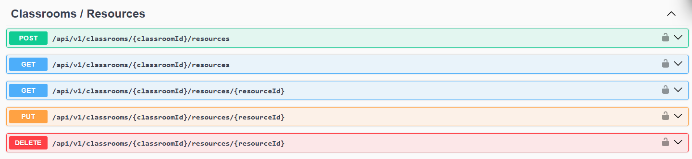

#### Shared Area

#### Teacher Profile

### 5.2.7. RESTful API documentation

| Acción Implementada                         | Verbo HTTP | Sintaxis de Llamada                                                        | Parámetros                                                                 | Ejemplo y Explicación del Response                                                                                     |
| ------------------------------------------- | ---------- | -------------------------------------------------------------------------- | -------------------------------------------------------------------------- | ---------------------------------------------------------------------------------------------------------------------- |
| **Authentication**                          |            |                                                                            |                                                                            |                                                                                                                        |
| Registrar un nuevo usuario                  | POST       | /api/v1/authentication/sign-up                                             | (en Body): Datos del usuario (nombre, email, contraseña, etc.)             | Response (201 - Created): Devuelve un objeto con la información básica del usuario creado.                             |
| Iniciar sesión de usuario                   | POST       | /api/v1/authentication/sign-in                                             | (en Body): Credenciales (email, contraseña).                               | Response (200 - OK): Devuelve un token de acceso (JWT) para autenticar solicitudes futuras. { "accessToken": "ey..." } |
| **AdministratorProfiles**                   |            |                                                                            |                                                                            |                                                                                                                        |
| Crear un perfil de administrador            | POST       | /api/v1/administrator-profiles                                             | (en Body): Datos del perfil del administrador.                             | Response (201 - Created): Devuelve el perfil del administrador recién creado.                                          |
| Obtener todos los perfiles de administrador | GET        | /api/v1/administrator-profiles                                             | Ninguno.                                                                   | Response (200 - OK): Devuelve una lista con todos los perfiles de administradores.                                     |
| Obtener un perfil de administrador por ID   | GET        | /api/v1/administrator-profiles/{administratorId}                           | administratorId (en la ruta).                                              | Response (200 - OK): Devuelve el perfil del administrador especificado.                                                |
| **Meetings**                                |            |                                                                            |                                                                            |                                                                                                                        |
| Crear una reunión para un aula              | POST       | /api/v1/administrators/{administratorId}/classrooms/{classroomId}/meetings | administratorId, classroomId (en la ruta). (en Body): Datos de la reunión. | Response (201 - Created): Devuelve la reunión recién creada.                                                           |
| Obtener todas las reuniones                 | GET        | /api/v1/meetings                                                           | Ninguno.                                                                   | Response (200 - OK): Devuelve una lista de todas las reuniones.                                                        |
| Actualizar una reunión                      | PUT        | /api/v1/meetings/{id}                                                      | id (en la ruta). (en Body): Datos actualizados de la reunión.              | Response (200 - OK): Devuelve la reunión con los datos actualizados.                                                   |
| Eliminar una reunión                        | DELETE     | /api/v1/meetings/{id}                                                      | id (en la ruta).                                                           | Response (204 - No Content): No devuelve contenido, indicando que la eliminación fue exitosa.                          |
| **Reports**                                 |            |                                                                            |                                                                            |                                                                                                                        |
| Crear un reporte                            | POST       | /api/v1/reports                                                            | (en Body): Datos del reporte a generar.                                    | Response (201 - Created): Devuelve el reporte recién creado.                                                           |
| Obtener todos los reportes                  | GET        | /api/v1/reports                                                            | Ninguno.                                                                   | Response (200 - OK): Devuelve una lista con todos los reportes.                                                        |
| Obtener reportes por recurso                | GET        | /api/v1/reports/resources/{resourceId}                                     | resourceId (en la ruta).                                                   | Response (200 - OK): Devuelve los reportes asociados al recurso especificado.                                          |
| **Reservations**                            |            |                                                                            |                                                                            |                                                                                                                        |
| Crear una reservación                       | POST       | /api/v1/teachers/{teacherId}/areas/{areaId}/reservations                   | teacherId, areaId (en la ruta). (en Body): Datos de la reservación.        | Response (201 - Created): Devuelve la reservación recién creada.                                                       |
| Obtener todas las reservaciones             | GET        | /api/v1/reservations                                                       | Ninguno.                                                                   | Response (200 - OK): Devuelve una lista de todas las reservaciones.                                                    |
| Obtener reservaciones por área              | GET        | /api/v1/areas/{areaId}/reservations                                        | areaId (en la ruta).                                                       | Response (200 - OK): Devuelve las reservaciones del área especificada.                                                 |
| **TeachersProfiles**                        |            |                                                                            |                                                                            |                                                                                                                        |
| Crear un perfil de profesor                 | POST       | /api/v1/teachers-profiles                                                  | (en Body): Datos del perfil del profesor.                                  | Response (201 - Created): Devuelve el perfil del profesor recién creado.                                               |
| Obtener todos los perfiles de profesor      | GET        | /api/v1/teachers-profiles                                                  | Ninguno.                                                                   | Response (200 - OK): Devuelve una lista con todos los perfiles de profesores.                                          |
| Obtener un perfil de profesor por ID        | GET        | /api/v1/teachers-profiles/{teacherId}                                      | teacherId (en la ruta).                                                    | Response (200 - OK): Devuelve el perfil del profesor especificado.                                                     |
| **Classrooms**                              |            |                                                                            |                                                                            |                                                                                                                        |
| Obtener todos los recursos de un aula       | GET        | /api/v1/classrooms/{id}/resources                                          | id (en la ruta).                                                           | Response (200 - OK): Devuelve una lista de los recursos del aula especificada.                                         |
| Obtener un aula por ID                      | GET        | /api/v1/classrooms/{id}                                                    | id (en la ruta).                                                           | Response (200 - OK): Devuelve el aula especificada.                                                                    |
| Actualizar un aula                          | PUT        | /api/v1/classrooms/{id}                                                    | id (en la ruta). (en Body): Datos actualizados del aula.                   | Response (200 - OK): Devuelve el aula con la información actualizada.                                                  |
| Eliminar un aula                            | DELETE     | /api/v1/classrooms/{id}                                                    | id (en la ruta).                                                           | Response (204 - No Content): Indica que el aula fue eliminada.                                                         |
| Crear un aula con un profesor a cargo       | POST       | /api/v1/classrooms/teachers/{teacherId}                                    | teacherId (en la ruta). (en Body): Datos del aula.                         | Response (201 - Created): Devuelve el aula recién creada.                                                              |
| Obtener aulas por profesor                  | GET        | /api/v1/classrooms/teachers/{teacherId}                                    | teacherId (en la ruta).                                                    | Response (200 - OK): Devuelve una lista de aulas a cargo del profesor.                                                 |
| Obtener todas las aulas                     | GET        | /api/v1/classrooms                                                         | Ninguno.                                                                   | Response (200 - OK): Devuelve una lista de todas las aulas.                                                            |
| **Resource**                                |            |                                                                            |                                                                            |                                                                                                                        |
| Obtener un recurso por su ID                | GET        | /api/v1/classrooms/resources/{resourceId}                                  | resourceId (en la ruta).                                                   | Response (200 - OK): Devuelve el recurso especificado.                                                                 |
| Crear un nuevo recurso en un aula           | POST       | /api/v1/classrooms/{classroomId}/resources                                 | classroomId (en la ruta). (en Body): Datos del recurso.                    | Response (201 - Created): Devuelve el recurso recién creado.                                                           |
| Obtener todos los recursos                  | GET        | /api/v1/resources                                                          | Ninguno.                                                                   | Response (200 - OK): Devuelve una lista de todos los recursos.                                                         |
| Actualizar un recurso                       | PUT        | /api/v1/resources/{id}                                                     | id (en la ruta). (en Body): Datos actualizados del recurso.                | Response (200 - OK): Devuelve el recurso con la información actualizada.                                               |
| Eliminar un recurso                         | DELETE     | /api/v1/resources/{id}                                                     | id (en la ruta).                                                           | Response (204 - No Content): Indica que el recurso fue eliminado.                                                      |
| **SharedArea**                              |            |                                                                            |                                                                            |                                                                                                                        |
| Obtener un área compartida por ID           | GET        | /api/v1/shared-area/{id}                                                   | id (en la ruta).                                                           | Response (200 - OK): Devuelve el área compartida especificada.                                                         |
| Actualizar un área compartida               | PUT        | /api/v1/shared-areas/{id}                                                  | id (en la ruta). (en Body): Datos actualizados del área.                   | Response (200 - OK): Devuelve el área con la información actualizada.                                                  |
| Eliminar un área compartida                 | DELETE     | /api/v1/shared-areas/{id}                                                  | id (en la ruta).                                                           | Response (204 - No Content): Indica que el área fue eliminada.                                                         |
| Crear un área compartida                    | POST       | /api/v1/shared-area                                                        | (en Body): Datos del área a crear.                                         | Response (201 - Created): Devuelve el área compartida recién creada.                                                   |
| Obtener todas las áreas compartidas         | GET        | /api/v1/shared-area                                                        | Ninguno.                                                                   | Response (200 - OK): Devuelve una lista de todas las áreas compartidas.                                                |
| **MeetingParticipants**                     |            |                                                                            |                                                                            |                                                                                                                        |
| Añadir un profesor a una reunión            | POST       | /api/v1/meetings/{meetingId}/teachers/{teacherId}                          | meetingId, teacherId (en la ruta).                                         | Response (201 - Created): Confirma la adición del participante.                                                        |

### 5.2.8. Team Collaboration Insights

Para el desarrollo de este primer sprint, todos los miembros del equipo desarrollaron y colaboraron de manera activa y continua. De tal modo, se muestra como evidencia los insights de cada miembro del equipo.

Colaboraciones de cada miembro del equipo:

| Alumno                             | Actividad                                                           |
| ---------------------------------- | ------------------------------------------------------------------- |
| Andres Alberto Torres Garcia       | Implementación del encabezado y vista Brief Introduction y About Us |
| Piero Alberto Velarde Luyo         | Implementación de la sección tools y vista de Planes                |
| Marllely Anahi Arias Segil         | Implementación de la vista Dashboard Admin y Education              |
| Luciana Celeste Sanchez Silva      | Implementación de la vista Valoraciones y Vista de Planes           |
| Alejandro Franklin Mendoza Vergara | Implementación de la sección Contact Us y Footer                    |

Commits:

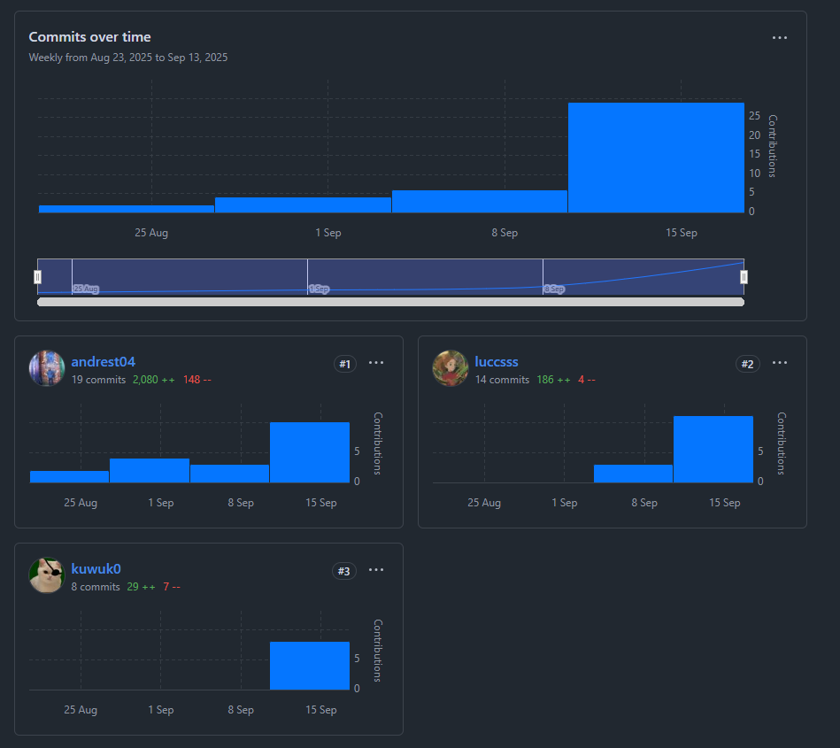

## 5.3. Video About-the-Product

Link del video: [Video about the product](https://youtu.be/tAP6TujgwuA)
