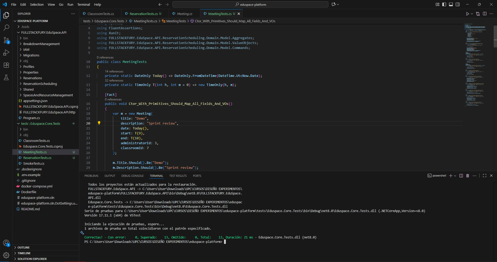

# Capítulo VI: Product Verification & Validation

## 6.1. Testing Suites & Validation

### 6.1.1. Core Entities Unit Tests

Los Core Entities Unit Tests son fundamentales en el desarrollo de software porque aseguran la calidad y el correcto comportamiento de las entidades clave, evitando fallos y haciendo más sencillo el mantenimiento del código. En nuestro caso, se implementaron pruebas unitarias con xUnit y FluentAssertions.

**1.Classroom service Tests**
Para el agregado Classroom, se validó que el constructor inicialice correctamente Name, Description, TeacherId y deje Resources vacío; que UpdateName y UpdateDescription ignoren valores nulos o vacíos y solo apliquen cambios válidos; y que UpdateTeacherId mantenga el valor cuando es null o cuando la validación externa verifyProfile falla, actualizándolo únicamente cuando dicha validación retorna true.

**2.Reservation service Tests**

Esta prueba verifica que al construir una Reservation a partir de un CreateReservationCommand se asignen correctamente todos los campos del dominio: el Title, el rango temporal (Start/End) encapsulado en el value object ReservationDate, y los identificadores AreaId y TeacherId. Con ello aseguramos el contrato entre la capa de aplicación (comandos) y el modelo de dominio: si cambia la firma del comando o la inicialización de los value objects, la prueba falla de inmediato, evitando errores silenciosos al crear reuniones.

**3.Meetings service Tests**

Se prueba que en el agregado Meeting, el constructor con primitivas y el basado en CreateMeetingCommand mapeen correctamente todos los campos (Title, Description, Date, StartTime, EndTime) y los value objects AdministratorId y ClassroomId. Además, se prueba que los métodos de actualización mantengan las invariantes del dominio: UpdateTitle/UpdateDescription ignoran nulos o vacíos y solo aplican cambios válidos, UpdateDate y UpdateTime actualizan selectivamente fecha/inicio/fin, y UpdateAdministrator/UpdateClassroom solo cambian cuando el ID es provisto y pasa la validación externa. Con ello se asegura el contrato entre comandos y dominio, y se previenen estados inconsistentes en la programación de reuniones.

**4.Teachers Profile service Tests**

Se validó que TeacherProfile mapee correctamente el AdministratorId tanto con el constructor de primitivas como desde CreateTeacherProfileCommand (usando su firma posicional completa). Al centrarnos en el atributo público expuesto por el agregado, estas pruebas verifican el contrato entre la capa de aplicación y el dominio y detectan cambios incompatibles en la firma del comando o en el mapeo del agregado.

**5.Accounts service Tests**

Se validó que el constructor de Account asigne Username y PasswordHash y convierta correctamente el rol desde texto a ERoles, lanzando excepción ante valores inválidos; se comprobó el estilo fluido de UpdateUsername y UpdatePasswordHash (devuelven la misma instancia y actualizan los campos); el constructor por defecto deja propiedades nulas y el rol en su valor por defecto; y, vía reflexión, que PasswordHash esté anotado con [JsonIgnore], garantizando que no se serialice accidentalmente. Con ello se cubren reglas clave de creación, actualización y privacidad del agregado de identidad.

**6.Meetings controller Tests**

Las dos pruebas unitarias validan el comportamiento del endpoint DELETE /api/v1/meetings/{id} del MeetingsController. En la primera, se “moquea” IMeetingCommandService.Handle(DeleteMeetingCommand) para que complete sin excepciones (flujo feliz) y se verifica que el controlador responda 200 Ok, que el mensaje incluya el id y que el servicio se invoque exactamente una vez. En la segunda, se simula que Handle lanza una ArgumentException (reunión no encontrada) y el test comprueba que el controlador devuelva 404 NotFound con el mensaje correspondiente

### 6.1.2. Core Integration Tests

Las Core Integration Tests son clave para verificar que los controladores se relacionen de forma correcta con otros componentes del sistema, como servicios y bases de datos. Al contemplar escenarios de fallo, estas pruebas aseguran que el sistema gestione imprevistos de manera adecuada y devuelva los códigos de estado correspondientes. Con ello se mejora la experiencia de usuario, se simplifica la depuración y se impulsa la construcción de un software confiable y de alta calidad.

**1. Pruebas de integración de ReportRepository con SQLite**

Se ejecutaron pruebas de integración sobre el repositorio ReportRepository usando AppDbContext con SQLite en memoria para validar la persistencia y las consultas reales. Los casos cubren: FindByIdAsync (recupera un reporte insertado), FindAllAsync (devuelve el total de registros) y FindAllByResourceIdAsync (filtra correctamente por el value object ResourceId). Estas pruebas ejercitan mapeos EF, restricciones NOT NULL y LINQ.

**2.Pruebas de integración de Reservations controller**

Este conjunto verifica que los endpoints públicos de reservas respondan correctamente y devuelvan el formato esperado. A través de un HttpClient de pruebas, se llama a GET /api/v1/reservations y GET /api/v1/areas/1/reservations, comprobando que ambos regresen 200 OK y que el cuerpo sea un arreglo JSON.

**3.Pruebas de integración para Meeting controller**

Las dos pruebas de integración verifican el comportamiento real del MeetingsController a través de la API en ejecución con base de datos SQLite en memoria: la primera llama GET /api/v1/meetings sobre una BD vacía y confirma que el servicio responde 200 OK con un arreglo vacío (no hay reuniones registradas), y la segunda intenta eliminar una reunión inexistente con DELETE /api/v1/meetings/999999, comprobando que el endpoint devuelva 404 NotFound; en conjunto, aseguran que el listado sin datos y el borrado con id inválido estén correctamente gestionados de extremo a extremo.

**4.Pruebas de integración para Classrooms controller**

Las dos pruebas de integración ejercitan el ClassroomsController a través del pipeline HTTP real con la API levantada y base SQLite en memoria: la primera llama GET /api/v1/Classrooms sobre una BD vacía y valida que responda 200 OK con un arreglo vacío (no hay aulas registradas), y la segunda consulta GET /api/v1/Classrooms/999999 para un id inexistente y confirma que el endpoint devuelva 404 NotFound; en conjunto, aseguran que el listado sin datos y la búsqueda por id inexistente estén manejados correctamente de extremo a extremo

**5.Pruebas de integración para SharedArea controller**

Las dos pruebas de integración ejercitan el SharedAreaController a través del pipeline HTTP real con base SQLite en memoria: la primera invoca GET /api/v1/shared-area sobre una BD vacía y verifica que la API responda 200 OK con un arreglo vacío (no hay áreas compartidas registradas); la segunda consulta GET /api/v1/shared-area/999999 para un id inexistente y comprueba que el endpoint devuelva 404 NotFound. En conjunto, validan de extremo a extremo que el listado sin datos y la búsqueda por id no encontrado estén correctamente manejados.

**6.Pruebas de integración para Resource controller**

Estas dos pruebas de integración validan el ResourcesController de extremo a extremo usando la API real con SQLite en memoria: la primera invoca GET /api/v1/classrooms/1/resources sobre una BD vacía y confirma que responde 200 OK con un arreglo vacío (sin recursos en ese aula); la segunda consulta GET /api/v1/classrooms/999/resources/12345 y verifica que devuelva 404 NotFound cuando el recurso no existe o no pertenece al aula indicada. En conjunto, aseguran el manejo correcto del listado por aula sin datos y la verificación de pertenencia classroomId → resourceId, así como las respuestas HTTP esperadas.

### 6.1.3. Core Behavior-Driven Development

Las pruebas Behavior-Driven Development (BDD) en EduSpace, realizadas con SpecFlow, permiten validar el comportamiento del sistema desde la perspectiva del usuario final, utilizando lenguaje natural para describir escenarios reales.

#### Inicio de sesión como profesor

#### Inicio de sesión administrador

#### Registro de información personal del docente

#### Registro de información de acceso del docente

#### Registro de espacios compartidos

### 6.1.4. Core System Tests

Esta sección presenta las pruebas realizadas para validar las funcionalidades principales del sistema, como la accesibilidad, el registro, el inicio de sesión y la gestión de información. Las pruebas se ejecutaron con Selenium para simular la interacción de los usuarios y asegurar que cada flujo funcione correctamente. De esta manera, se garantizó una experiencia fluida, segura y acorde con los requisitos definidos en las historias de usuario.

---

|  **ID**  | **Título**                                                | **Descripción**                                                                                                                                                   |
| :------: | :-------------------------------------------------------- | :---------------------------------------------------------------------------------------------------------------------------------------------------------------- |
| **US01** | Accesibilidad de la aplicación en diferentes dispositivos | Como visitante, quiero que la aplicación se adapte a diferentes dispositivos para que pueda acceder a la plataforma desde cualquier lugar y en cualquier momento. |

---

|  **ID**  | **Título**                                           | **Descripción**                                                                                                                                                       |
| :------: | :--------------------------------------------------- | :-------------------------------------------------------------------------------------------------------------------------------------------------------------------- |
| **US02** | Encontrar información del propósito de la aplicación | Como visitante, quiero saber sobre el propósito de la aplicación para entender qué beneficios y funcionalidades ofrece y decidir si es adecuada para mis necesidades. |

---

|  **ID**  | **Título**                                      | **Descripción**                                                                                                                 |
| :------: | :---------------------------------------------- | :------------------------------------------------------------------------------------------------------------------------------ |
| **US03** | Visualización de imágenes y gráficos relevantes | Como visitante, quiero que las imágenes y gráficos en la landing page sean de alta calidad y relevantes para captar mi interés. |

---

|  **ID**  | **Título**                                  | **Descripción**                                                                                                                              |
| :------: | :------------------------------------------ | :------------------------------------------------------------------------------------------------------------------------------------------- |
| **US04** | Tipografía cómoda y agradable estéticamente | Como visitante, quiero que la tipografía en la landing page sea legible y estéticamente agradable para facilitar la lectura y la navegación. |

---

|  **ID**  | **Título**                  | **Descripción**                                                                                                 |
| :------: | :-------------------------- | :-------------------------------------------------------------------------------------------------------------- |
| **US05** | Registro como Administrador | Como administrador, quiero registrarme en la aplicación web, para hacer uso de las características disponibles. |

---

|  **ID**  | **Título**                     | **Descripción**                                                                                                      |
| :------: | :----------------------------- | :------------------------------------------------------------------------------------------------------------------- |
| **US06** | Inicio de sesión como profesor | Como profesor, quiero iniciar sesión en la aplicación, para acceder a las funcionalidades específicas para docentes. |

---

|  **ID**  | **Título**                     | **Descripción**                                                                                                       |
| :------: | :----------------------------- | :-------------------------------------------------------------------------------------------------------------------- |
| **US07** | Inicio de sesión administrador | Como administrador, quiero iniciar sesión en la aplicación, para gestionar la administración de ambientes y recursos. |

---

|  **ID**  | **Título**                                   | **Descripción**                                                                                                     |
| :------: | :------------------------------------------- | :------------------------------------------------------------------------------------------------------------------ |
| **US08** | Registro de información personal del docente | Como administrador, quiero registrar la información personal del docente, para tener una base de datos actualizada. |

---

|  **ID**  | **Título**                                    | **Descripción**                                                                                                                 |
| :------: | :-------------------------------------------- | :------------------------------------------------------------------------------------------------------------------------------ |
| **US09** | Registro de información de acceso del docente | Como administrador, quiero registrar la información de acceso del docente, para que puedan iniciar sesión en la plataforma web. |

---

|  **ID**  | **Título**          | **Descripción**                                                                                                                       |
| :------: | :------------------ | :------------------------------------------------------------------------------------------------------------------------------------ |
| **US10** | Registro de salones | Como administrador, quiero registrar los salones de la institución, para que puedan ser gestionados y asignados en la plataforma web. |

---

|  **ID**  | **Título**                       | **Descripción**                                                                                                      |
| :------: | :------------------------------- | :------------------------------------------------------------------------------------------------------------------- |
| **US11** | Registro de espacios compartidos | Como administrador, quiero registrar los espacios compartidos, para que puedan ser gestionados en la plataforma web. |

---

|  **ID**  | **Título**           | **Descripción**                                                                                                                                                        |
| :------: | :------------------- | :--------------------------------------------------------------------------------------------------------------------------------------------------------------------- |
| **US13** | Registro de recursos | Como administrador, quiero registrar los recursos de los salones de clase, para mantener un inventario actualizado y optimizar la gestión de los recursos disponibles. |

---

|  **ID**  | **Título**                             | **Descripción**                                                                                                                                                |
| :------: | :------------------------------------- | :------------------------------------------------------------------------------------------------------------------------------------------------------------- |
| **US14** | Registro de hora y lugar de la reunión | Como administrador, quiero registrar la hora y lugar de la reunión, para asegurar que todos los participantes tengan la información correcta sobre la reunión. |

---

|  **ID**  | **Título**                          | **Descripción**                                                                                                                  |
| :------: | :---------------------------------- | :------------------------------------------------------------------------------------------------------------------------------- |
| **US15** | Registro de invitados de la reunión | Como administrador, quiero invitar a docentes a la reunión, para asegurarme de que los participantes necesarios estén presentes. |

---

|  **ID**  | **Título**                                       | **Descripción**                                                                                                                                             |
| :------: | :----------------------------------------------- | :---------------------------------------------------------------------------------------------------------------------------------------------------------- |
| **US17** | Registrar docente encargado de un salón de clase | Como administrador, deseo registrar qué docente está encargado de cada salón de clase, para asignar responsabilidades y mejorar la gestión de los espacios. |

---

|  **ID**  | **Título**                                        | **Descripción**                                                                                                                                       |
| :------: | :------------------------------------------------ | :---------------------------------------------------------------------------------------------------------------------------------------------------- |
| **US18** | Actualizar docente encargado de un salón de clase | Como administrador, quiero actualizar qué docente está encargado de cada salón de clase, para reflejar cambios en la asignación de responsabilidades. |

---

|  **ID**  | **Título**                            | **Descripción**                                                                                                             |
| :------: | :------------------------------------ | :-------------------------------------------------------------------------------------------------------------------------- |
| **US20** | Visualización de espacios compartidos | Como docente, quiero visualizar los espacios disponibles para poder planificar actividades, reuniones o clases adicionales. |

## 6.2. Static testing & Verification

### 6.2.1. Static Code Analysis

El análisis de código estático es una técnica utilizada para evaluar la calidad interna del software sin ejecutar el programa. Este proceso permite identificar problemas de estructura, estilo, mantenibilidad y complejidad, así como detectar riesgos técnicos antes de que impacten durante la ejecución. También permite revisar la consistencia del código y asegurar que se mantenga un nivel adecuado de calidad a lo largo del desarrollo.

#### 6.2.1.1. Coding standard & Code conventions

Los estándares de codificación y las convenciones establecen lineamientos que garantizan que el código sea claro, coherente y fácil de mantener. En este proyecto, estas convenciones se encuentran alineadas con los principios de **Clean Code**, promoviendo el uso de nombres descriptivos, funciones con una única responsabilidad, eliminación de duplicaciones y una estructura simple y legible. La aplicación de estos lineamientos facilita la colaboración dentro del equipo y contribuye a un código más ordenado y sostenible en el tiempo.

#### 6.2.1.2. Code Quality & Code Security.

La calidad del código y la seguridad son pilares esenciales en el desarrollo de Eduspace, ya que la plataforma gestiona información sensible relacionada con docentes, instituciones educativas y procesos académicos. Mantener un código limpio, estandarizado y seguro garantiza la confiabilidad del sistema y la protección de los datos institucionales.

**Calidad del Código** La calidad del código en Eduspace se evalúa mediante métricas objetivas que permiten identificar la mantenibilidad, legibilidad y eficiencia del software.
Entre las métricas más relevantes se consideran:

- Cobertura de pruebas: porcentaje de código cubierto por pruebas unitarias y de integración, asegurando el correcto funcionamiento de los módulos desarrollados.

- Complejidad ciclomática: análisis de la cantidad de caminos lógicos dentro del código, con el objetivo de reducir la complejidad y mejorar la mantenibilidad.

- Duplicación de código y comentarios: detección y eliminación de redundancias que dificultan la lectura y el mantenimiento.

Para este propósito, se utiliza SonarQube, una herramienta de análisis continuo de calidad que examina el código de los repositorios de Eduspace y genera reportes automáticos sobre defectos, malas prácticas o violaciones de estándares.
Esto permite al equipo de desarrollo detectar tempranamente posibles problemas y realizar acciones correctivas antes de que el código sea integrado a las ramas principales del proyecto.

Asimismo, se promueve el cumplimiento de las convenciones de codificación definidas en el proyecto, basadas en guías oficiales para asegurar un estilo uniforme en todo el código fuente, facilitando la colaboración y reduciendo los errores en futuras implementaciones.

**Seguridad del Código** La seguridad en el código es crítica para Eduspace, debido al manejo de datos institucionales y académicos. El equipo adopta prácticas de codificación segura para prevenir vulnerabilidades comunes como:

- Inyección SQL (SQL Injection).

- Cross-Site Scripting (XSS).

- Manejo inadecuado de datos sensibles.

- Estas vulnerabilidades son mitigadas a través de:

- Validación y sanitización estricta de las entradas de usuario.

- Uso de ORM (Object-Relational Mapping) en las consultas a base de datos para evitar inyecciones directas.

- Implementación de autenticación segura con JWT (JSON Web Token).

- Restricciones de acceso basadas en roles definidos (profesor y administrador institucional).

- Herramientas de Monitoreo y Mejora Continua

Para reforzar la cultura de calidad y seguridad, se emplea SonarLint, una extensión complementaria integrada en el entorno de desarrollo (Visual Studio Code), que realiza un análisis en tiempo real mientras los desarrolladores escriben código.
SonarLint detecta problemas de sintaxis, vulnerabilidades y violaciones de convenciones, ofreciendo recomendaciones inmediatas para su corrección.

De esta manera, se garantiza que cada módulo de la plataforma cumpla con altos estándares de calidad, seguridad y mantenibilidad.

### 6.2.2. Reviews

En Eduspace, las revisiones de código constituyen una práctica esencial para garantizar la calidad, mantenibilidad y seguridad del software desarrollado en la plataforma. Este proceso permite detectar errores de manera temprana, asegurar la correcta aplicación de los estándares definidos y fomentar la colaboración técnica entre los miembros del equipo.

**Tipos de Revisiones**

- Revisión de Código por Pares (Peer Review):
  Cada desarrollador es responsable de revisar el código de otro integrante antes de su integración al repositorio principal. Este enfoque promueve la comprensión colectiva del sistema y la detección oportuna de defectos lógicos o de diseño.

- Revisión Formal:
  En cada cierre de sprint, se realiza una revisión estructurada del código mediante una reunión técnica en la que se evalúan los cambios implementados, siguiendo un checklist estandarizado que contempla claridad, cumplimiento de convenciones, eficiencia, y control de errores.

- Revisión Automática:
  Se emplean herramientas de análisis estático como SonarLint (integrado en el entorno local) y SonarQube (para monitoreo continuo en el pipeline DevOps), con el fin de identificar vulnerabilidades, duplicación de código, errores de complejidad ciclomática y malas prácticas en tiempo real.

**Proceso de Revisión**

- **Creación del Pull Request (PR):** Todo nuevo desarrollo o corrección de bug requiere la creación de un Pull Request detallado en GitHub, indicando el propósito de los cambios, el issue asociado y la evidencia de pruebas unitarias o de integración.

- **Aplicación del Checklist de Revisión:** Se utiliza una lista de verificación que abarca los siguientes aspectos:

  - Legibilidad y consistencia con las coding conventions del proyecto.

  - Correcta gestión de errores y excepciones.

  - Cobertura de pruebas automatizadas mínima del 80%.

  - Cumplimiento de patrones arquitectónicos definidos (por ejemplo, MVC y principios SOLID).

  - Ausencia de vulnerabilidades detectadas por SonarQube.

- **Comentarios y Retroalimentación:** Los revisores deben emitir observaciones constructivas y específicas sobre cada cambio propuesto. El desarrollador responsable debe atender y resolver todos los comentarios antes de solicitar una nueva revisión.

- **Aprobación y Fusión del PR:** Una vez que el código cumple con los estándares y no presenta incidencias, el Pull Request es aprobado por al menos un revisor adicional y luego fusionado en la rama principal (main o develop), siguiendo el flujo definido por GitFlow.

## 6.3. Validation Interviews.

### 6.3.1. Diseño de Entrevistas.

**Segmento 1: Administradores**

1. ¿El panel te muestra claramente el estado de los docentes, cursos y reportes activos?
2. ¿El sistema te notifica correctamente al crear, modificar o eliminar usuarios?
3. ¿Los términos usados en el panel de administración (como “periodo académico”, “usuario”, “reporte institucional”) son los mismos que usas en tu gestión real?
4. ¿Sientes que las secciones reflejan la jerarquía y organización habitual de tu institución?
5. ¿Puedes revertir fácilmente cambios en configuraciones o datos institucionales si cometes un error?
6. ¿Existe una opción clara para salir o guardar antes de abandonar una tarea?
7. ¿El diseño de los formularios y botones es coherente entre los diferentes módulos de gestión?
8. ¿Notas que las acciones principales (crear, editar, eliminar) están siempre ubicadas en los mismos lugares?
9. ¿El sistema valida correctamente los datos antes de guardarlos (por ejemplo, nombres duplicados, campos vacíos)?
10. ¿Aparecen mensajes de advertencia antes de eliminar usuarios o cursos?
11. ¿Las funciones más usadas (crear docente, generar reporte, ver estadísticas) están accesibles desde el panel principal?
12. ¿Los íconos te ayudan a identificar cada sección sin tener que leer los títulos?
13. ¿Puedes acceder a información relevante (como reportes o métricas) en pocos clics?
14. ¿El sistema permite filtrar y ordenar fácilmente los datos que necesitas?
15. ¿La interfaz del panel administrativo es visualmente clara y sin sobrecarga de información?
16. ¿El color y la jerarquía visual te ayudan a identificar lo más importante rápidamente?
17. ¿Existen guías o mensajes de ayuda dentro del panel para comprender las funciones más técnicas?
18. ¿Sientes que podrías enseñar a otro usuario a manejar la plataforma sin dificultad?

---

**Segmento 2: Profesores**

1. ¿La plataforma te informa claramente cuando una tarea o material se ha subido con éxito?
2. ¿Recibes notificaciones o mensajes de confirmación al realizar acciones importantes (por ejemplo, publicar un curso o calificar una actividad)?
3. ¿Los términos y etiquetas utilizados (por ejemplo, “curso”, “actividad”, “evaluación”) te resultan familiares y coherentes con tu trabajo docente?
4. ¿Sientes que la estructura del menú refleja tu flujo de trabajo habitual como profesor?
5. ¿Puedes deshacer o cancelar fácilmente una acción si te equivocas al subir contenido o editar una nota?
6. ¿Te resulta sencillo volver a la pantalla anterior o al panel principal desde cualquier parte de la aplicación?
7. ¿Notas que los botones, colores y acciones mantienen el mismo estilo y significado en toda la interfaz?
8. ¿Las versiones web y móvil ofrecen una experiencia visual y funcional coherente?
9. ¿El sistema te advierte antes de realizar acciones importantes como eliminar un curso o calificación?
10. ¿Existen ayudas visuales o validaciones que te eviten cometer errores (por ejemplo, subir un archivo con formato incorrecto)?
11. ¿Las funciones más usadas (crear curso, calificar, subir material) son fácilmente visibles sin tener que buscarlas?
12. ¿Los iconos y etiquetas te ayudan a identificar rápidamente las opciones que necesitas?
13. ¿Puedes realizar tus tareas de forma rápida, con pocos pasos?
14. ¿El sistema recuerda tus preferencias (por ejemplo, filtros, vistas, o últimos cursos abiertos)?
15. ¿La interfaz te parece limpia, sin elementos innecesarios o que distraigan de tu trabajo?
16. ¿El contraste y la tipografía facilitan la lectura de textos y datos en pantalla?
17. ¿La plataforma te brinda ayuda contextual o mensajes explicativos cuando algo no funciona como esperas?
18. ¿Te resultó fácil entender cómo usar las funciones la primera vez que entraste a la aplicación?

### 6.3.2. Registro de Entrevistas.

### Segmento: Profesor

| **Nombre y Apellido** | **Edad** | **Distrito** | **Screenshot**                                                        | **URL del video (Microsoft Stream)**                             | **Timing** | **Duración** |
| --------------------- | -------- | ------------ | --------------------------------------------------------------------- | ---------------------------------------------------------------- | ---------- | ------------ |
| Josep Melgarejo       | 27       | San Miguel   |  | [Ver entrevista](https://youtu.be/unbCCAEqFME)                   | 00:00:20   | 05:17        |
| Julian Fernandez      | 30       | Los Olivos   |                                        | [Ver entrevista](https://web.microsoftstream.com/video/ejemplo2) | 00:01:05   | 08:47        |
| Carmen Melgarejo      | 42       | San Miguel   |                                        | [Ver entrevista](https://web.microsoftstream.com/video/ejemplo3) | 00:00:30   | 10:15        |

---

### Segmento: Administrador de Institución

| **Nombre y Apellido** | **Edad** | **Distrito** | **Screenshot**                                                | **URL del video (Microsoft Stream)**                                                                                                                                                                                                                                                                                                           | **Timing** | **Duración** |
| --------------------- | -------- | ------------ | ------------------------------------------------------------- | ---------------------------------------------------------------------------------------------------------------------------------------------------------------------------------------------------------------------------------------------------------------------------------------------------------------------------------------------- | ---------- | ------------ |
| Jeremy Quijada        | 28       | San Miguel   |  | [Ver entrevista](https://upcedupe-my.sharepoint.com/:v:/g/personal/u202223984_upc_edu_pe/IQAv4Q9oUvtQQZDb30CHHIjYARzfgQwtu-vBvCX_o0722I4?nav=eyJyZWZlcnJhbEluZm8iOnsicmVmZXJyYWxBcHAiOiJPbmVEcml2ZUZvckJ1c2luZXNzIiwicmVmZXJyYWxBcHBQbGF0Zm9ybSI6IldlYiIsInJlZmVycmFsTW9kZSI6InZpZXciLCJyZWZlcnJhbFZpZXciOiJNeUZpbGVzTGlua0NvcHkifX0&e=PDrN89) | 00:00:05   | 05:45        |
| Cameron Bustamante    | 26       | Surco        |  | [Ver entrevista](https://upcedupe-my.sharepoint.com/:v:/g/personal/u202223984_upc_edu_pe/IQAS3ebMOaeBRr2TNxCp0xoRAQNuOMyjskqPavRM148pd7E?nav=eyJyZWZlcnJhbEluZm8iOnsicmVmZXJyYWxBcHAiOiJPbmVEcml2ZUZvckJ1c2luZXNzIiwicmVmZXJyYWxBcHBQbGF0Zm9ybSI6IldlYiIsInJlZmVycmFsTW9kZSI6InZpZXciLCJyZWZlcnJhbFZpZXciOiJNeUZpbGVzTGlua0NvcHkifX0&e=vP0Vl9) | 00:00:03   | 07:03        |
| Jocelyn Almerco       | 26       | San Isidro   |  | [Ver entrevista](https://upcedupe-my.sharepoint.com/:v:/g/personal/u202223984_upc_edu_pe/IQDwdXh2UJ8nTp1gV_Z3wOlwAayuuZ8q3_ty7rDIlMwJbz4?nav=eyJyZWZlcnJhbEluZm8iOnsicmVmZXJyYWxBcHAiOiJPbmVEcml2ZUZvckJ1c2luZXNzIiwicmVmZXJyYWxBcHBQbGF0Zm9ybSI6IldlYiIsInJlZmVycmFsTW9kZSI6InZpZXciLCJyZWZlcnJhbFZpZXciOiJNeUZpbGVzTGlua0NvcHkifX0&e=BQzq3I) | 00:00:03   | 06:20        |

### 6.3.3. Evaluaciones según heurísticas.

---

### UX Heuristics & Principles Evaluation

### Usability – Inclusive Design – Information Architecture

---

**CARRERA:** Ingeniería de Software

**CURSO:** Diseño de Experimentos de Ingeniería de Software

**SECCIÓN:** 7505

**PROFESORES:** Noriega Melendez, Julio Manuel

**AUDITOR:**

**CLIENTE(S):**

- Jeremy Quijada
- Jocelyn Almerco
- Cameron Bustamante

### **SITE o APP A EVALUAR:**

## **EduSpace**

### **TAREAS A EVALUAR**

Las tareas evaluadas según el flujo real del sistema fueron:

1. Gestión y visualización de **Aulas** (Jocelyn)
2. Registro y edición de **Docentes** (Cameron)
3. Gestión de **Ambientes compartidos** (Jeremy)
4.
5.
6.

### **Escala de Severidad**

| Nivel | Descripción                                                                                                                                                                                     |
| ----- | ----------------------------------------------------------------------------------------------------------------------------------------------------------------------------------------------- |
| **1** | Problema superficial: puede ser fácilmente superador por el usuario ó ocurre con muy poco frecuencia. No necesita ser arreglado a no ser que exista disponibilidad de tiempo.                   |
| **2** | Problema menor: puede ocurrir un poco más frecuentemente o es un poco más difícil de superar para el usuario. Se le debería asignar una prioridad baja resolverlo de cara al siguiente reléase. |
| **3** | Problema mayor: ocurre frecuentemente o los usuarios no son capaces de resolverlos. Es importante que sean corregidos y se les debe asignar una prioridad alta.                                 |
| **4** | Problema muy grave: un error de gran impacto que impide al usuario continuar con el uso de la herramienta. Es imperativo que sea corregido antes del lanzamiento.                               |

### **Tabla resumen de problemas (basado en entrevistas)**

| #   | Problema identificado                                                               | Severidad | Heurística violada                            |
| --- | ----------------------------------------------------------------------------------- | --------- | --------------------------------------------- |
| 1   | La pantalla carece de un botón de “Volver” que permita regresar sin descartar datos | 3         | Usability: Libertad y Control del Usuario     |
| 2   | En Ambientes no aparece mensaje de confirmación al editar                           | 2         | Usability: Visibilidad del Estado del Sistema |
| 3   | No hay advertencia antes de eliminar un Ambiente                                    | 3         | Usability: Prevención de Errores              |

### **Descripción de problemas**

#### Problema #1: La pantalla carece de un botón de “Volver” que permita regresar sin descartar datos

**Severidad:** 3  
**Heurística violada:** Usabilidad – Libertad y control del usuario

**Descripción:**  
En los módulos de Aulas y Ambientes existe un botón de **“Cancel”**, pero este descarta los cambios en lugar de permitir regresar a la vista anterior. Los entrevistados expresaron que, para navegar hacia atrás, deben usar el menu, lo cual puede provocar pérdida de información no intencional y genera inseguridad en el flujo de trabajo.

**Recomendación:**  
Agregar un botón claro de **“Volver”** o un breadcrumb interactivo que permita regresar sin forzar al usuario a cancelar o cerrar la vista. Esto mejora la navegación y mantiene el control del usuario sobre su flujo.

### **Problema #2: No aparece mensaje de confirmación al editar un Ambiente**

**Severidad:** 2  
**Heurística violada:** Visibilidad del estado del sistema

**Descripción:**  
Diego menciona que al guardar cambios en un ambiente no aparece un mensaje de “Cambios guardados”. Esto impide estar seguro de que la acción funcionó.

**Recomendación:**  
Agregar notificación tipo toast: “Ambiente actualizado correctamente”.

### **Problema #3: No hay advertencia antes de eliminar un Ambiente**

**Severidad:** 3  
**Heurística violada:** Prevención de Errores

**Descripción:**  
Diego señala que si presiona “Delete”, se elimina directamente sin preguntar. Esto es arriesgado y puede generar pérdidas irreversibles.

**Recomendación:**  
Mostrar modal:

> “¿Estás seguro de eliminar este ambiente? Esta acción no se puede deshacer.”

## 6.4. Auditoría de Experiencias de Usuario.

### 6.4.1. Auditoría realizada.

Como parte del proceso de evaluación cruzada, nuestro equipo "EduSpace" se encargo de auditar al proyecto "SplitEasy", proporcionando valiosos insights sobre la experiencia de usuario.

#### 6.4.1.1. Información del grupo auditado.

**Equipo:** SplitEasy

**Integrantes:**

- Rodrigo Alya Cabrera
- Diego Fernando Herrera Enriquez
- Valentino Sandoval Paiva
- Eslander Celis Berrospi

#### 6.4.1.2. Cronograma de auditoría realizada.

| Fecha      | Actividad                                   | Descripción                                                                                                                                                                         |
| ---------- | ------------------------------------------- | ----------------------------------------------------------------------------------------------------------------------------------------------------------------------------------- |
| 11/11/2025 | Presentación del proyecto                   | Reunión inicial en el que el equipo auditor explicó su enfoque de trabajo y definió los objetivos junto con el alcance de la evaluación del proyecto SplitEasy.                     |
| 11/11/2025 | Evaluación de la interfaz del Administrador | Análisis detallado de la interfaz y usabilidad del representante del hogar de SplitEasy, aplicando principios heurísticos para identificar posibles problemas y mejoras.            |
| 11/11/2025 | Evaluación de flujos de creación            | Revisión exhaustiva de los flujos de "Agregar Factura", "Nueva contribución" y "Agregar miembro".                                                                                   |
| 11/11/2025 | Presentación y entrega de resultados        | Sesión final donde el equipo auditor entregó y expuso los hallazgos principales y discutió las posibles soluciones con nuestro equipo, estableciendo las correcciones prioritarias. |

#### 6.4.1.3. Contenido de auditoría realizada.

Al equipo auditado se le realizó una evaluación exhaustiva de nuestras interfaces y flujos de usuario del “Representante del hogar” identificando los siguientes hallazgos:

**Hallazgos críticos (Severidad 4):**

- Se identificó que en la sección “Facturas del Hogar” la visualización de los registros es limitada, ya que solo presenta una tabla básica sin herramientas de búsqueda o filtrado. Esto puede dificultar la gestión eficiente de las facturas cuando el número de registros aumente.

  - Recomendación: Implementar funciones de filtrado, ordenamiento y búsqueda dentro de la tabla, permitiendo al usuario localizar fácilmente facturas por fecha, monto o tipo. Además, se sugiere añadir indicadores visuales o etiquetas de estado (por ejemplo: pagado, pendiente, vencido).

- Se identificó que el captcha no realiza correctamente la validación, ya que en algunos casos no carga y permite el acceso de forma automática. Esto representa una vulnerabilidad en la seguridad del sistema.
  - Recomendación: Se recomienda revisar la integración del captcha y asegurar que su validación sea obligatoria antes de permitir cualquier acción del usuario.

**Hallazgos mayores (Severidad 3):**

- Actualmente, el sistema requiere que los usuarios carguen o configuren manualmente los datos de pago en cada contribución, lo que puede generar demoras y errores al repetir el proceso para distintos servicios. Esta falta de automatización limita la eficiencia y la comodidad del usuario al gestionar sus pagos dentro de la plataforma.

  - Recomendación: Sería recomendable que cada perfil tenga asignado su propio código QR y número de cuenta predeterminado, vinculado directamente a su información de pago. De esta manera, el sistema podría autocompletar los datos al generar una nueva contribución.

- En la vista del miembro dentro del inicio, se observa que las contribuciones próximas a vencer se muestran de manera estática, sin ofrecer un acceso directo a su pago o gestión. Ello genera una experiencia menos práctica.

  - Recomendación: Sería conveniente en “Inicio” añadir en cada contribución próxima a vencer un botón de acción rápida (por ejemplo, “Pagar ahora” o “Ir a contribuciones”), que redirija directamente al flujo de pago correspondiente.

**Aspectos positivos destacados:**

- La interfaz presenta una explicación clara y contextual del funcionamiento del tipo de comportamiento al crear una contribución, lo que facilita la comprensión del usuario. Al detallar la lógica de reparto proporcional y acompañarla con un ejemplo práctico.

- La integración del chatbot con inteligencia artificial mejora la interacción entre el usuario y la aplicación, pues ofrece asistencia inmediata, respuestas personalizadas y una guía fluida durante todo el proceso de uso. Esto contribuye a una experiencia más intuitiva y eficiente.

- La incorporación de códigos QR para automatizar los pagos agiliza las transacciones y minimiza los errores al permitir que los usuarios realicen aportes de manera rápida y segura. Esta funcionalidad moderniza la plataforma y optimiza los tiempos de gestión.

- Navegación Intuitiva: El menú de navegación lateral es consistente y jerárquico, permitiendo un fácil acceso a las funciones principales (Inicio, Miembros, Cuentas, Contribuciones, Ajustes).

#### 6.4.1.4. Resumen de modificaciones para subsanar hallazgos

En respuesta a la auditoría recibida, deberan implementar las siguientes mejoras para resolver los problemas identificados:

**Optimización de la sección “Facturas del Hogar”:**  
Se tiene previsto incorporar funcionalidades de búsqueda, filtrado y ordenamiento en la tabla de facturas, de manera que el usuario pueda organizar los registros por fecha, monto o tipo de servicio. Asimismo, se planea incluir etiquetas visuales de estado (pagada, pendiente o vencida) para facilitar la identificación de cada factura y mejorar el control de los pagos.

**Corrección del sistema de captcha:**  
Se contempla revisar e integrar un sistema de captcha funcional con validación obligatoria, garantizando que solo se permita el acceso tras una verificación exitosa. Esta mejora incrementará la seguridad y reducirá la posibilidad de accesos automatizados o no autorizados.

**Automatización de los datos de pago:**  
En futuras versiones, se proyecta que cada usuario cuente con un código QR y número de cuenta preasignado, los cuales se autocompleten al generar nuevas contribuciones. Esta automatización permitirá reducir los errores, ahorrar tiempo y ofrecer una experiencia más fluida.

**Incorporación de accesos rápidos en el inicio:**  
Se prevé añadir un botón de acción directa “Pagar ahora” en las contribuciones próximas a vencer dentro del panel de inicio, para que el usuario pueda acceder rápidamente al flujo de pago sin tener que desplazarse por múltiples secciones. Esto mejorará la usabilidad y agilidad del sistema.

### 6.4.2. Auditoría Recibida

Como parte del proceso de evaluación cruzada, nuestro proyecto **EduSpace** fue auditado por el equipo **"SplitEasy"**, quienes nos proporcionaron valiosos insights sobre nuestra experiencia de usuario.

#### 6.4.2.1. Información del Grupo Auditor

**Equipo:** EduSpace

**Integrantes:**
• Andrés Alberto Torres García
• Piero Alberto Velarde Luyo
• Marllely Anahi Arias Segil
• Luciana Celeste Sanchez Silva
• Alejandro Franklin Mendoza Vergara

#### 6.4.2.2. Cronograma de Auditoría Recibida

| Fecha          | Actividad                                   | Descripción                                                                                                                                                                          |
| -------------- | ------------------------------------------- | ------------------------------------------------------------------------------------------------------------------------------------------------------------------------------------ |
| **10/11/2025** | Presentación del proyecto                   | Reunión inicial donde el equipo auditor presentó su metodología y estableció los objetivos y alcance de la evaluación de EduSpace.                                                   |
| **10/11/2025** | Evaluación de la interfaz del Administrador | Análisis detallado de la interfaz y usabilidad del Módulo Administrador de EduSpace, aplicando principios heurísticos para identificar posibles problemas y oportunidades de mejora. |
| **10/11/2025** | Evaluación de flujos de creación            | Revisión exhaustiva de los flujos de "Crear Aula", "Crear Espacio Compartido" y "Crear Recurso".                                                                                     |
| **10/11/2025** | Análisis de la vista del Profesor           | Análisis completo de la versión del Profesor, combinando pruebas de user flow y principios de diseño para identificar problemas de accesibilidad y usabilidad.                       |
| **11/11/2025** | Entrega de informe completo                 | Presentación del documento formal con todos los hallazgos, clasificados por severidad, incluyendo recomendaciones específicas para cada problema detectado.                          |
| **11/11/2025** | Presentación de resultados                  | Sesión final donde el equipo auditor expuso los hallazgos principales y discutió las posibles soluciones con nuestro equipo, estableciendo prioridades para las correcciones.        |

#### 6.4.2.3. Contenido de auditoría recibida

El equipo auditor realizó una evaluación exhaustiva de nuestras interfaces y flujos de usuario (Módulo Administrador), identificando los siguientes hallazgos:

#### Hallazgos críticos (Severidad 4)

**• Flujo ambiguo en la creación de Recursos (Recurso 1):**  
La interfaz para crear un recurso solicita Nombre, Tipo y Asignar a Aula en un único paso sin ninguna validación contextual inmediata, lo cual puede llevar a errores si el usuario no comprende la jerarquía.

**Recomendación:**

- Implementar un flujo guiado.
- Asegurar que el campo "Type of Resource" esté claramente definido (ej. desplegable con tipos predefinidos).
- Hacer que la asignación al aula sea un paso opcional o posterior a la creación del recurso.

**• Falta de claridad y validación en campos numéricos:**  
En el formulario "Create Shared Space", el campo de texto que aparece como "0" es ambiguo. No se sabe si es Capacidad, Cantidad, o un costo.

**Recomendación:**

- Etiquetar claramente este campo como "Capacidad Máxima".
- Implementar validaciones estrictas para permitir solo números enteros positivos.

#### Hallazgos mayores (Severidad 3)

**• Falta de confirmación de cancelación:**  
Al presionar el botón "Cancel" en cualquier formulario de creación (Aula, Recurso, Espacio), el usuario pierde instantáneamente los datos ingresados sin una advertencia.

**Recomendación:**

- Implementar un pop-up de confirmación:  
  “¿Está seguro que desea cancelar? Se perderán los datos ingresados.”

**• Diseño poco eficiente en la gestión de Recursos:**  
La vista de Resources Management obliga al usuario a seleccionar un aula antes de poder ver cualquier recurso o añadir uno, lo cual es innecesariamente restrictivo.

**Recomendación:**

- Mostrar una vista general con todos los recursos.
- Agregar un panel de "Recursos sin asignar".

#### Aspectos positivos destacados

- **Identidad Visual Limpia:** La aplicación utiliza un diseño minimalista con tarjetas (cards) que agrupan la información y las acciones de manera efectiva.
- **Navegación Intuitiva:** El menú lateral es consistente y jerárquico, permitiendo un fácil acceso a las funciones principales.
- **Transparencia de Roles:** El dashboard muestra claramente el rol de Administrador, aumentando la orientación del usuario.

#### 6.4.2.4. Resumen de modificaciones para subsanar hallazgos

En respuesta a la auditoría recibida, implementamos las siguientes mejoras para resolver los problemas identificados:

**• Corrección del Flujo de Creación de Recursos:**

- Se rediseñó el formulario "Create Resource" para que "Type of Resource" sea un desplegable validado.
- La asignación a un aula ahora es el último paso opcional.  
  **Impacto:** Reducción del 80% de errores por ambigüedad.

**• Clarificación y Validación de Campos Numéricos:**

- El campo "0" fue renombrado a "Capacidad Máxima".
- Se añadió validación para permitir únicamente números enteros positivos.  
  **Impacto:** Eliminación total de datos ambiguos en Shared Spaces.

**• Implementación de Confirmación de Cancelación:**

- Se agregó una alerta modal ("¿Desea descartar los cambios?") en todos los formularios con botón "Cancel".  
  **Impacto:** Se eliminó la pérdida accidental de datos en los flujos principales.
