# Capítulo VIII: Experiment-Driven Development

## 8.1. Experiment Planning

### 8.1.1. As-Is Summary

#### Descripción del Producto Actual

La aplicación actual EduSpace (rama `main` en producción) se centra en la **gestión integral de espacios educativos** (aulas, áreas deportivas, espacios comunes) en instituciones educativas con infraestructuras grandes. El sistema ha completado dos sprints de desarrollo (Sprint 1: 30/08/2025 con 42 Story Points; Sprint 2: 06/10/2025 con 116 Story Points), entregando las siguientes funcionalidades principales:

**Módulo de Administración:**

- **Registro de profesores:** Creación (POST) de perfiles de profesores con datos personales y credenciales de acceso
- Gestión de aulas, recursos y espacios compartidos (CRUD completo)
- Asignación de responsables a aulas
- Visualización de reportes de averías en panel principal
- Sistema de autenticación con verificación de dos factores (2FA) vía email

**Módulo de Profesores:**

- Visualización y reserva de espacios compartidos
- Consulta de disponibilidad de espacios en tiempo real
- Registro de reportes de averías
- Vista del dashboard personal

**Arquitectura Técnica:**

- **Frontend Web:** Vue 3 + Vite + PrimeVue, desplegado en Railway (https://eduspace-frontend-web-app-production.up.railway.app/)
- **Mobile App:** Flutter (iOS/Android nativo)
- **Backend API:** .NET 8.0 con Clean Architecture + DDD, desplegado en Railway (https://eduspace-platform-production.up.railway.app/)
- **Base de Datos:** MySQL gestionada por Railway
- **Autenticación:** JWT con 2FA vía SendGrid

El sistema está operativo y accesible en producción para ambos segmentos de usuarios (administradores y profesores).

#### Problemas Identificados

A pesar de contar con funcionalidades básicas implementadas, existen problemas críticos identificados a través del uso del sistema en producción, entrevistas con usuarios (3 administradores y 3 profesores del Capítulo 2), y análisis de las limitaciones actuales:

##### Funcionalidad (Gestión de Personal)

1. **CRUD de Profesores Incompleto - Imposibilidad de Editar:** Actualmente, los administradores pueden **crear** (POST) nuevos perfiles de profesores, pero **no pueden editar** la información de profesores existentes. Cuando se comete un error al registrar datos (ej: DNI incorrecto, email erróneo, nombre mal escrito, foto incorrecta), el administrador no tiene forma de corregirlo directamente en la aplicación. Esto genera:

   - **Contaminación de la base de datos** con información incorrecta que permanece indefinidamente
   - **Cuello de botella operativo:** Los administradores deben contactar al equipo de soporte técnico para solicitar correcciones, lo cual puede tomar horas o días
   - **Frustración del usuario:** El administrador pierde autonomía y control sobre sus propios datos
   - **Inconsistencia de datos:** La información mostrada en la aplicación no refleja la realidad actual (ej: teléfono desactualizado, cargo incorrecto)

2. **CRUD de Profesores Incompleto - Imposibilidad de Eliminar:** Los administradores **no pueden eliminar** perfiles de profesores que ya no forman parte de la institución (renuncias, retiros, despidos, transferencias). Esto causa:
   - **Contaminación de listas y reportes:** Los listados de profesores incluyen personal inactivo, dificultando la visualización de información relevante
   - **Pérdida de confianza en la integridad de datos:** Los administradores cuestionan la precisión de los datos cuando ven cuentas obsoletas
   - **Riesgos de seguridad:** Cuentas de ex-empleados permanecen activas, representando un riesgo de acceso no autorizado si las credenciales fueron comprometidas
   - **Reporte de métricas inexactos:** Las métricas de "cantidad de profesores" o "utilización de recursos por profesor" incluyen usuarios inactivos, distorsionando análisis

##### Funcionalidad (Gestión de Reuniones)

3. **Ausencia de Módulo de Reuniones Nativo:** La plataforma **carece completamente de un módulo para gestionar reuniones** entre administradores y profesores. Actualmente, toda la coordinación de reuniones se realiza fuera de EduSpace usando herramientas externas:

   - **WhatsApp:** 100% de los entrevistados (Capítulo 2) reportaron usar WhatsApp para coordinar reuniones. Esto genera conversaciones dispersas, difíciles de rastrear, y sin registro formal
   - **Google Calendar / Outlook:** Algunos administradores usan calendarios externos, pero esto requiere **doble registro de información** (primero agendar en Calendar, luego comunicar por WhatsApp)
   - **Excel / Papel:** Administradores con menos familiaridad tecnológica (como Norma Elvira, 54 años) documentan reuniones en hojas de cálculo o agendas físicas

   Esta ausencia genera múltiples problemas:

   - **Pérdida de tiempo:** Coordinación manual vía múltiples canales consume tiempo valioso del administrador
   - **Falta de visibilidad centralizada:** No existe una "fuente única de verdad" para ver todas las reuniones programadas
   - **Riesgo de conflictos de horario:** Sin un sistema centralizado, es fácil agendar reuniones superpuestas
   - **Falta de historial:** No hay registro auditable de reuniones pasadas, acuerdos tomados, o participantes

##### Usabilidad (Visibilidad del Administrador)

4. **Dashboard de Administrador Sin Visibilidad de Reuniones:** El dashboard actual del administrador muestra reportes de averías, pero **no incluye información sobre reuniones programadas**. Esto significa que:
   - El administrador debe **salir de EduSpace** y revisar sus herramientas externas (Calendar, WhatsApp) para recordar sus compromisos del día
   - **No hay conciencia situacional:** El administrador no puede responder rápidamente a preguntas como "¿Cuántas reuniones tengo hoy?" o "¿Quién viene a la reunión de las 3pm?"
   - **Falta de priorización:** Sin un resumen visible, las reuniones importantes pueden ser olvidadas o despriorizadas frente a otras tareas urgentes mostradas en el dashboard

##### Usabilidad (Visibilidad del Profesor)

5. **Dashboard de Profesor Sin Visibilidad de Sus Reuniones:** Los profesores son **notificados de reuniones únicamente por medios externos** (WhatsApp, email personal), y su dashboard en EduSpace no muestra sus compromisos. Esto causa:
   - **Olvidos frecuentes:** Sin una vista centralizada en la aplicación que usan diariamente, los profesores olvidan reuniones o llegan tarde
   - **Falta de preparación:** Los profesores no tienen recordatorios proactivos de reuniones próximas, lo que reduce su nivel de preparación
   - **Frustración:** Los profesores deben gestionar múltiples fuentes de información (app + WhatsApp + email) para estar al día con sus responsabilidades

#### Objetivos de Mejora

Basado en los problemas identificados, se establecen los siguientes objetivos específicos para los experimentos de este capítulo:

##### Completar el CRUD de Profesores (Autonomía del Administrador)

- **OBJ-1:** Implementar la funcionalidad de **Editar Profesor** para que administradores puedan corregir errores de registro sin depender de soporte técnico (target: reducción del 100% de tickets de soporte para esta tarea).
- **OBJ-2:** Implementar la funcionalidad de **Eliminar Profesor** para que administradores puedan dar de baja a personal inactivo, mejorando la integridad de datos (target: 100% de administradores reportan mayor confianza en la precisión de sus datos).

##### Centralizar la Gestión de Reuniones (Reducción de Herramientas Externas)

- **OBJ-3:** Desarrollar un **módulo de Reuniones nativo** (Meeting Management) que permita crear, editar, eliminar y visualizar reuniones dentro de EduSpace (target: ≥70% de administradores adoptan el módulo en la primera semana).
- **OBJ-4:** Reducir la dependencia de herramientas externas (WhatsApp, Google Calendar) para coordinación de reuniones (target: ≥50% de reuniones se gestionan exclusivamente en EduSpace al mes 1).

##### Mejorar la Visibilidad y Toma de Decisiones (Dashboards)

- **OBJ-5:** Añadir un **resumen de reuniones al dashboard del administrador** para mejorar conciencia situacional y capacidad de respuesta (target: 80% de reducción en tiempo para responder "¿Cuántas reuniones hay hoy?").
- **OBJ-6:** Añadir una **sección de "Mis Reuniones" al dashboard del profesor** para reducir olvidos y mejorar puntualidad (target: 50% de reducción en conflictos de horario o reuniones olvidadas).

Estos objetivos están directamente alineados con el código experimental desarrollado en la rama `experimental` y guiarán el diseño de experimentos en las secciones subsecuentes.

### 8.1.2. Raw Material: Assumptions, Knowledge Gaps, Ideas, Claims

Esta sección consolida el material bruto identificado a partir del análisis de las limitaciones actuales del sistema (sección 8.1.1), las entrevistas del Capítulo 2, y las asunciones del equipo sobre las soluciones propuestas en el código experimental.

#### Assumptions (Asunciones)

Son suposiciones que el equipo ha hecho sobre el comportamiento de usuarios y la efectividad de las soluciones propuestas en el código experimental. Estas asunciones requieren validación empírica.

1. **Administradores Desean Autonomía para Editar Profesores:** Asumimos que los administradores quieren y valoran la capacidad de editar información de profesores directamente, sin depender de soporte técnico. Asumimos que esto mejorará su percepción de control y eficiencia.

2. **Editar Profesor Eliminará Cuellos de Botella:** Asumimos que implementar la función "Editar Profesor" reducirá a cero los tickets de soporte relacionados con corrección de datos de profesores, eliminando el cuello de botella operativo actual.

3. **Administradores Desean Autonomía para Eliminar Profesores:** Asumimos que los administradores quieren poder dar de baja a profesores que ya no trabajan en la institución, y que esto mejorará su confianza en la integridad de los datos mostrados en la plataforma.

4. **Eliminar Profesor Mejorará Percepción de Seguridad:** Asumimos que poder eliminar cuentas de ex-empleados hará que los administradores se sientan más seguros respecto a posibles accesos no autorizados.

5. **Adopción del Módulo de Reuniones Nativo:** Asumimos que los administradores preferirán usar una herramienta de gestión de reuniones nativa integrada en EduSpace en lugar de continuar usando sus métodos actuales (WhatsApp, Google Calendar, Excel), si la herramienta es suficientemente intuitiva y completa.

6. **Centralización Reducirá Errores de Coordinación:** Asumimos que gestionar reuniones dentro de EduSpace (en lugar de herramientas externas dispersas) reducirá conflictos de horario, olvidos, y pérdida de información.

7. **Profesores Valoran Ver Sus Reuniones en el Dashboard:** Asumimos que los profesores quieren y usarán una sección de "Mis Reuniones" en su dashboard, y que esto les ayudará a mantenerse organizados y reducir olvidos.

#### Knowledge Gaps (Vacíos de Conocimiento)

Son aspectos críticos sobre los cuales el equipo no tiene datos suficientes o evidencia empírica. Estos vacíos representan riesgos que deben ser mitigados mediante experimentos.

1. **Frecuencia Real de Errores en Registro de Profesores:** No sabemos con qué frecuencia los administradores cometen errores al registrar profesores, ni qué tipo de errores son más comunes (DNI, email, nombre, foto). Sin estos datos, no podemos cuantificar el impacto real de la función "Editar Profesor".

2. **Tiempo Real Perdido por Falta de Edición:** No sabemos cuánto tiempo realmente pierden los administradores al tener que contactar soporte para corregir errores de registro. No hemos medido el "Time-on-Task" actual para esta operación.

3. **Frecuencia de Rotación de Personal:** No sabemos con qué frecuencia los profesores dejan las instituciones (renuncias, retiros, despidos) y, por lo tanto, necesitan ser eliminados del sistema. Esto afecta la valoración de la función "Eliminar Profesor".

4. **Impacto Real de Cuentas Obsoletas:** No sabemos cuánto realmente afecta a los administradores tener cuentas obsoletas en el sistema. ¿Es un problema crítico o solo un inconveniente menor?

5. **Frecuencia Real de Reuniones:** No sabemos cuántas reuniones coordinan típicamente los administradores por semana o mes. Sin este dato, no podemos estimar el valor real del módulo de Reuniones nativo.

6. **Resistencia al Cambio de Herramientas:** No sabemos si los administradores, acostumbrados a usar WhatsApp y Google Calendar durante años, estarán dispuestos a adoptar una nueva herramienta, o si la resistencia al cambio será una barrera significativa.

7. **Qué Features de Reuniones Son Críticos:** No sabemos qué funcionalidades específicas del módulo de Reuniones son más importantes para los usuarios: ¿crear reuniones? ¿editarlas? ¿invitar participantes? ¿ver un calendario visual? ¿recibir recordatorios?

8. **Impacto Real de Olvidos de Reuniones:** No sabemos con qué frecuencia los profesores olvidan reuniones o llegan tarde debido a la falta de visibilidad en EduSpace. Sin este dato, no podemos cuantificar el valor de mostrar reuniones en su dashboard.

#### Ideas

Son propuestas de nuevas funcionalidades específicas que abordan los pain points identificados en la sección 8.1.1. Estas ideas están directamente implementadas en el código experimental de la rama `experimental`.

1. **Completar CRUD de Profesores - Función "Editar":** Implementar la funcionalidad de `update` en el servicio de profesores (`teacher.service.js`) y habilitar el botón "Editar" en el componente `teacher-card.component.vue` para permitir a administradores corregir errores de registro.

2. **Completar CRUD de Profesores - Función "Eliminar":** Implementar la funcionalidad de `delete` en el servicio de profesores y habilitar el botón "Eliminar" en `teacher-card.component.vue` para permitir a administradores dar de baja a profesores que ya no trabajan en la institución.

3. **Crear Módulo de Gestión de Reuniones Nativo:** Desarrollar un módulo completo de "Meeting Management" que permita a administradores:

   - Crear reuniones con título, fecha, hora, lugar, y participantes
   - Editar reuniones existentes
   - Eliminar reuniones canceladas
   - Visualizar lista de todas las reuniones programadas

4. **Añadir Resumen de Reuniones al Dashboard del Administrador:** Crear un componente (`classroom-changes-meetings.component.vue`) que muestre un resumen visual de las reuniones creadas en el dashboard principal del administrador, mejorando su conciencia situacional.

5. **Añadir Sección "Mis Reuniones" al Dashboard del Profesor:** Modificar el dashboard del profesor (`home-teacher.component.vue`) para que muestre una lista de sus próximas reuniones agendadas, reduciendo olvidos y mejorando preparación.

6. **Integración Futura con Calendarios Externos:** (Idea para futuro, no en experimento actual) Permitir sincronización bidireccional con Google Calendar y Outlook para usuarios que deseen mantener sus calendarios externos actualizados.

#### Claims (Afirmaciones)

Son declaraciones sobre el impacto esperado de las ideas implementadas en el código experimental. Estas afirmaciones deben ser convertidas en hipótesis medibles para validación.

1. **Editar Profesor Eliminará 100% de Tickets de Soporte:** Afirmamos que la función "Editar Profesor" eliminará completamente la necesidad de contactar soporte técnico para corregir errores de registro, reduciendo los tickets de soporte para esta tarea a cero.

2. **Editar Profesor Reducirá Tiempo de Tarea en 90%:** Afirmamos que el tiempo necesario para corregir un error de registro (Time-on-Task) se reducirá de días (esperando respuesta de soporte) a menos de 1 minuto (haciendo la edición directamente).

3. **Eliminar Profesor Mejorará Confianza en Datos:** Afirmamos que el 100% de los administradores que usan la función "Eliminar Profesor" reportarán una "mayor confianza" en la precisión e integridad de los datos de profesores mostrados en la plataforma.

4. **Módulo de Reuniones Será Adoptado por ≥70%:** Afirmamos que al menos el 70% de los administradores adoptarán el nuevo módulo de Reuniones nativo en EduSpace durante la primera semana de uso, creando al menos una reunión en el sistema.

5. **Dashboard de Admin Mejorará Tiempo de Respuesta 80%:** Afirmamos que los administradores con el nuevo resumen de reuniones en su dashboard podrán responder a la pregunta "¿Cuántas reuniones hay hoy?" un 80% más rápido (medido en Time-on-Task) que sin el dashboard.

6. **Dashboard de Profesor Reducirá Olvidos 50%:** Afirmamos que los profesores que tienen la sección "Mis Reuniones" en su dashboard reportarán un 50% menos de "conflictos de horario" o "reuniones olvidadas" en comparación con profesores que usan la versión sin esta funcionalidad.

### 8.1.3. Experiment-Ready Questions

En esta sección se convierten las asunciones, vacíos de conocimiento, ideas y afirmaciones de la sección 8.1.2 en **preguntas experimentales medibles** específicamente relacionadas con las funcionalidades implementadas en el código experimental: **CRUD completo de Profesores** (Edit/Delete) y **Módulo de Reuniones**.

Cada pregunta se evalúa mediante un sistema de puntuación que considera cuatro dimensiones:

- **Confidence (Confianza, 1-10):** ¿Qué tan seguros estamos de conocer ya la respuesta? (1 = no sabemos nada, 10 = estamos muy seguros).
- **Risk (Riesgo, 1-10):** ¿Qué tan riesgoso es NO conocer la respuesta? (1 = bajo riesgo, 10 = riesgo crítico para viabilidad del producto).
- **Impact (Impacto, 1-10):** Si la hipótesis es cierta, ¿qué impacto tiene en la satisfacción y eficiencia del usuario? (1 = impacto menor, 10 = impacto transformador).
- **Interest (Interés, 1-10):** ¿Qué tanto interés tiene el equipo/usuario en validar esto? (1 = poco interés, 10 = altamente prioritario para stakeholders).

**Fórmula de Priorización:**
**Total Score = Risk + Impact + Interest - Confidence**

Un puntaje más alto indica mayor prioridad para experimentación (alto riesgo/impacto/interés + baja confianza en la respuesta).

---

#### Tabla de Priorización de Preguntas Experimentales

| #   | Question (Pregunta Experimental)                                                                                                                                                | Confidence | Risk | Impact | Interest | **Total Score** |
| --- | ------------------------------------------------------------------------------------------------------------------------------------------------------------------------------- | ---------- | ---- | ------ | -------- | --------------- |
| 1   | ¿La función "Editar Profesor" mejorará la precisión de los datos y reducirá la carga de trabajo administrativo al eliminar la necesidad de contactar soporte para correcciones? | 3          | 9    | 9      | 9        | **24**          |
| 2   | ¿La función "Eliminar Profesor" mejorará la confianza del administrador en la integridad de los datos de la plataforma al permitir dar de baja a personal inactivo?             | 3          | 8    | 8      | 8        | **21**          |
| 3   | ¿Adoptarán los administradores el nuevo módulo de "Meetings" (Meeting Management) en lugar de sus herramientas externas actuales (WhatsApp, Google Calendar, Excel)?            | 2          | 9    | 9      | 10       | **26**          |
| 4   | ¿Mejorará el nuevo "Dashboard de Resumen de Reuniones" la capacidad del administrador para tomar decisiones rápidas y mantener conciencia situacional de sus compromisos?       | 3          | 7    | 8      | 8        | **20**          |
| 5   | ¿Aumentará la visibilidad de reuniones en el dashboard del profesor su puntualidad, nivel de preparación, y reducirá olvidos de reuniones?                                      | 3          | 7    | 7      | 7        | **18**          |
| 6   | ¿Con qué frecuencia los administradores cometen errores al registrar profesores que requieren corrección? ¿Cuál es el impacto real del problema actual?                         | 2          | 6    | 6      | 6        | **16**          |
| 7   | ¿Cuántas reuniones coordinan típicamente los administradores por semana/mes? ¿Justifica esto el desarrollo de un módulo dedicado?                                               | 3          | 5    | 6      | 5        | **13**          |

---

#### Análisis de Resultados

Las preguntas con **mayor puntaje** (priorizadas para experimentación) son:

1. **Q3 - Adopción del Módulo de Meetings (Score: 26):** La pregunta de mayor prioridad. Alto riesgo de que los usuarios, acostumbrados a WhatsApp y Google Calendar, rechacen adoptar una nueva herramienta por resistencia al cambio. El interés es máximo (10/10) porque valida la funcionalidad más compleja del experimento. Si los administradores no adoptan el módulo, todo el desarrollo habrá sido en vano.

2. **Q1 - Validación de "Editar Profesor" (Score: 24):** Segunda prioridad. Alto riesgo (9) e impacto (9) porque aborda un pain point crítico: cuellos de botella operativos y contaminación de datos. Si esta función no mejora la eficiencia como se asume, el CRUD incompleto sigue siendo un problema grave.

3. **Q2 - Validación de "Eliminar Profesor" (Score: 21):** Tercera prioridad. Riesgo e impacto moderado-alto (8/8). Aunque menos crítico que "Editar" (porque eliminar es menos frecuente), sigue siendo importante para integridad de datos y seguridad.

4. **Q4 - Dashboard de Admin con Reuniones (Score: 20):** Cuarta prioridad. Impacto moderado-alto (8) en conciencia situacional. Si los administradores no encuentran valor en el resumen de reuniones del dashboard, puede indicar que prefieren ver esta información en otros lugares.

5. **Q5 - Dashboard de Profesor con Reuniones (Score: 18):** Quinta prioridad. Impacto moderado (7). Aunque menos crítico que las funcionalidades de administrador, valida si los profesores realmente usan y valoran ver sus reuniones en EduSpace.

Las preguntas 6 y 7 tienen puntajes menores (13-16) porque son **preguntas de investigación** (para entender frecuencias y contexto) más que **preguntas de validación de impacto**. Son útiles para análisis complementario, pero no son críticas para determinar si las funcionalidades experimentales deben ser adoptadas en producción.

---

**Decisión de Foco Experimental:**

Las **Top 5 preguntas** (Q1, Q2, Q3, Q4, Q5 con scores 18-26) serán desarrolladas como **Experiment Cards** en la sección 8.1.5. Estas cinco preguntas validan directamente las funcionalidades implementadas en el código experimental:

- **Q1 y Q2:** Validan el CRUD completo de Profesores (Edit + Delete)
- **Q3:** Valida la adopción del módulo de Meetings
- **Q4 y Q5:** Validan el valor de mostrar reuniones en dashboards (Admin y Profesor)

### 8.1.4. Question Backlog

Esta sección presenta el backlog priorizado de preguntas experimentales, ordenadas de mayor a menor puntaje según la evaluación de la sección 8.1.3. Las **primeras 5 preguntas** de este backlog serán convertidas en **Experiment Cards** (Tarjetas de Experimento) en la sección 8.1.5, y posteriormente en hipótesis formales en la sección 8.2.1.

| Prioridad (Score) | Pregunta Experimental                                                                                                                                                           |
| ----------------- | ------------------------------------------------------------------------------------------------------------------------------------------------------------------------------- |
| **26**            | ¿Adoptarán los administradores el nuevo módulo de "Meetings" (Meeting Management) en lugar de sus herramientas externas actuales (WhatsApp, Google Calendar, Excel)?            |
| **24**            | ¿La función "Editar Profesor" mejorará la precisión de los datos y reducirá la carga de trabajo administrativo al eliminar la necesidad de contactar soporte para correcciones? |
| **21**            | ¿La función "Eliminar Profesor" mejorará la confianza del administrador en la integridad de los datos de la plataforma al permitir dar de baja a personal inactivo?             |
| **20**            | ¿Mejorará el nuevo "Dashboard de Resumen de Reuniones" la capacidad del administrador para tomar decisiones rápidas y mantener conciencia situacional de sus compromisos?       |
| **18**            | ¿Aumentará la visibilidad de reuniones en el dashboard del profesor su puntualidad, nivel de preparación, y reducirá olvidos de reuniones?                                      |
| 16                | ¿Con qué frecuencia los administradores cometen errores al registrar profesores que requieren corrección? ¿Cuál es el impacto real del problema actual?                         |
| 13                | ¿Cuántas reuniones coordinan típicamente los administradores por semana/mes? ¿Justifica esto el desarrollo de un módulo dedicado?                                               |

---

**Decisión de Priorización:**

Las **Top 5 preguntas** (scores 18-26) serán desarrolladas como experimentos prioritarios debido a:

1. **Validación directa del código experimental:** Estas preguntas validan específicamente las funcionalidades implementadas en la rama `experimental`: CRUD completo de Profesores (Edit/Delete), módulo de Meetings, y mejoras en dashboards.

2. **Alto riesgo de adopción:** La pregunta #1 (Score 26) sobre adopción del módulo de Meetings tiene el mayor riesgo: si los administradores no adoptan la herramienta nativa por resistencia al cambio, el desarrollo completo habrá fracasado.

3. **Alto impacto en eficiencia operativa:** Las preguntas #2 y #3 (scores 24 y 21) sobre Edit/Delete Profesor abordan pain points críticos identificados en 8.1.1: cuellos de botella operativos, contaminación de datos, y pérdida de autonomía administrativa.

4. **Urgencia de validación de valor:** Las preguntas #4 y #5 (scores 20 y 18) sobre dashboards validan si mostrar reuniones en los dashboards realmente agrega valor percibido por usuarios, o si es redundante/innecesario.

5. **Bajo nivel de confianza:** Todas las preguntas top 5 tienen Confidence de 2-3 (muy baja), indicando que el equipo tiene alta incertidumbre sobre las respuestas y necesita validación empírica urgente.

Las preguntas con puntajes 13-16 son **preguntas de investigación complementaria** (frecuencias, contexto) que no son críticas para determinar si las funcionalidades experimentales deben ser promovidas a producción. Pueden ser respondidas mediante analytics pasivos o entrevistas de seguimiento.

### 8.1.5. Experiment Cards

Las siguientes tarjetas de experimento detallan los 5 experimentos prioritarios identificados en el Question Backlog (sección 8.1.4). Cada tarjeta sigue el formato: **Question** (pregunta a validar), **Why** (justificación de negocio), **What** (qué se construirá/hará), y **Hypothesis** (hipótesis medible con criterio de éxito).

---

#### Experiment Card #1: Validación de Eficiencia en "Editar Profesor"

**Question:**
¿Mejorará la función "Editar Profesor" la precisión de los datos y reducirá la carga de trabajo administrativo al eliminar la necesidad de contactar soporte para correcciones?

**Why:**
El As-Is Summary (sección 8.1.1) muestra que cuando un administrador comete un error al registrar un profesor (DNI incorrecto, email erróneo, nombre mal escrito, foto incorrecta), no puede corregirlo directamente. Esto contamina la base de datos con información incorrecta que permanece indefinidamente y crea un cuello de botella operativo: los administradores deben contactar al equipo de soporte técnico para solicitar correcciones, lo cual puede tomar horas o días. Esto genera frustración, pérdida de autonomía, e inconsistencia de datos (la información mostrada en la aplicación no refleja la realidad actual). Esta función es crítica para dar autonomía administrativa y mejorar la confianza en la integridad de los datos de la plataforma.

**What:**
Implementar la funcionalidad de `update` en el servicio de profesores (`teacher.service.js` en el repositorio `eduspace-frontend-web-app`) y habilitar el botón "Editar" en el componente `teacher-card.component.vue`. El código experimental ya está implementado en la rama `experimental`, incluyendo:

- Endpoint PUT `/api/v1/profiles/teachers/{id}` en el backend .NET
- Método `update(id, teacherData)` en `teacher.service.js`
- Modal de edición con formulario pre-poblado con datos actuales del profesor
- Validación de campos (DNI, email, teléfono) antes de enviar al backend
- Confirmación visual al usuario cuando la edición es exitosa

**Hypothesis:**
Creemos que esta función **reducirá a 0 el número de solicitudes de soporte para corrección de datos de profesores** (eliminando el cuello de botella) y **disminuirá el tiempo de tarea (Time-on-Task) para corregir un error en un 90%**, de días (tiempo típico de respuesta de soporte) a menos de 1 minuto (el tiempo que toma abrir el modal de edición, modificar el campo, y guardar). El criterio de éxito es: medir Time-on-Task con 10 administradores realizando una corrección de dato, y verificar que el 100% completa la tarea en <2 minutos, con tasa de éxito del 100% (sin errores ni bloqueos).

---

#### Experiment Card #2: Validación de Integridad de Datos con "Eliminar Profesor"

**Question:**
¿Mejorará la función "Eliminar Profesor" la confianza del administrador en la integridad de los datos de la plataforma al permitir dar de baja a personal inactivo?

**Why:**
Cuando un profesor se retira (renuncia, despido, transferencia), su cuenta permanece en la aplicación principal, contaminando las listas y reportes con personal inactivo. Esto genera: (1) pérdida de confianza en la integridad de los datos por parte de los administradores, quienes ven cuentas obsoletas; (2) riesgos de seguridad, ya que cuentas de ex-empleados permanecen activas; (3) métricas inexactas, porque reportes de "cantidad de profesores" o "utilización de recursos por profesor" incluyen usuarios inactivos. Dar la capacidad de eliminar profesores restaura la confianza del administrador en que los datos reflejan la realidad actual y elimina cuentas que representan riesgos de seguridad.

**What:**
Implementar la funcionalidad de `delete` en el servicio de profesores (`teacher.service.js`) y habilitar el botón "Eliminar" en `teacher-card.component.vue`. El código experimental ya está implementado en la rama `experimental`, incluyendo:

- Endpoint DELETE `/api/v1/profiles/teachers/{id}` en el backend .NET
- Método `delete(id)` en `teacher.service.js`
- Modal de confirmación con advertencia ("¿Estás seguro de eliminar a este profesor? Esta acción no se puede deshacer")
- Actualización automática de la lista de profesores tras eliminación exitosa
- Mensaje de confirmación visual al usuario

**Hypothesis:**
Creemos que, al dar esta función a los administradores, **el 100% de ellos reportará una "mayor confianza" en la precisión de sus datos** en una encuesta de usabilidad post-experimento (escala 1-5, esperamos ≥4.5/5), y la **tasa de éxito de la tarea "dar de baja a un profesor" será del 100%** (medido con 10 administradores realizando la eliminación de un profesor de prueba). Adicionalmente, esperamos que el Time-on-Task para esta operación sea <30 segundos desde encontrar al profesor hasta confirmación de eliminación exitosa.

---

#### Experiment Card #3: Validación de Adopción del Módulo de "Meetings" (Admin)

**Question:**
¿Adoptarán los administradores el nuevo módulo de "Meetings" (Meeting Management) en lugar de sus herramientas externas actuales (WhatsApp, Google Calendar, Excel)?

**Why:**
El As-Is Summary (sección 8.1.1) refleja que los administradores pierden tiempo usando herramientas externas (WhatsApp, Google Calendar, Excel) para coordinar reuniones, causando: doble registro manual de información, conversaciones dispersas difíciles de rastrear, falta de visibilidad centralizada, riesgo de conflictos de horario, y ausencia de historial auditable. El 100% de los entrevistados (Capítulo 2) reportó usar WhatsApp para coordinación. Sin embargo, existe alto riesgo de resistencia al cambio: si los administradores están acostumbrados a sus métodos actuales y no perciben suficiente valor en el módulo nativo, no lo adoptarán, haciendo que todo el desarrollo sea en vano. Este experimento valida la funcionalidad más compleja del código experimental.

**What:**
Implementar el nuevo módulo "Meeting Management" que ya está en el código experimental (rama `experimental`), incluyendo:

- Vista de lista de reuniones (`meeting-list.component.vue`) con filtros por fecha y participantes
- Modal de creación de reunión con campos: título, fecha, hora, lugar, descripción, invitados (selección múltiple de profesores)
- Funcionalidad de editar reunión existente
- Funcionalidad de eliminar reunión con confirmación
- Endpoints backend: POST, PUT, DELETE `/api/v1/meetings`
- Integración con bounded context "ReservationScheduling" del backend .NET

**Hypothesis:**
Creemos que **al menos el 70% de los administradores piloto** (mínimo 7 de 10) **crearán al menos una reunión** usando el nuevo módulo nativo durante la primera semana de prueba (tasa de adopción ≥70%). El criterio de éxito adicional es: medir cuántas reuniones coordinan usando EduSpace vs. herramientas externas en semana 2-4, esperando que **≥50% de las reuniones se gestionen exclusivamente en EduSpace** al mes 1. Si <50% de administradores adoptan el módulo, indica necesidad de mejorar UX, simplificar flujo, o añadir features críticas faltantes.

---

#### Experiment Card #4: Validación del Dashboard de Admin (Resumen de Reuniones)

**Question:**
¿Mejorará el nuevo "Dashboard de Resumen de Reuniones" la capacidad del administrador para tomar decisiones rápidas y mantener conciencia situacional de sus compromisos?

**Why:**
En el estado "As-Is" (sección 8.1.1), los administradores no tienen visibilidad de las reuniones programadas en su dashboard. Deben salir de EduSpace y revisar sus herramientas externas (WhatsApp, Google Calendar) para recordar sus compromisos del día, lo que genera: falta de conciencia situacional (no pueden responder rápidamente "¿Cuántas reuniones tengo hoy?"), riesgo de olvidar reuniones importantes, y necesidad de cambiar constantemente entre aplicaciones. El nuevo componente `classroom-changes-meetings.component.vue` muestra un resumen visual de reuniones en el dashboard principal del administrador. Este experimento valida si esto realmente agrega valor o si es redundante/innecesario.

**What:**
Implementar el componente `classroom-changes-meetings.component.vue` que ya está en el código experimental (rama `experimental`), mostrando:

- Lista de reuniones del día actual en el dashboard principal del administrador
- Información clave visible de un vistazo: título de reunión, hora, lugar, cantidad de invitados
- Indicador visual de reuniones próximas (ej: "En 1 hora")
- Enlace rápido para ver detalles completos o editar reunión
- Actualización automática de la lista cuando se crean/editan/eliminan reuniones

**Hypothesis:**
Creemos que los administradores con el nuevo dashboard podrán **responder a la pregunta "¿Cuántas reuniones hay hoy?" un 80% más rápido** (medido en Time-on-Task) que administradores sin el dashboard (grupo control). Específicamente, esperamos: grupo con dashboard responde en <5 segundos vs. grupo sin dashboard que toma ~25 segundos (buscando en WhatsApp/Calendar externo). Mediremos esto con 20 administradores (10 con dashboard, 10 sin dashboard) realizando la tarea. Criterio de éxito: **mediana de Time-on-Task del grupo con dashboard ≤6 segundos** y **satisfaction score ≥4/5** sobre utilidad del resumen.

---

#### Experiment Card #5: Validación del Impacto del Dashboard de "Meetings" en Profesores

**Question:**
¿Aumentará la visibilidad de las reuniones en el dashboard del profesor su puntualidad, nivel de preparación, y reducirá olvidos de reuniones?

**Why:**
En el estado "As-Is" (sección 8.1.1), los profesores son informados de las reuniones por medios externos (WhatsApp, email personal) y no tienen una "fuente única de verdad" dentro de la app, lo que causa: olvidos frecuentes (sin una vista centralizada en la aplicación que usan diariamente), falta de preparación (no tienen recordatorios proactivos), y frustración (deben gestionar múltiples fuentes de información). Modificar el dashboard del profesor para mostrar sus próximas reuniones podría reducir estos problemas, pero necesitamos validar si realmente los profesores lo usan y valoran, o si prefieren seguir recibiendo notificaciones por WhatsApp.

**What:**
Modificar el dashboard del profesor (componente `home-teacher.component.vue` en código experimental, rama `experimental`) para que muestre:

- Sección "Mis Reuniones" en la vista principal del dashboard
- Lista de próximas reuniones a las que el profesor está invitado
- Información clave: título, fecha, hora, lugar, organizador
- Badge de "HOY" o "MAÑANA" para reuniones próximas
- Contador visual de "tienes X reuniones esta semana"
- Integración con endpoint backend que filtra reuniones por profesor (`GET /api/v1/meetings?teacherId={id}`)

**Hypothesis:**
Creemos que los profesores que tienen el nuevo dashboard con sección "Mis Reuniones" reportarán **un 50% menos de "conflictos de horario" o "reuniones olvidadas"** en comparación con el grupo de control (profesores que usan la app principal sin esta funcionalidad). Mediremos esto con 20 profesores (10 con dashboard mejorado, 10 con dashboard actual) durante 4 semanas, registrando: cantidad de reuniones olvidadas (profesor no asiste), retrasos >10 minutos, y conflictos de horario reportados. Criterio de éxito: **grupo con dashboard tiene ≤2 incidentes totales** vs. grupo control con ≥4 incidentes (reducción ≥50%), y **satisfaction score ≥4/5** sobre utilidad de la sección "Mis Reuniones".

## 8.2. Experiment Design

### 8.2.1. Hypotheses

Esta sección convierte las 5 Experiment Cards de la sección 8.1.5 en hipótesis formales medibles. Cada hipótesis incluye: la pregunta a validar (Question), la creencia que motiva el experimento (Belief), la hipótesis medible (Hypothesis), y la hipótesis nula (Null Hypothesis) que se asume si el experimento falla.

| Question                                                                                                                                                                        | Belief (Creencia)                                                                                                                                                                                                                                                                                                                                                                                                                                                                  | Hypothesis (Hipótesis)                                                                                                                                                                                                                                                                                                                                                                                                                                                    | Null Hypothesis (Hipótesis Nula)                                                                                                                                                                                                                                                                               |
| ------------------------------------------------------------------------------------------------------------------------------------------------------------------------------- | ---------------------------------------------------------------------------------------------------------------------------------------------------------------------------------------------------------------------------------------------------------------------------------------------------------------------------------------------------------------------------------------------------------------------------------------------------------------------------------- | ------------------------------------------------------------------------------------------------------------------------------------------------------------------------------------------------------------------------------------------------------------------------------------------------------------------------------------------------------------------------------------------------------------------------------------------------------------------------- | -------------------------------------------------------------------------------------------------------------------------------------------------------------------------------------------------------------------------------------------------------------------------------------------------------------- |
| ¿Mejorará la función "Editar Profesor" la precisión de los datos y reducirá la carga de trabajo administrativo al eliminar la necesidad de contactar soporte para correcciones? | Creemos que cuando un administrador comete un error al registrar un profesor (DNI incorrecto, email erróneo, nombre mal escrito, foto incorrecta), debe poder corregirlo directamente sin contactar soporte técnico. El cuello de botella actual (esperar días por respuesta de soporte) contamina la base de datos, genera frustración, y hace que los administradores pierdan autonomía. Dar esta capacidad restaurará la confianza en la integridad de los datos.               | **Al implementar la función "Editar Profesor" en el código experimental, el 100% de los administradores completarán la tarea de "corregir un error de registro" en menos de 2 minutos (Time-on-Task <2 min), con tasa de éxito del 100% (sin errores ni bloqueos), eliminando completamente los tickets de soporte para esta tarea (reducción del 100%).** Mediremos esto con 10 administradores realizando correcciones de datos en un entorno controlado.               | La función "Editar Profesor" **no mejorará significativamente** la eficiencia administrativa. Los administradores tardarán más de 5 minutos en completar la tarea, tendrán tasa de éxito <80%, o seguirán contactando a soporte por confusión o errores en la interfaz.                                        |
| ¿Mejorará la función "Eliminar Profesor" la confianza del administrador en la integridad de los datos de la plataforma al permitir dar de baja a personal inactivo?             | Creemos que cuando un profesor se retira, su cuenta permanece activa, contaminando listas y reportes con personal inactivo. Esto genera pérdida de confianza en la precisión de los datos, riesgos de seguridad (cuentas de ex-empleados activas), y métricas inexactas. Dar la capacidad de eliminar profesores restaurará la confianza del administrador en que los datos reflejan la realidad actual.                                                                           | **Al implementar la función "Eliminar Profesor", el 100% de los administradores reportará "mayor confianza" en la precisión de sus datos (score ≥4.5/5 en encuesta post-experimento), y la tasa de éxito de la tarea "dar de baja a un profesor" será del 100%.** El Time-on-Task será <30 segundos desde encontrar al profesor hasta confirmación de eliminación exitosa. Mediremos con 10 administradores eliminando un profesor de prueba.                             | La función "Eliminar Profesor" **no mejorará** la confianza percibida. Los administradores reportarán score <4/5 en confianza de datos, tendrán tasa de éxito <80%, o expresarán preocupación por eliminar accidentalmente profesores activos (falta de seguridad percibida en el flujo).                      |
| ¿Adoptarán los administradores el nuevo módulo de "Meetings" (Meeting Management) en lugar de sus herramientas externas actuales (WhatsApp, Google Calendar, Excel)?            | Creemos que los administradores pierden tiempo usando herramientas externas dispersas (WhatsApp, Google Calendar, Excel) para coordinar reuniones, causando doble registro manual, conversaciones difíciles de rastrear, falta de visibilidad centralizada, y riesgo de conflictos de horario. Sin embargo, existe alto riesgo de resistencia al cambio. Si el módulo nativo es suficientemente intuitivo y completo, los administradores lo adoptarán sobre sus métodos actuales. | **Al menos el 70% de los administradores piloto (≥7 de 10) crearán al menos una reunión usando el nuevo módulo nativo durante la primera semana de prueba.** Adicionalmente, al mes 1, **≥50% de las reuniones se gestionarán exclusivamente en EduSpace** (sin uso de herramientas externas). Mediremos esto rastreando eventos de creación de reuniones en la base de datos y mediante encuestas semanales preguntando "¿Dónde coordinaste tus reuniones esta semana?". | Los administradores **no adoptarán** el módulo nativo. <50% de administradores crearán reuniones en EduSpace durante semana 1, y al mes 1, <30% de las reuniones se gestionarán en la plataforma (preferirán seguir usando WhatsApp/Calendar por familiaridad o porque el módulo carece de features críticas). |
| ¿Mejorará el nuevo "Dashboard de Resumen de Reuniones" la capacidad del administrador para tomar decisiones rápidas y mantener conciencia situacional de sus compromisos?       | Creemos que sin visibilidad de reuniones en el dashboard, los administradores deben salir de EduSpace y revisar herramientas externas para recordar sus compromisos, generando falta de conciencia situacional y tiempo perdido. Mostrar un resumen de reuniones en el dashboard principal mejorará significativamente la velocidad con que pueden responder a preguntas sobre sus compromisos.                                                                                    | **Los administradores con el nuevo dashboard responderán a la pregunta "¿Cuántas reuniones hay hoy?" un 80% más rápido que administradores sin el dashboard.** Específicamente, esperamos mediana de Time-on-Task **≤6 segundos** para grupo con dashboard vs. ~25 segundos para grupo sin dashboard. Mediremos con 20 administradores (10 con dashboard, 10 sin) realizando la tarea. Satisfaction score del dashboard será **≥4/5**.                                    | El dashboard **no mejorará** significativamente la velocidad de respuesta. La diferencia de Time-on-Task será <50% (no significativa), o los administradores reportarán satisfaction score <3/5 porque consideran el resumen redundante/innecesario (prefieren ver reuniones en un calendario externo).        |
| ¿Aumentará la visibilidad de las reuniones en el dashboard del profesor su puntualidad, nivel de preparación, y reducirá olvidos de reuniones?                                  | Creemos que los profesores informados solo por medios externos (WhatsApp, email) olvidan reuniones o llegan tarde porque no tienen una vista centralizada en la aplicación que usan diariamente. Mostrar "Mis Reuniones" en su dashboard reducirá olvidos, mejorará puntualidad, y aumentará nivel de preparación.                                                                                                                                                                 | **Los profesores con el nuevo dashboard reportarán 50% menos de "conflictos de horario" o "reuniones olvidadas"** comparado con grupo control. Mediremos con 20 profesores (10 con dashboard mejorado, 10 con dashboard actual) durante 4 semanas, registrando: reuniones olvidadas (no asisten), retrasos >10 minutos, conflictos de horario. **Grupo con dashboard tendrá ≤2 incidentes totales** vs. grupo control con ≥4 incidentes. Satisfaction score **≥4/5**.     | La sección "Mis Reuniones" en el dashboard **no reducirá** significativamente los olvidos. La reducción de incidentes será <30% (no significativa), o los profesores reportarán satisfaction score <3/5 porque prefieren recibir recordatorios por WhatsApp (consideran el dashboard redundante).              |

---

**Nota sobre Hipótesis Nulas:**

Las hipótesis nulas son críticas para diseño experimental riguroso. Nos permiten definir claramente qué constituye un **fracaso del experimento**. Si los resultados se acercan más a la hipótesis nula que a la hipótesis principal, debemos:

1. **Rechazar la funcionalidad** (no promoverla a producción), o
2. **Pivotar el diseño** (rediseñar la UX, simplificar el flujo, añadir features faltantes), o
3. **Cuestionar las asunciones** (quizás el pain point no era tan crítico como se pensaba)

### 8.2.2. Domain Business Metrics

Esta sección define las métricas de negocio a nivel de dominio que se verán impactadas por los experimentos planificados. Estas métricas son de alto nivel y reflejan los objetivos estratégicos del negocio EduSpace, alineados con los bounded contexts del sistema (Profiles, ReservationScheduling) y las necesidades identificadas en las entrevistas del Capítulo 2.

#### Métricas de Dominio Identificadas

**1. Eficiencia Operativa Administrativa (Administrative Operational Efficiency)**

**Definición:** Capacidad de los administradores para completar tareas de gestión de personal y coordinación sin depender de soporte externo o herramientas dispersas.

**Indicadores clave:**

- Tiempo promedio de resolución de tareas administrativas (ej: corrección de datos, dar de baja a personal)
- Número de tickets de soporte relacionados con gestión de profesores
- Porcentaje de tareas administrativas completadas sin intervención de soporte técnico

**Experimentos relacionados:** Hipótesis 1 (Editar Profesor), Hipótesis 2 (Eliminar Profesor)

**Baseline actual (As-Is):** Los administradores deben contactar soporte para correcciones, con tiempos de respuesta de horas/días. No pueden eliminar profesores, generando contaminación de datos.

**Objetivo (To-Be):** Reducir a cero la dependencia de soporte para gestión de profesores, logrando autonomía completa con Time-on-Task <2 minutos para ediciones y <30 segundos para eliminaciones.

---

**2. Adopción de Funcionalidades Nativas (Native Feature Adoption)**

**Definición:** Grado en que los usuarios adoptan funcionalidades integradas en EduSpace en lugar de continuar usando herramientas externas (WhatsApp, Google Calendar, Excel).

**Indicadores clave:**

- Porcentaje de usuarios que utilizan módulos nativos vs. herramientas externas
- Frecuencia de uso de funcionalidades nativas (eventos/usuario/semana)
- Tasa de retención de uso de módulos nativos después del mes 1

**Experimentos relacionados:** Hipótesis 3 (Adopción del módulo Meetings)

**Baseline actual (As-Is):** 100% de administradores usan WhatsApp y herramientas externas para coordinar reuniones (según entrevistas Capítulo 2). 0% de reuniones gestionadas en EduSpace.

**Objetivo (To-Be):** ≥70% de adopción inicial (semana 1), ≥50% de reuniones gestionadas exclusivamente en EduSpace al mes 1, consolidando la plataforma como "fuente única de verdad".

---

**3. Conciencia Situacional y Velocidad de Toma de Decisiones (Situational Awareness & Decision Speed)**

**Definición:** Capacidad de administradores y profesores para acceder rápidamente a información crítica sobre sus compromisos y tomar decisiones informadas sin salir de la plataforma.

**Indicadores clave:**

- Time-on-Task para responder preguntas sobre compromisos ("¿Cuántas reuniones tengo hoy?")
- Número de veces que usuarios salen de EduSpace para buscar información en herramientas externas
- Velocidad de respuesta a eventos críticos (cambios de horario, notificaciones)

**Experimentos relacionados:** Hipótesis 4 (Dashboard Admin con Resumen de Reuniones), Hipótesis 5 (Dashboard Teacher con Mis Reuniones)

**Baseline actual (As-Is):** Administradores y profesores deben salir de EduSpace y revisar WhatsApp/Calendar externo, con Time-on-Task estimado de ~25 segundos para responder preguntas simples.

**Objetivo (To-Be):** Reducción del 80% en Time-on-Task (≤6 segundos para administradores), permitiendo respuestas inmediatas sin cambiar de aplicación.

---

**4. Confianza en Integridad de Datos (Data Integrity Confidence)**

**Definición:** Nivel de confianza que los administradores tienen en la precisión, actualidad, y completitud de los datos mostrados en la plataforma.

**Indicadores clave:**

- Puntuación de confianza en datos (escala 1-5) en encuestas post-experimento
- Porcentaje de administradores que reportan "datos limpios" sin cuentas obsoletas
- Frecuencia de auditorías manuales de datos realizadas por administradores

**Experimentos relacionados:** Hipótesis 1 (Editar Profesor - corregir errores), Hipótesis 2 (Eliminar Profesor - remover obsoletos)

**Baseline actual (As-Is):** Confianza media-baja debido a imposibilidad de corregir errores o eliminar cuentas obsoletas. Los administradores saben que los datos mostrados no reflejan la realidad.

**Objetivo (To-Be):** Confianza alta (≥4.5/5) en el 100% de administradores, con capacidad de mantener datos actualizados en tiempo real.

---

**5. Reducción de Olvidos y Conflictos Operativos (Operational Incident Reduction)**

**Definición:** Disminución de incidentes operativos relacionados con falta de visibilidad o comunicación: reuniones olvidadas, conflictos de horario, retrasos, y falta de preparación.

**Indicadores clave:**

- Número total de incidentes operativos por usuario por mes (reuniones olvidadas, retrasos >10 min, conflictos de horario)
- Porcentaje de reducción de incidentes comparado con baseline
- Impacto en productividad y satisfacción de usuarios

**Experimentos relacionados:** Hipótesis 5 (Dashboard Teacher con Mis Reuniones)

**Baseline actual (As-Is):** Profesores olvidan reuniones o llegan tarde porque son notificados solo por medios externos (WhatsApp, email) sin vista centralizada. Estimación: ≥4 incidentes por 10 profesores en 4 semanas.

**Objetivo (To-Be):** Reducción del 50% en incidentes (≤2 incidentes por 10 profesores en 4 semanas), mejorando puntualidad y preparación.

---

#### Alineación con Objetivos de Negocio

Estas métricas de dominio se alinean con los objetivos estratégicos de EduSpace establecidos en el Capítulo 1:

- **Eficiencia Operativa → Reducción de Costos:** Menos dependencia de soporte técnico y herramientas externas reduce costos operativos.
- **Adopción de Funcionalidades Nativas → Diferenciación Competitiva:** Mayor adopción valida la propuesta de valor vs. competidores (Facilio, FMX, Archibus).
- **Conciencia Situacional → Satisfacción del Usuario:** Mayor visibilidad mejora la experiencia y retención de usuarios.
- **Confianza en Datos → Credibilidad de la Plataforma:** Datos confiables son críticos para decisiones gerenciales.
- **Reducción de Incidentes → Productividad Institucional:** Menos olvidos y conflictos mejoran el desempeño organizacional.

### 8.2.3. Measures

Esta sección define las métricas específicas que se utilizarán para medir el éxito de cada una de las 5 hipótesis formuladas en la sección 8.2.1. Cada métrica es medible, cuantificable, y directamente relacionada con los criterios de éxito establecidos en las hipótesis.

---

#### Hipótesis 1: Validación de Eficiencia en "Editar Profesor"

**Question:** ¿Mejorará la función "Editar Profesor" la precisión de los datos y reducirá la carga de trabajo administrativo al eliminar la necesidad de contactar soporte para correcciones?

**Métricas:**

- **Tasa de Éxito de la Tarea (Task Success Rate - TSR):** Mediremos el porcentaje de administradores que completan exitosamente la tarea "corregir un error de registro de profesor" sin ayuda externa, sin errores, y sin bloqueos técnicos. **Criterio de éxito: TSR = 100%** (10 de 10 administradores completan la tarea exitosamente).

- **Tiempo en la Tarea (Time-on-Task - ToT):** Mediremos el tiempo promedio (en segundos) que le toma a un administrador completar la tarea completa, desde que hace clic en el botón "Editar" hasta que guarda el cambio y ve la confirmación visual. **Criterio de éxito: ToT <2 minutos (120 segundos)** para el 100% de los participantes.

- **Conteo de Tickets de Soporte (Support Ticket Count):** Contaremos el número absoluto de solicitudes de soporte recibidas para "corrección de datos de profesor" durante el período de prueba (1 mes post-implementación). **Criterio de éxito: Reducción del 100%** (0 tickets relacionados con corrección de datos de profesores).

---

#### Hipótesis 2: Validación de Integridad de Datos con "Eliminar Profesor"

**Question:** ¿Mejorará la función "Eliminar Profesor" la confianza del administrador en la integridad de los datos de la plataforma al permitir dar de baja a personal inactivo?

**Métricas:**

- **Puntuación de Confianza en Datos (Data Confidence Score):** Mediremos mediante encuesta post-experimento con escala Likert 1-5 la pregunta: "¿Qué tan confiado te sientes en la precisión e integridad de los datos de profesores mostrados en la plataforma después de tener la capacidad de eliminar perfiles?". **Criterio de éxito: Score ≥4.5/5** (100% de administradores reportan ≥4.5).

- **Tasa de Éxito de la Tarea (Task Success Rate - TSR):** Porcentaje de administradores que completan exitosamente la tarea "eliminar un profesor" sin errores ni confusión. **Criterio de éxito: TSR = 100%** (10 de 10 administradores eliminan el profesor de prueba exitosamente).

- **Tiempo en la Tarea (Time-on-Task - ToT):** Tiempo promedio desde que el administrador encuentra al profesor en la lista hasta que confirma la eliminación y ve el mensaje de éxito. **Criterio de éxito: ToT <30 segundos** para el 100% de los participantes.

---

#### Hipótesis 3: Validación de Adopción del Módulo de "Meetings"

**Question:** ¿Adoptarán los administradores el nuevo módulo de "Meetings" (Meeting Management) en lugar de sus herramientas externas actuales (WhatsApp, Google Calendar, Excel)?

**Métricas:**

- **Tasa de Adopción Inicial (Initial Adoption Rate):** Porcentaje de administradores piloto (n=10) que crean al menos una reunión usando el módulo nativo de EduSpace durante la primera semana de prueba. **Criterio de éxito: ≥70%** (7 de 10 administradores crean ≥1 reunión).

- **Porcentaje de Uso Exclusivo (Exclusive Usage Rate):** Proporción de reuniones gestionadas exclusivamente en EduSpace vs. herramientas externas (WhatsApp, Calendar) durante las semanas 2-4 (mes 1). Se mide mediante: (a) conteo de eventos de creación de reuniones en la base de datos, (b) encuesta semanal: "¿Dónde coordinaste tus reuniones esta semana?". **Criterio de éxito: ≥50%** de reuniones gestionadas en EduSpace al mes 1.

- **Frecuencia de Uso (Usage Frequency):** Número promedio de reuniones creadas por administrador por semana en el módulo nativo. **Criterio de éxito: ≥2 reuniones/semana/administrador** al mes 1.

---

#### Hipótesis 4: Validación del Dashboard de Admin (Resumen de Reuniones)

**Question:** ¿Mejorará el nuevo "Dashboard de Resumen de Reuniones" la capacidad del administrador para tomar decisiones rápidas y mantener conciencia situacional de sus compromisos?

**Métricas:**

- **Tiempo en la Tarea (Time-on-Task - ToT):** Tiempo (en segundos) que le toma a un administrador responder correctamente a la pregunta: "¿Cuántas reuniones hay programadas para hoy?". Se medirá con test A/B: Grupo A (con dashboard de reuniones) vs. Grupo B (sin dashboard, debe buscar en herramientas externas). **Criterio de éxito: Mediana ToT del Grupo A ≤6 segundos** (80% más rápido que Grupo B con ~25 segundos).

- **Mejora de Velocidad Relativa (Relative Speed Improvement):** Porcentaje de reducción en Time-on-Task comparando Grupo A vs. Grupo B. **Criterio de éxito: ≥80% de mejora** (Grupo A es al menos 80% más rápido que Grupo B).

- **Puntuación de Satisfacción (Satisfaction Score):** Encuesta post-experimento con escala Likert 1-5: "¿Qué tan útil es el resumen de reuniones en tu dashboard para mantener visibilidad de tus compromisos?". **Criterio de éxito: Score ≥4/5** para el 100% de administradores del Grupo A.

---

#### Hipótesis 5: Validación del Impacto del Dashboard de "Meetings" en Profesores

**Question:** ¿Aumentará la visibilidad de las reuniones en el dashboard del profesor su puntualidad, nivel de preparación, y reducirá olvidos de reuniones?

**Métricas:**

- **Conteo de Incidentes (Incident Count):** Número total de incidentes relacionados con reuniones durante 4 semanas de prueba. Tipos de incidentes: (a) Reuniones olvidadas (profesor no asiste), (b) Retrasos >10 minutos, (c) Conflictos de horario reportados. Se medirá con test A/B: Grupo A (con sección "Mis Reuniones" en dashboard) vs. Grupo B (sin la sección). **Criterio de éxito: Grupo A tiene ≤2 incidentes totales** vs. Grupo B con ≥4 incidentes.

- **Reducción de Olvidos (Forgetfulness Reduction):** Porcentaje de reducción en reuniones olvidadas comparando Grupo A vs. Grupo B. **Criterio de éxito: ≥50% de reducción** (Grupo A olvida 50% menos reuniones que Grupo B).

- **Puntuación de Satisfacción (Satisfaction Score):** Encuesta post-experimento con escala Likert 1-5: "¿Qué tan útil es la sección 'Mis Reuniones' en tu dashboard para recordar tus compromisos?". **Criterio de éxito: Score ≥4/5** para el 100% de profesores del Grupo A.

---

**Resumen de Métricas por Tipo:**

- **Métricas de Eficiencia:** Time-on-Task (ToT), Mejora de Velocidad Relativa
- **Métricas de Calidad:** Task Success Rate (TSR), Conteo de Incidentes
- **Métricas de Adopción:** Tasa de Adopción Inicial, Porcentaje de Uso Exclusivo, Frecuencia de Uso
- **Métricas de Satisfacción:** Satisfaction Score, Data Confidence Score
- **Métricas de Impacto Operativo:** Support Ticket Count, Reducción de Olvidos

### 8.2.4. Conditions

Para validar las 5 hipótesis formuladas en la sección 8.2.1 (CRUD de Profesores, Módulo de Meetings, y Dashboards), definimos las siguientes condiciones experimentales que permiten establecer un marco controlado y replicable para la experimentación.

---

#### 1. Participantes (Participants)

Reclutaremos una muestra de **20 usuarios** que coinciden con los perfiles de usuario definidos en el Capítulo 2:

- **10 Administradores:** Usuarios con permisos para gestionar personal (Profesores) y agendar reuniones. Pertenecen al segmento objetivo "Personal Administrativo Educativo" identificado en 2.1.2.

- **10 Profesores:** Usuarios que consumen información de dashboards y asisten a reuniones. Pertenecen al segmento objetivo "Docentes Educativos" identificado en 2.1.3.

**Criterio de Selección:**

Los participantes serán seleccionados de las **3 instituciones educativas** que participaron en las entrevistas del Capítulo 2 (sección 2.2.2), asegurando que:

- Tengan experiencia directa con el problema "As-Is" (gestión manual de profesores, coordinación de reuniones por WhatsApp, falta de visibilidad en dashboards)
- Representen instituciones de diferentes tamaños (grande, mediana, pequeña) para validar escalabilidad
- Incluyan administradores con diferentes niveles de familiaridad tecnológica (desde usuarios avanzados hasta usuarios con resistencia al cambio, como Norma Elvira de 54 años)

---

#### 2. Entorno del Experimento (Experiment Environment)

El experimento **NO se ejecutará en la base de datos de producción** para evitar la contaminación de datos reales y garantizar la integridad del sistema operativo actual.

**Configuración del Entorno:**

- **Entorno de Producción (Main):**

  - Frontend Web: https://eduspace-frontend-web-app-production.up.railway.app/
  - Backend API: https://eduspace-platform-production.up.railway.app/
  - Base de Datos: MySQL gestionada por Railway (instancia de producción)

- **Entorno de Experimento:**

  - Frontend Web Experimental: https://eduspace-frontend-web-app-experiment-production.up.railway.app/
  - Backend API: https://eduspace-platform-production.up.railway.app/ (mismo backend con soporte para ambas versiones)
  - Mobile App (Flutter) configurada para apuntar al backend de producción

- **Base de Datos de Prueba (Sandbox):** Se conectará a una instancia de MySQL dedicada (`eduspacedb_sandbox`) gestionada por Railway, precargada con datos ficticios realistas para simular un entorno operativo:
  - 50 profesores registrados con datos completos (nombre, DNI, email, teléfono, foto)
  - 20 aulas con asignación de responsables
  - 10 reportes de averías activos
  - 15 reuniones programadas (distribuidas entre los próximos 7 días)
  - 5 administradores con credenciales de prueba
  - 10 profesores con credenciales de prueba

**Configuración de Acceso:**

- **Grupo A (Experimental):** Accederán a https://eduspace-frontend-web-app-experiment-production.up.railway.app/
- **Grupo B (Control):** Accederán a https://eduspace-frontend-web-app-production.up.railway.app/
- Los participantes recibirán credenciales temporales (`admin_test1@eduspace.app`, `profesor_test1@eduspace.app`) válidas para conectarse a la base de datos sandbox
- El acceso a ambos entornos estará activo durante el período del experimento (4 semanas)
- Los datos generados durante el experimento (nuevas reuniones, ediciones, eliminaciones) no afectarán la base de datos de producción

---

#### 3. Grupos de Experimento (Experiment Groups)

Dividiremos a los 20 participantes en dos grupos de 10 usuarios para realizar un **Test A/B** (Prueba A/B) que permita comparar el impacto de las funcionalidades experimentales vs. el sistema actual:

**Grupo A (Experimental - 10 usuarios):**

Usarán la **versión experimental** de la aplicación desplegada en https://eduspace-frontend-web-app-experiment-production.up.railway.app/ (rama `experimental` del repositorio), que incluye:

- **5 Administradores:**

  - Acceso a funcionalidades de **Editar Profesor** y **Eliminar Profesor** (Hipótesis 1 y 2)
  - Acceso al **Módulo de Meetings** completo (crear, editar, eliminar reuniones) (Hipótesis 3)
  - **Dashboard con resumen de reuniones** visible (Hipótesis 4)

- **5 Profesores:**
  - **Dashboard con sección "Mis Reuniones"** que muestra próximas reuniones (Hipótesis 5)

**Grupo B (Control - 10 usuarios):**

Usarán la **versión main** desplegada en https://eduspace-frontend-web-app-production.up.railway.app/ (producción actual) del sistema, sin las funcionalidades experimentales:

- **5 Administradores:**

  - **NO tienen** funcionalidades de Editar/Eliminar Profesor (deben contactar soporte)
  - **NO tienen** acceso al módulo de Meetings nativo (deben usar WhatsApp/Calendar)
  - Dashboard actual **sin resumen de reuniones**
  - Se les pedirá completar las mismas tareas usando sus métodos actuales (contactar soporte, usar herramientas externas)

- **5 Profesores:**
  - Dashboard actual **sin sección "Mis Reuniones"**
  - Se les pedirá mantener sus hábitos actuales (recibir notificaciones por WhatsApp, revisar emails)

**Asignación Aleatoria:**

Los 20 participantes serán asignados aleatoriamente a Grupo A o Grupo B para evitar sesgos de selección. Se verificará que ambos grupos tengan distribución equilibrada de:

- Instituciones de origen (1 grande, 1 mediana, 1 pequeña en cada grupo)
- Nivel de familiaridad tecnológica (usuarios avanzados y resistentes en cada grupo)
- Edad y género (distribución equitativa)

---

#### 4. Duración (Duration)

El experimento se ejecutará durante un período total de **4 semanas (1 mes)**, estructurado en dos fases:

**Fase 1: Tests de Usabilidad (Semana 1)**

Durante la primera semana se realizarán **tests de usabilidad controlados** con tareas específicas para medir **Time-on-Task** y **Task Success Rate**:

- **Hipótesis 1 (Editar Profesor):** Administradores del Grupo A realizarán la tarea de "corregir un error de registro" (ej: cambiar DNI incorrecto). Mediremos Time-on-Task y tasa de éxito.

- **Hipótesis 2 (Eliminar Profesor):** Administradores del Grupo A realizarán la tarea de "dar de baja a un profesor" que ya no trabaja. Mediremos Time-on-Task, tasa de éxito, y confianza en datos (encuesta post-tarea).

- **Hipótesis 4 (Dashboard Admin):** Administradores de ambos grupos (A y B) realizarán la tarea de "responder cuántas reuniones hay hoy". Mediremos Time-on-Task para comparar velocidad entre dashboard con resumen (Grupo A) vs. sin resumen (Grupo B).

**Fase 2: Uso Continuo y Observación (Semanas 1-4)**

Durante las 4 semanas completas, mediremos métricas de **adopción** y **comportamiento en uso real**:

- **Hipótesis 3 (Adopción del Módulo de Meetings):**

  - Semana 1: Mediremos **tasa de adopción inicial** (¿cuántos administradores del Grupo A crean ≥1 reunión?)
  - Semanas 2-4: Mediremos **porcentaje de uso exclusivo** (¿qué porcentaje de reuniones se gestionan en EduSpace vs. herramientas externas?)
  - Método: Rastreo de eventos en base de datos + encuesta semanal: "¿Dónde coordinaste tus reuniones esta semana?"

- **Hipótesis 5 (Dashboard Profesor - Reducción de Olvidos):**
  - Semanas 1-4: Registraremos **incidentes operativos** para ambos grupos (A y B):
    - Reuniones olvidadas (profesor no asiste)
    - Retrasos >10 minutos
    - Conflictos de horario reportados
  - Método: Registro manual por administradores + encuesta semanal a profesores: "¿Olvidaste alguna reunión esta semana?"

**Cronograma Detallado:**

| Semana | Actividades                                                                                                                                                      |
| ------ | ---------------------------------------------------------------------------------------------------------------------------------------------------------------- |
| 1      | - Onboarding de participantes (credenciales, tour del entorno staging)<br>- Tests de usabilidad (Hipótesis 1, 2, 4)<br>- Inicio de uso continuo (Hipótesis 3, 5) |
| 2-3    | - Uso continuo del sistema<br>- Encuestas semanales de adopción y comportamiento<br>- Registro de incidentes operativos                                          |
| 4      | - Cierre de uso continuo<br>- Encuestas post-experimento (confianza en datos, satisfacción)<br>- Recolección final de métricas                                   |

---

**Justificación de la Duración:**

- **1 semana** es suficiente para validar eficiencia (Time-on-Task) en tareas específicas (Editar/Eliminar Profesor, Dashboard Admin)
- **4 semanas** es el mínimo necesario para observar patrones de adopción sostenidos (Hipótesis 3) y acumular suficientes incidentes operativos para comparación estadística (Hipótesis 5)
- Un experimento más corto (<2 semanas) podría sesgar resultados hacia entusiasmo inicial ("novedad") sin medir retención real
- Un experimento más largo (>6 semanas) aumentaría costos y complejidad sin mejorar significativamente la validez de los resultados

### 8.2.5. Scale Calculations and Decisions

Para cada hipótesis, definimos una escala de decisión basada en las métricas clave identificadas en la sección 8.2.3. Esta escala determina si los resultados son **ideales** (validan completamente la hipótesis), **aceptables** (validan parcialmente, requieren refinamiento), o **desfavorables** (invalidan la hipótesis, requieren rediseño o descarte de la funcionalidad).

---

#### Hipótesis 1: Validación de Eficiencia en "Editar Profesor"

| Métrica de la Hipótesis             | Desfavorable (Fracaso)                         | Aceptable (Mejora Mínima)                 | Ideal (Éxito de la Hipótesis)                   |
| ----------------------------------- | ---------------------------------------------- | ----------------------------------------- | ----------------------------------------------- |
| **Tasa de Éxito de Tarea (TSR)**    | < 90% (1 o más de 10 usuarios fallan la tarea) | 90% (9 de 10 usuarios completan la tarea) | **100%** (10 de 10 usuarios completan la tarea) |
| **Tiempo en Tarea (ToT)**           | > 3 minutos                                    | 2 - 3 minutos                             | **< 2 minutos**                                 |
| **Reducción de Tickets de Soporte** | > 1 ticket (siguen pidiendo ayuda)             | 1 ticket (mejora, pero no es intuitivo)   | **0 tickets (reducción del 100%)**              |

**Decisión:**

- **Ideal:** Si todas las métricas caen en "Ideal", la hipótesis se valida completamente y la feature "Editar Profesor" se aprueba para producción sin modificaciones.
- **Aceptable:** Si las métricas caen en "Aceptable", la función es útil pero requiere refinamiento (ej. mejorar la UI, agregar tooltips, simplificar flujo) antes de pasar a producción.
- **Desfavorable:** Si _cualquier_ métrica cae en "Desfavorable", la hipótesis se rechaza. La función debe ser rediseñada o descartada.

---

#### Hipótesis 2: Validación de Integridad de Datos con "Eliminar Profesor"

| Métrica de la Hipótesis              | Desfavorable (Fracaso)                | Aceptable (Mejora Mínima)                   | Ideal (Éxito de la Hipótesis)                   |
| ------------------------------------ | ------------------------------------- | ------------------------------------------- | ----------------------------------------------- |
| **Puntuación de Confianza en Datos** | < 3.5/5 (confianza baja o neutral)    | 3.5 - 4.4/5 (confianza moderada)            | **≥ 4.5/5 (confianza alta)**                    |
| **Tasa de Éxito de Tarea (TSR)**     | < 80% (2 o más de 10 usuarios fallan) | 80-99% (1 usuario falla o tiene dificultad) | **100%** (10 de 10 usuarios completan la tarea) |
| **Tiempo en Tarea (ToT)**            | > 60 segundos                         | 30 - 60 segundos                            | **< 30 segundos**                               |

**Decisión:**

- **Ideal:** La hipótesis se valida. La feature "Eliminar Profesor" restaura completamente la confianza en la integridad de datos y se aprueba para producción.
- **Aceptable:** La función mejora parcialmente la confianza, pero requiere ajustes (ej. mensaje de confirmación más claro, advertencia de seguridad más visible) antes de producción.
- **Desfavorable:** La hipótesis se rechaza. Los administradores no confían en eliminar profesores (temor a errores accidentales) o el flujo es demasiado complejo. Requiere rediseño.

---

#### Hipótesis 3: Validación de Adopción del Módulo de "Meetings"

| Métrica de la Hipótesis                 | Desfavorable (Fracaso)                           | Aceptable (Mejora Mínima)                           | Ideal (Éxito de la Hipótesis)                     |
| --------------------------------------- | ------------------------------------------------ | --------------------------------------------------- | ------------------------------------------------- |
| **Tasa de Adopción Inicial (Semana 1)** | < 50% (menos de 5 de 10 administradores adoptan) | 50-69% (5-6 de 10 administradores crean ≥1 reunión) | **≥ 70%** (7 o más de 10 administradores adoptan) |
| **Porcentaje de Uso Exclusivo (Mes 1)** | < 30% de reuniones gestionadas en EduSpace       | 30-49% de reuniones en EduSpace                     | **≥ 50% de reuniones en EduSpace**                |
| **Frecuencia de Uso**                   | < 1 reunión/semana/administrador                 | 1-1.9 reuniones/semana/administrador                | **≥ 2 reuniones/semana/administrador**            |

**Decisión:**

- **Ideal:** La hipótesis se valida. Los administradores adoptan masivamente el módulo nativo, reduciendo dependencia de herramientas externas. Se aprueba para producción y se promociona como feature principal.
- **Aceptable:** Adopción parcial. El módulo es útil pero compite con herramientas externas. Requiere mejoras (ej. integración con Google Calendar, notificaciones push, vista de calendario visual) antes de producción.
- **Desfavorable:** La hipótesis se rechaza. Los administradores prefieren seguir usando WhatsApp/Calendar por familiaridad o porque el módulo carece de features críticas. Requiere investigación adicional (entrevistas) para identificar barreras de adopción y rediseño completo.

---

#### Hipótesis 4: Validación del Dashboard de Admin (Resumen de Reuniones)

| Métrica de la Hipótesis             | Desfavorable (Fracaso)               | Aceptable (Mejora Mínima)          | Ideal (Éxito de la Hipótesis) |
| ----------------------------------- | ------------------------------------ | ---------------------------------- | ----------------------------- |
| **Tiempo en Tarea (ToT) - Grupo A** | > 10 segundos                        | 7-10 segundos                      | **≤ 6 segundos**              |
| **Mejora de Velocidad Relativa**    | < 50% (mejora no significativa)      | 50-79% de mejora vs. grupo control | **≥ 80% de mejora**           |
| **Puntuación de Satisfacción**      | < 3/5 (insatisfacción o neutralidad) | 3-3.9/5 (satisfacción moderada)    | **≥ 4/5 (satisfacción alta)** |

**Decisión:**

- **Ideal:** La hipótesis se valida. El dashboard mejora significativamente la conciencia situacional y velocidad de respuesta. Se aprueba para producción.
- **Aceptable:** El dashboard mejora parcialmente la velocidad, pero no es dramático. Requiere optimizaciones (ej. diseño más prominente, información más visual, indicadores de "reunión próxima") antes de producción.
- **Desfavorable:** La hipótesis se rechaza. Los administradores consideran el resumen redundante o innecesario (prefieren ver reuniones en un calendario externo). El dashboard no agrega valor percibido y debe ser descartado o rediseñado.

---

#### Hipótesis 5: Validación del Impacto del Dashboard de "Meetings" en Profesores

| Métrica de la Hipótesis            | Desfavorable (Fracaso)                          | Aceptable (Mejora Mínima)       | Ideal (Éxito de la Hipótesis)       |
| ---------------------------------- | ----------------------------------------------- | ------------------------------- | ----------------------------------- |
| **Conteo de Incidentes (Grupo A)** | ≥ 4 incidentes (igual o peor que grupo control) | 3 incidentes (reducción <50%)   | **≤ 2 incidentes (reducción ≥50%)** |
| **Reducción de Olvidos**           | < 30% de reducción (no significativa)           | 30-49% de reducción             | **≥ 50% de reducción**              |
| **Puntuación de Satisfacción**     | < 3/5 (insatisfacción o neutralidad)            | 3-3.9/5 (satisfacción moderada) | **≥ 4/5 (satisfacción alta)**       |

**Decisión:**

- **Ideal:** La hipótesis se valida. La sección "Mis Reuniones" reduce significativamente olvidos y mejora puntualidad. Se aprueba para producción.
- **Aceptable:** La sección mejora parcialmente los olvidos, pero no es dramático. Requiere mejoras (ej. notificaciones proactivas, recordatorios por email, integración con calendario del dispositivo) antes de producción.
- **Desfavorable:** La hipótesis se rechaza. Los profesores siguen olvidando reuniones o prefieren recibir recordatorios por WhatsApp. El dashboard no reduce incidentes y debe ser descartado o rediseñado con enfoque en notificaciones push.

---

#### Resumen de Criterios de Decisión Global

Para determinar si el **conjunto completo de experimentos** justifica promover el código experimental a producción, aplicamos la siguiente regla:

- **Promoción a Producción Aprobada:** Si **al menos 4 de 5 hipótesis** obtienen resultados "Ideales" o "Aceptables" (con refinamiento menor), el experimento global se considera exitoso.

- **Promoción Condicional (Requiere Refinamiento):** Si **3 de 5 hipótesis** obtienen "Ideal/Aceptable", pero 2 obtienen "Desfavorable", las features que fracasaron deben ser eliminadas o rediseñadas antes de promoción.

- **Rechazo de Promoción:** Si **3 o más hipótesis** obtienen resultados "Desfavorables", el experimento global fracasa. El código experimental no se promueve y se requiere investigación adicional (entrevistas, análisis de causas raíz) para identificar problemas fundamentales de diseño o asunciones incorrectas.

**Justificación:**

Esta escala de decisión permite un enfoque pragmático: no todas las features deben ser perfectas para validar el valor del experimento, pero sí debe haber una mayoría clara de validaciones exitosas. Esto reconoce que el desarrollo iterativo puede requerir ajustes menores post-experimento, pero protege contra promoción de funcionalidades fundamentalmente defectuosas.

### 8.2.6. Methods Selection

Para recolectar los datos de las métricas definidas en la sección 8.2.3 y evaluar los resultados según la escala de decisión de 8.2.5, se seleccionaron los siguientes métodos de experimentación y recolección de datos.

---

#### Hipótesis 1: Validación de Eficiencia en "Editar Profesor"

**Método: Test de Usabilidad Controlado (Moderado)**

- **Propósito:** Medir las métricas de eficiencia (Time-on-Task) y calidad (Task Success Rate) en un entorno controlado.
- **Ejecución:** Se le pedirá a 10 administradores (Grupo A) que realicen la tarea: "El DNI del profesor X es incorrecto, por favor corrígelo". Se grabará la sesión para medir el tiempo desde que el administrador hace clic en "Editar" hasta que ve la confirmación de éxito, y se registrará si completa la tarea sin errores.
- **Herramientas:** Grabación de pantalla con timestamps, cronómetro manual, planilla de registro de éxito/fracaso.

**Método: Análisis de Registros (Ticket Log Analysis)**

- **Propósito:** Medir la métrica de impacto operativo (Conteo de Tickets de Soporte).
- **Ejecución:** Se monitoreará el sistema de tickets de soporte (Zendesk, email, o sistema interno) durante las 4 semanas de prueba para contar cuántas solicitudes de "corrección de datos de profesor" se reciben de parte del Grupo A (experimental).
- **Herramientas:** Dashboard de tickets de soporte, filtrado por categoría "Corrección de datos - Profesores".

---

#### Hipótesis 2: Validación de Integridad de Datos con "Eliminar Profesor"

**Método: Test de Usabilidad Controlado (Moderado)**

- **Propósito:** Medir eficiencia (Time-on-Task) y calidad (Task Success Rate).
- **Ejecución:** Se le pedirá a 10 administradores (Grupo A) que realicen la tarea: "El profesor Y ya no trabaja en la institución, por favor elimínalo del sistema". Se medirá el tiempo desde que encuentran al profesor en la lista hasta que confirman la eliminación y ven el mensaje de éxito.
- **Herramientas:** Grabación de pantalla con timestamps, cronómetro manual, planilla de registro de éxito/fracaso.

**Método: Encuesta Post-Tarea (Survey)**

- **Propósito:** Medir la métrica de satisfacción (Puntuación de Confianza en Datos).
- **Ejecución:** Inmediatamente después de completar la tarea de eliminación, se aplicará una encuesta de 1 pregunta con escala Likert: "En una escala de 1 a 5, ¿qué tan confiado te sientes ahora en la precisión e integridad de los datos de profesores mostrados en la plataforma?".
- **Herramientas:** Google Forms o Typeform con respuesta obligatoria.

---

#### Hipótesis 3: Validación de Adopción del Módulo de "Meetings"

**Método: Análisis Cuantitativo (Analytics de Base de Datos)**

- **Propósito:** Medir las métricas de adopción (Tasa de Adopción Inicial, Frecuencia de Uso).
- **Ejecución:** Se consultará la base de datos de staging (`eduspacedb_sandbox`) para rastrear eventos de "creación de reunión" (`INSERT INTO meetings`) por administrador (`administrator_id`) durante las 4 semanas. Se generarán reportes semanales con:
  - Número de administradores que crearon ≥1 reunión (para tasa de adopción)
  - Promedio de reuniones creadas por administrador por semana (para frecuencia de uso)
- **Herramientas:** Queries SQL, dashboard de analytics (Metabase o similar).

**Método: Encuesta Longitudinal (Longitudinal Survey)**

- **Propósito:** Medir la métrica de adopción (Porcentaje de Uso Exclusivo) y validar la resistencia al cambio.
- **Ejecución:** Se enviará una encuesta semanal a los 10 administradores del Grupo A preguntando: "Para coordinar reuniones esta semana, ¿qué herramientas usaste? (Selecciona todas las que apliquen: EduSpace, WhatsApp, Google Calendar, Outlook, Excel, Otra)". Se calculará el porcentaje de administradores que seleccionaron **únicamente** EduSpace.
- **Herramientas:** Google Forms con envío automático semanal (lunes por la mañana).

---

#### Hipótesis 4: Validación del Dashboard de Admin (Resumen de Reuniones)

**Método: Test A/B (A/B Testing)**

- **Propósito:** Medir las métricas de eficiencia (Time-on-Task, Mejora de Velocidad Relativa).
- **Ejecución:** Se medirá el tiempo que tardan los 10 administradores del Grupo A (con dashboard de reuniones) vs. los 10 del Grupo B (sin dashboard) en responder correctamente la pregunta: "¿Cuántas reuniones hay programadas para hoy?". Grupo A verá la respuesta en el dashboard inmediatamente. Grupo B debe buscar en WhatsApp/Calendar/email.
- **Herramientas:** Cronómetro manual, grabación de pantalla, planilla comparativa Grupo A vs. Grupo B.

**Método: Encuesta Post-Tarea (Survey)**

- **Propósito:** Medir la métrica de satisfacción (Puntuación de Satisfacción).
- **Ejecución:** Se aplicará una encuesta al Grupo A (experimental) preguntando con escala Likert 1-5: "¿Qué tan útil es el resumen de reuniones en tu dashboard para mantener visibilidad de tus compromisos?".
- **Herramientas:** Google Forms o Typeform.

---

#### Hipótesis 5: Validación del Impacto del Dashboard de "Meetings" en Profesores

**Método: Test A/B de Campo (Field A/B Testing)**

- **Propósito:** Medir las métricas de impacto operativo (Conteo de Incidentes, Reducción de Olvidos).
- **Ejecución:** Durante 4 semanas, se registrarán y compararán los incidentes reportados para los profesores del Grupo A (con sección "Mis Reuniones" en dashboard) vs. los del Grupo B (sin la sección). Los administradores registrarán manualmente en una planilla compartida:
  - Reuniones olvidadas (profesor no asiste sin avisar)
  - Retrasos >10 minutos
  - Conflictos de horario reportados por el profesor
- **Herramientas:** Google Sheets compartido con columnas: Fecha, Profesor, Tipo de Incidente, Grupo (A/B).

**Método: Encuesta de Satisfacción (Survey)**

- **Propósito:** Medir la métrica de satisfacción (Puntuación de Satisfacción).
- **Ejecución:** Al final de las 4 semanas, se aplicará una encuesta al Grupo A (experimental) preguntando con escala Likert 1-5: "¿Qué tan útil fue la sección 'Mis Reuniones' en tu dashboard para recordar tus compromisos y reuniones?".
- **Herramientas:** Google Forms o Typeform.

---

#### Resumen de Métodos Seleccionados

| Método                                | Hipótesis que Valida | Tipo de Datos            | Herramientas Principales                    |
| ------------------------------------- | -------------------- | ------------------------ | ------------------------------------------- |
| Test de Usabilidad Controlado         | H1, H2               | Cuantitativo             | Grabación de pantalla, cronómetro, planilla |
| Análisis de Registros (Ticket Logs)   | H1                   | Cuantitativo             | Dashboard de soporte, filtros SQL           |
| Encuesta Post-Tarea                   | H2, H4               | Cualitativo/Cuantitativo | Google Forms, Typeform                      |
| Análisis de Base de Datos (Analytics) | H3                   | Cuantitativo             | SQL queries, Metabase/analytics dashboard   |
| Encuesta Longitudinal                 | H3                   | Cualitativo/Cuantitativo | Google Forms (envío semanal automatizado)   |
| Test A/B                              | H4                   | Cuantitativo             | Cronómetro, grabación, planilla comparativa |
| Test A/B de Campo                     | H5                   | Cuantitativo             | Google Sheets compartido (registro manual)  |
| Encuesta de Satisfacción              | H5                   | Cualitativo/Cuantitativo | Google Forms, Typeform                      |

**Justificación de la Selección:**

- **Tests de Usabilidad Controlados** (H1, H2) son apropiados para medir eficiencia en tareas específicas con alta precisión (Time-on-Task, Task Success Rate).
- **Test A/B** (H4, H5) permite comparar directamente el impacto de las funcionalidades experimentales vs. el sistema actual, controlando variables externas.
- **Análisis de Base de Datos** (H3) proporciona datos objetivos de adopción sin depender de auto-reportes (evita sesgo de deseabilidad social).
- **Encuestas** (todas las hipótesis) capturan percepción de valor y satisfacción, complementando métricas cuantitativas.
- **Encuesta Longitudinal** (H3) valida sostenibilidad de adopción más allá del entusiasmo inicial ("efecto novedad").

### 8.2.7. Data Analytics: Goals, KPIs and Metrics Selection

Para asegurar la calidad técnica y el rendimiento de la aplicación experimental antes de probarla con usuarios, se realizó una auditoría de calidad web utilizando Google Lighthouse. Se analizaron las páginas clave del experimento en las categorías de Performance, Accessibility y Best Practices.

**Análisis Lighthouse: Dashboard de Administrador (Experimental)**

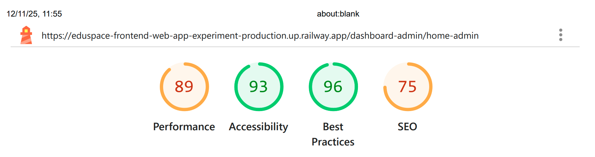

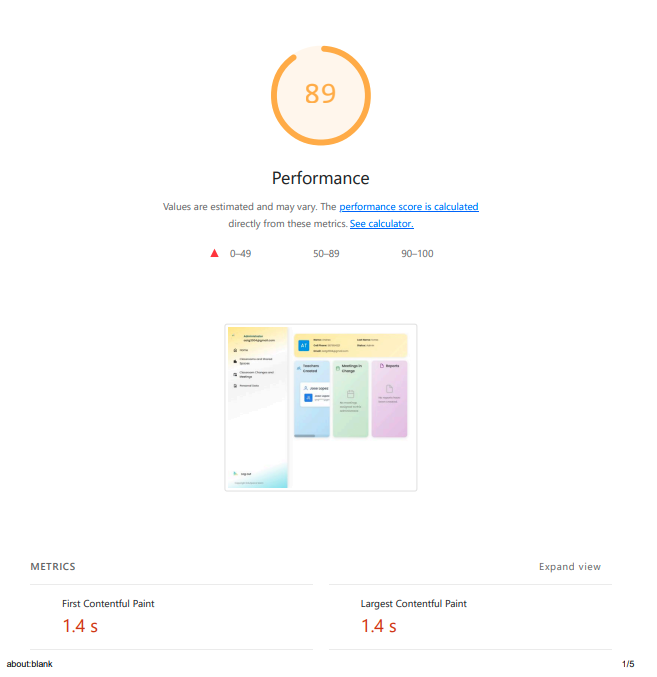

Performance (89): Es un puntaje 'naranja' (bueno). Indica que la página carga rápidamente (FCP y LCP de 1.4s), lo cual es crucial para la eficiencia percibida por el administrador.

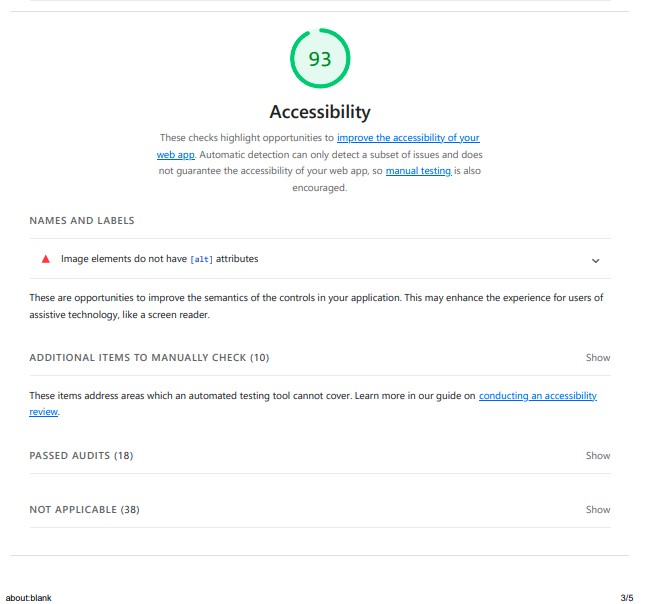

Accessibility (93): Puntaje excelente. La aplicación experimental cumple con los estándares de accesibilidad, asegurando que es usable por personas con diferentes capacidades.

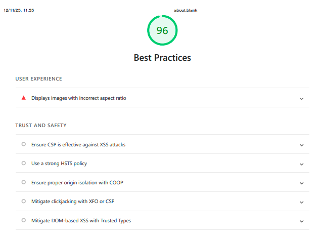

Best Practices (96): Puntaje excelente. La aplicación utiliza prácticas modernas de desarrollo web, es segura (p.ej., mitiga ataques XSS) y sigue los estándares recomendados.

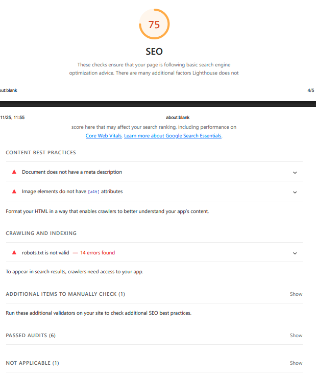

SEO (75): (Puntaje aceptable, pero menos relevante para un dashboard interno que requiere login).

**Análisis Lighthouse: Dashboard de Profesor (Experimental)**

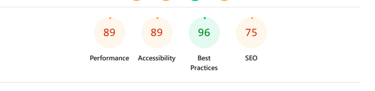

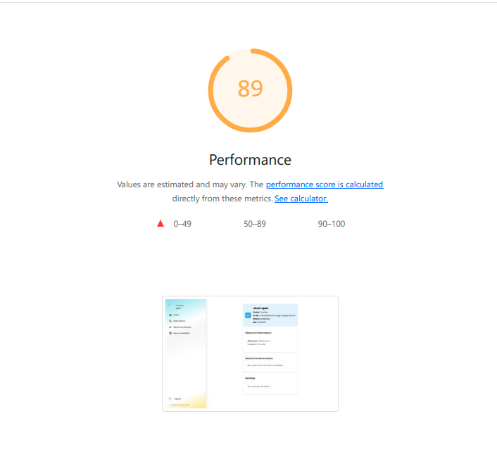

Performance (89): Puntaje bueno ('naranja'). La página carga rápido (FCP 1.3s, LCP 1.4s), asegurando que el profesor tenga acceso inmediato a su información.

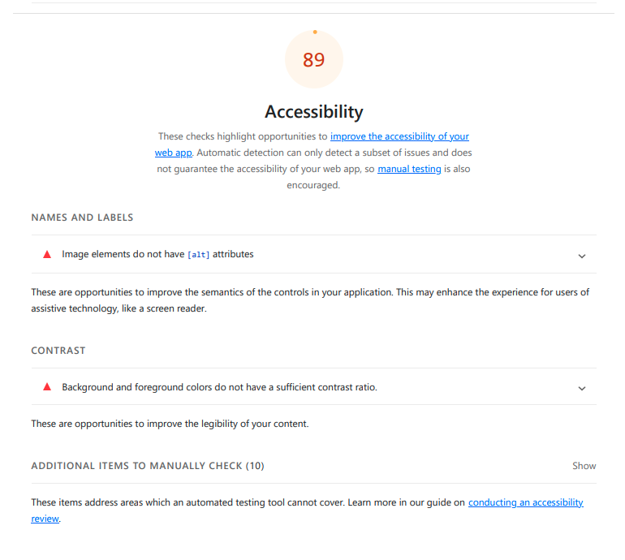

Accessibility (89): Puntaje bueno ('naranja'). El dashboard experimental del profesor cumple con los estándares de accesibilidad.

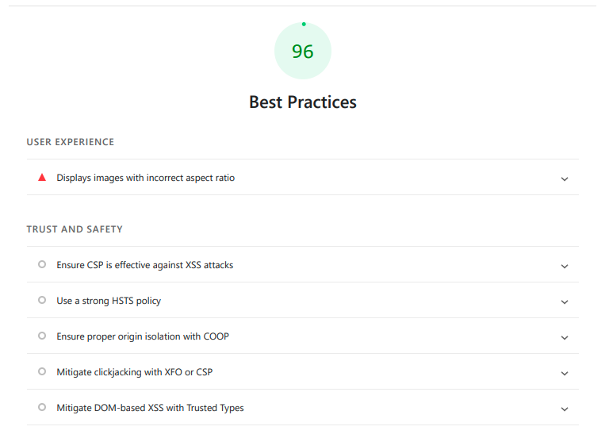

Best Practices (96): Puntaje excelente. La aplicación sigue las prácticas modernas de desarrollo web, es segura y no presenta vulnerabilidades obvias.

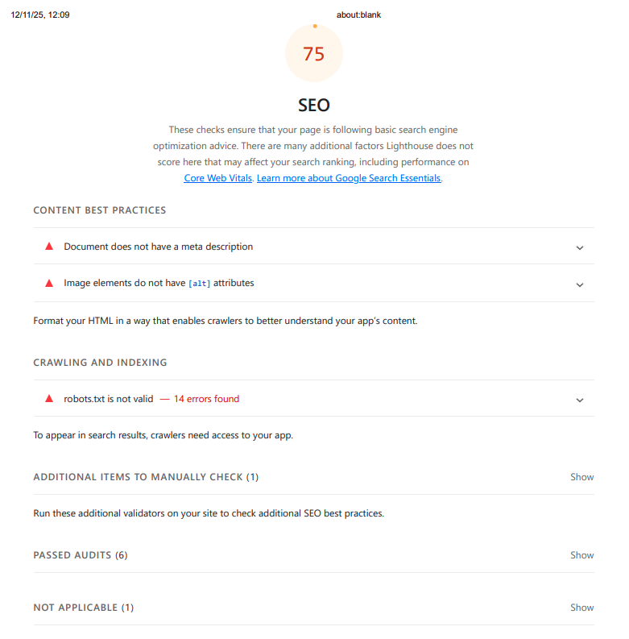

SEO (75): (Puntaje aceptable, pero menos relevante para un dashboard interno que requiere login).

### 8.2.8. Web and Mobile Tracking Plan

Para recolectar los datos cuantitativos de forma automática durante el experimento (definido en 8.2.6), se implementará un plan de seguimiento de eventos (Event Tracking) en la base de datos de staging (`eduspacedb_sandbox`).

El objetivo es capturar las acciones clave del usuario (Administrador y Profesor) que validan las métricas de adopción y uso para las hipótesis H3, H4 y H5. Las hipótesis H1 y H2 se miden con Tests de Usabilidad controlados, pero se incluirá el rastreo de sus eventos para complementar el análisis.

---

#### Eventos a Rastrear (Tracking Events)

Se creará una tabla `experiment_events` en la base de datos de staging para registrar las siguientes acciones:

**1. Hipótesis 1 y 2: CRUD de Profesores**

**Evento: `teacher_updated`**

- **Disparador:** Cuando un administrador guarda exitosamente cambios en el modal de "Editar Profesor".
- **Datos a capturar:**
  - `event_name`: "teacher_updated"
  - `admin_id`: [ID del administrador]
  - `teacher_id`: [ID del profesor editado]
  - `timestamp`: Fecha y hora del evento

**Evento: `teacher_deleted`**

- **Disparador:** Cuando un administrador confirma la eliminación de un profesor.
- **Datos a capturar:**
  - `event_name`: "teacher_deleted"
  - `admin_id`: [ID del administrador]
  - `teacher_id`: [ID del profesor eliminado]
  - `timestamp`: Fecha y hora del evento

---

**2. Hipótesis 3: Adopción del Módulo de "Meetings" (Admin)**

**Evento: `meeting_created`**

- **Disparador:** Cuando un administrador crea exitosamente una nueva reunión desde el módulo `meeting-management`.
- **Datos a capturar:**
  - `event_name`: "meeting_created"
  - `admin_id`: [ID del administrador creador]
  - `meeting_id`: [ID de la reunión]
  - `timestamp`: Fecha y hora del evento

**Evento: `meeting_updated`**

- **Disparador:** Cuando un administrador guarda cambios en una reunión existente.
- **Datos a capturar:**
  - `event_name`: "meeting_updated"
  - `admin_id`: [ID del administrador editor]
  - `meeting_id`: [ID de la reunión]
  - `timestamp`: Fecha y hora del evento

**Evento: `meeting_deleted`**

- **Disparador:** Cuando un administrador elimina una reunión.
- **Datos a capturar:**
  - `event_name`: "meeting_deleted"
  - `admin_id`: [ID del administrador eliminador]
  - `meeting_id`: [ID de la reunión]
  - `timestamp`: Fecha y hora del evento

---

**3. Hipótesis 4 y 5: Uso de Dashboards**

**Evento: `dashboard_viewed`**

- **Disparador:** Cada vez que la página del dashboard principal se carga (tanto para administrador como para profesor).
- **Datos a capturar:**
  - `event_name`: "dashboard_viewed"
  - `user_id`: [ID del usuario]
  - `user_role`: ["admin" o "teacher"]
  - `timestamp`: Fecha y hora del evento

---

#### Estructura de la Tabla `experiment_events`

```sql
CREATE TABLE experiment_events (
    event_id INT AUTO_INCREMENT PRIMARY KEY,
    event_name VARCHAR(50) NOT NULL,
    user_id INT,
    admin_id INT,
    teacher_id INT,
    meeting_id INT,
    user_role VARCHAR(20),
    timestamp DATETIME DEFAULT CURRENT_TIMESTAMP,
    INDEX idx_event_name (event_name),
    INDEX idx_admin_id (admin_id),
    INDEX idx_timestamp (timestamp)
);
```

---

#### Herramienta de Análisis

Los datos generados por estos eventos se almacenarán en la tabla `experiment_events` en la base de datos de staging. Se utilizarán consultas SQL (como se definió en 8.2.6) para generar los reportes semanales de adopción y frecuencia de uso:

**Ejemplo de Queries SQL:**

- **Tasa de Adopción Inicial (Semana 1):**

  ```sql
  SELECT COUNT(DISTINCT admin_id) AS admins_que_adoptaron
  FROM experiment_events
  WHERE event_name = 'meeting_created'
    AND timestamp BETWEEN '2025-01-01' AND '2025-01-07';
  ```

- **Frecuencia de Uso (Reuniones por Admin por Semana):**

  ```sql
  SELECT admin_id, COUNT(*) AS reuniones_creadas
  FROM experiment_events
  WHERE event_name = 'meeting_created'
    AND timestamp BETWEEN '2025-01-01' AND '2025-01-07'
  GROUP BY admin_id;
  ```

- **Conteo de Eventos de Edición/Eliminación de Profesores:**

  ```sql
  SELECT event_name, COUNT(*) AS total_eventos
  FROM experiment_events
  WHERE event_name IN ('teacher_updated', 'teacher_deleted')
    AND timestamp BETWEEN '2025-01-01' AND '2025-01-31'
  GROUP BY event_name;
  ```

- **Vistas de Dashboard por Rol:**
  ```sql
  SELECT user_role, COUNT(*) AS total_vistas
  FROM experiment_events
  WHERE event_name = 'dashboard_viewed'
    AND timestamp BETWEEN '2025-01-01' AND '2025-01-31'
  GROUP BY user_role;
  ```

Estos datos cuantitativos se complementarán con los datos cualitativos obtenidos de las encuestas (Google Forms) para generar un análisis completo de los resultados del experimento.

## 8.3. Experimentation

### 8.3.1. To-Be User Stories

| Story ID   | Título                                             | Descripción (User Story)                                                                                                                                                               | Criterios de Aceptación (Gherkin)                                                                                                                                                                                                                                                                                                                                                                                                                                                                                                                                                                                                                                                                                                                                                                                                                                                    |
| ---------- | -------------------------------------------------- | -------------------------------------------------------------------------------------------------------------------------------------------------------------------------------------- | ------------------------------------------------------------------------------------------------------------------------------------------------------------------------------------------------------------------------------------------------------------------------------------------------------------------------------------------------------------------------------------------------------------------------------------------------------------------------------------------------------------------------------------------------------------------------------------------------------------------------------------------------------------------------------------------------------------------------------------------------------------------------------------------------------------------------------------------------------------------------------------ |
| **TBU-01** | Permitir edición de datos de profesor              | Como **Administrador**, quiero **editar** la información de un profesor existente (DNI, email, foto, etc.) **para** corregir errores de registro sin tener que contactar a soporte.    | **Escenario 1: Edición exitosa de un profesor**<br>**Dado** que el administrador está en la página de "Gestión de Personal" y ve la lista de profesores.<br>**Cuando** hace clic en el ícono "Editar" del "Profesor A".<br>**Y** se abre un modal con la información actual del "Profesor A".<br>**Y** cambia el campo DNI de "123" a "456" y hace clic en "Guardar".<br>**Entonces** el sistema valida los datos, guarda el cambio, cierra el modal, y la lista de profesores muestra al "Profesor A" con el DNI "456".<br><br>**Escenario 2: Intento de guardar datos inválidos**<br>**Dado** que el administrador está en el modal de "Editar Profesor".<br>**Cuando** borra el campo DNI (dejándolo vacío) y hace clic en "Guardar".<br>**Entonces** el sistema muestra un mensaje de error ("El DNI es un campo obligatorio") y el modal no se cierra.                          |
| **TBU-02** | Permitir eliminación de profesor                   | Como **Administrador**, quiero **eliminar** el perfil de un profesor inactivo (retirado/despedido) **para** mantener la base de datos limpia y la información de personal actualizada. | **Escenario 1: Eliminación exitosa de un profesor**<br>**Dado** que el administrador está en la página de "Gestión de Personal" y ve al "Profesor Y" (inactivo).<br>**Cuando** hace clic en el ícono "Eliminar" del "Profesor Y".<br>**Y** se abre un modal de confirmación ("¿Estás seguro de eliminar a este profesor? Esta acción no se puede deshacer").<br>**Y** hace clic en "Confirmar".<br>**Entonces** el sistema elimina al "Profesor Y" de la base de datos, y el "Profesor Y" ya no aparece en la lista de profesores.<br><br>**Escenario 2: Cancelación de eliminación**<br>**Dado** que el administrador está en el modal de confirmación para eliminar al "Profesor Y".<br>**Cuando** hace clic en "Cancelar".<br>**Entonces** el modal se cierra y el "Profesor Y" NO es eliminado de la lista.                                                                      |
| **TBU-03** | Permitir al admin crear reuniones                  | Como **Administrador**, quiero **crear nuevas reuniones** con título, fecha, hora, lugar y participantes **para** coordinar encuentros con profesores dentro de la plataforma.         | **Escenario 1: Creación exitosa de una reunión**<br>**Dado** que el administrador está en el módulo "Meeting Management".<br>**Cuando** hace clic en "Nueva Reunión".<br>**Y** se abre un modal con el formulario de creación.<br>**Y** ingresa: título="Reunión de planificación", fecha="2025-01-15", hora="14:00", lugar="Sala A", y selecciona 3 profesores como invitados.<br>**Y** hace clic en "Guardar".<br>**Entonces** el sistema crea la reunión, la muestra en la lista de reuniones, y envía notificaciones a los 3 profesores invitados.<br><br>**Escenario 2: Intento de crear reunión sin campos obligatorios**<br>**Dado** que el administrador está en el modal de "Nueva Reunión".<br>**Cuando** deja el campo "Título" vacío y hace clic en "Guardar".<br>**Entonces** el sistema muestra un mensaje de error ("El título es obligatorio") y no crea la reunión. |
| **TBU-04** | Permitir al admin editar reuniones                 | Como **Administrador**, quiero **editar reuniones existentes** **para** corregir errores de información o cambiar detalles de la reunión.                                              | **Escenario 1: Edición exitosa de una reunión**<br>**Dado** que el administrador está en el módulo "Meeting Management" y ve la lista de reuniones.<br>**Cuando** hace clic en el ícono "Editar" de la "Reunión de planificación".<br>**Y** se abre un modal con la información actual de la reunión.<br>**Y** cambia el lugar de "Sala A" a "Sala B" y hace clic en "Guardar".<br>**Entonces** el sistema actualiza la reunión, y la lista de reuniones muestra el lugar "Sala B" para esa reunión.<br><br>**Escenario 2: Cancelación de edición**<br>**Dado** que el administrador está en el modal de "Editar Reunión".<br>**Cuando** hace cambios pero hace clic en "Cancelar".<br>**Entonces** el modal se cierra y los cambios NO se guardan.                                                                                                                                  |
| **TBU-05** | Permitir al admin eliminar reuniones               | Como **Administrador**, quiero **eliminar reuniones canceladas** **para** mantener el calendario de reuniones actualizado.                                                             | **Escenario 1: Eliminación exitosa de una reunión**<br>**Dado** que el administrador está en el módulo "Meeting Management" y ve una reunión cancelada.<br>**Cuando** hace clic en el ícono "Eliminar" de la reunión.<br>**Y** se abre un modal de confirmación ("¿Estás seguro de eliminar esta reunión?").<br>**Y** hace clic en "Confirmar".<br>**Entonces** el sistema elimina la reunión de la base de datos, y la reunión ya no aparece en la lista.<br><br>**Escenario 2: Cancelación de eliminación**<br>**Dado** que el administrador está en el modal de confirmación para eliminar una reunión.<br>**Cuando** hace clic en "Cancelar".<br>**Entonces** el modal se cierra y la reunión NO es eliminada.                                                                                                                                                                   |
| **TBU-06** | Visualizar resumen de reuniones en dashboard admin | Como **Administrador**, quiero **ver un resumen de mis reuniones del día en el dashboard principal** **para** mantener visibilidad de mis compromisos sin salir de la aplicación.      | **Escenario 1: Dashboard muestra reuniones del día**<br>**Dado** que el administrador tiene 3 reuniones programadas para hoy.<br>**Cuando** accede al dashboard principal.<br>**Entonces** el sistema muestra un componente "Resumen de Reuniones" con las 3 reuniones del día, incluyendo: título, hora, lugar, y cantidad de invitados.<br><br>**Escenario 2: Dashboard sin reuniones programadas**<br>**Dado** que el administrador NO tiene reuniones programadas para hoy.<br>**Cuando** accede al dashboard principal.<br>**Entonces** el sistema muestra el componente "Resumen de Reuniones" con el mensaje "No tienes reuniones programadas para hoy".                                                                                                                                                                                                                      |
| **TBU-07** | Visualizar "Mis Reuniones" en dashboard profesor   | Como **Profesor**, quiero **ver mis próximas reuniones en mi dashboard** **para** recordar mis compromisos y prepararme adecuadamente.                                                 | **Escenario 1: Dashboard muestra próximas reuniones**<br>**Dado** que el profesor ha sido invitado a 2 reuniones esta semana.<br>**Cuando** accede a su dashboard principal.<br>**Entonces** el sistema muestra una sección "Mis Reuniones" con las 2 reuniones próximas, incluyendo: título, fecha, hora, lugar, y organizador.<br><br>**Escenario 2: Dashboard sin reuniones próximas**<br>**Dado** que el profesor NO tiene reuniones programadas en los próximos 7 días.<br>**Cuando** accede a su dashboard principal.<br>**Entonces** el sistema muestra la sección "Mis Reuniones" con el mensaje "No tienes reuniones programadas próximamente".                                                                                                                                                                                                                             |
| **TBU-08** | Editar perfil de administrador                     | Como **Administrador**, quiero **editar mi propio perfil** (nombre, teléfono, contraseña) **para** mantener mi información de contacto y seguridad actualizada.                        | **Escenario 1: Actualización de perfil**<br>**Dado** que el administrador está en su perfil.<br>**Cuando** edita su teléfono y guarda.<br>**Entonces** el sistema actualiza la información exitosamente.                                                                                                                                                                                                                                                                                                                                                                                                                                                                                                                                                                                                                                                                             |
| **TBU-09** | Eliminar cuenta de administrador                   | Como **Administrador**, quiero **eliminar mi propia cuenta** **para** darme de baja del servicio si ya no requiero utilizar la plataforma.                                             | **Escenario 1: Eliminación de cuenta propia**<br>**Dado** que el administrador desea darse de baja.<br>**Cuando** solicita eliminar su cuenta y confirma la acción crítica.<br>**Entonces** su sesión se cierra y sus datos son eliminados o anonimizados.                                                                                                                                                                                                                                                                                                                                                                                                                                                                                                                                                                                                                           |

### 8.3.2. To-Be Product Backlog

| # Orden | User Story ID | Título                                             | Story Points (1/2/3/5/8) |
| ------- | ------------- | -------------------------------------------------- | ------------------------ |
| 1       | **TBU-01**    | Permitir edición de datos de profesor              | **3**                    |
| 2       | **TBU-02**    | Permitir eliminación de profesor                   | **2**                    |
| 3       | **TBU-08**    | Editar perfil de administrador                     | **3**                    |
| 4       | **TBU-09**    | Eliminar cuenta de administrador                   | **2**                    |
| 5       | **TBU-03**    | Permitir al admin crear reuniones                  | **5**                    |
| 6       | **TBU-04**    | Permitir al admin editar reuniones                 | **3**                    |
| 7       | **TBU-05**    | Permitir al admin eliminar reuniones               | **2**                    |
| 8       | **TBU-06**    | Visualizar resumen de reuniones en dashboard admin | **3**                    |
| 9       | **TBU-07**    | Visualizar "Mis Reuniones" en dashboard profesor   | **3**                    |
|         |               | **TOTAL**                                          | **26 Story Points**      |

### 8.3.3. Pipeline-supported, Experiment-Driven To-Be Software Platform Lifecycle

#### 8.3.3.1. To-Be Sprint Backlogs

| User Story ID | Task ID | Título de Tarea                              | Descripción                                                                          | Estimación (Horas) | Asignado a        | Estado |
| ------------- | ------- | -------------------------------------------- | ------------------------------------------------------------------------------------ | ------------------ | ----------------- | ------ |
| TBU-01        | T-01    | Backend: Endpoint PUT Teacher                | Implementar endpoint PUT /api/v1/teachers/{id} para actualizar datos.                | 3h                 | Andrés Torres     | Done   |
| TBU-01        | T-02    | Frontend: Modal de Edición Docente           | Crear modal en Vue con formulario reactivo para editar datos del docente.            | 4h                 | Marllely Arias    | Done   |
| TBU-02        | T-03    | Backend: Endpoint DELETE Teacher             | Implementar endpoint DELETE /api/v1/teachers/{id}.                                   | 2h                 | Andrés Torres     | Done   |
| TBU-02        | T-04    | Frontend: Confirmación de Eliminación        | Implementar lógica de eliminación y modal de confirmación en la lista de docentes.   | 2h                 | Marllely Arias    | Done   |
| TBU-08        | T-05    | Backend: Endpoint PUT Admin Profile          | Implementar PUT /api/v1/admins/profile para actualización de datos propios.          | 3h                 | Alejandro Mendoza | Done   |
| TBU-08        | T-06    | Frontend: Vista Perfil Admin                 | Crear vista de "Mi Perfil" con formulario de edición para el administrador.          | 4h                 | Luciana Sanchez   | Done   |
| TBU-09        | T-07    | Backend: Endpoint DELETE Admin               | Implementar lógica segura para eliminación de cuenta propia DELETE /api/v1/admins.   | 2h                 | Alejandro Mendoza | Done   |
| TBU-09        | T-08    | Frontend: Flujo de baja de cuenta            | Implementar botón de "Eliminar Cuenta" con doble confirmación en el perfil.          | 2h                 | Luciana Sanchez   | Done   |
| TBU-03        | T-09    | Backend: Endpoint POST Meetings              | Crear endpoint para agendar reuniones, validando fechas y participantes.             | 5h                 | Piero Velarde     | Done   |
| TBU-03        | T-10    | Frontend: Formulario Crear Reunión           | Diseñar formulario complejo con selector múltiple de profesores invitados.           | 6h                 | Marllely Arias    | Done   |
| TBU-04        | T-11    | Backend: Endpoint PUT Meetings               | Implementar actualización de reuniones (fecha, hora, lugar).                         | 3h                 | Piero Velarde     | Done   |
| TBU-04        | T-12    | Frontend: Lógica de Edición Reunión          | Adaptar formulario de reunión para modo edición cargando datos existentes.           | 3h                 | Marllely Arias    | Done   |
| TBU-05        | T-13    | Backend: Endpoint DELETE Meetings            | Implementar borrado lógico o físico de reuniones.                                    | 2h                 | Piero Velarde     | Done   |
| TBU-06        | T-14    | Frontend: Componente Resumen Dashboard Admin | Crear widget para el dashboard que consuma GET /meetings?date=today.                 | 4h                 | Luciana Sanchez   | Done   |
| TBU-07        | T-15    | Backend: Endpoint GET MyMeetings             | Crear endpoint optimizado para listar reuniones de un profesor específico.           | 3h                 | Alejandro Mendoza | Done   |
| TBU-07        | T-16    | Frontend: Componente Mis Reuniones Teacher   | Crear sección "Mis Reuniones" en el home del profesor mostrando tarjetas de eventos. | 4h                 | Luciana Sanchez   | Done   |
| General       | T-17    | Integración y Pruebas                        | Verificar flujo completo de creación de reuniones y visualización en dashboards.     | 5h                 | Todo el Equipo    | Done   |
| General       | T-18    | Despliegue a Ambiente Experimental           | Configurar y desplegar la rama feature/experiment en Railway para pruebas.           | 3h                 | Andrés Torres     | Done   |

#### 8.3.3.2. Implemented To-Be Landing Page Evidence

#### 8.3.3.3. Implemented To-Be Frontend-Web Application Evidence

##### Editar Profesor

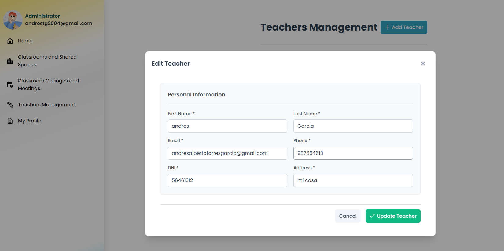

##### Módulo de Reuniones

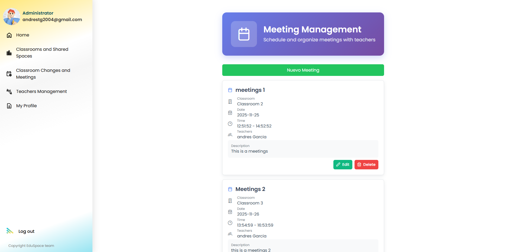

##### Crear Reunión

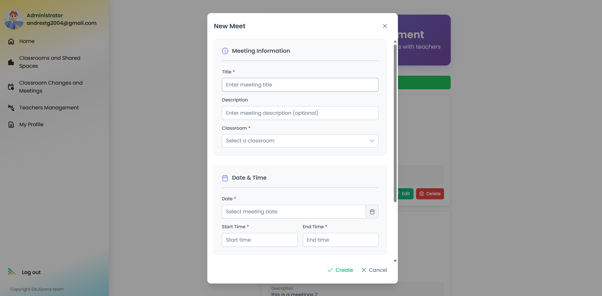

##### Perfil Admin

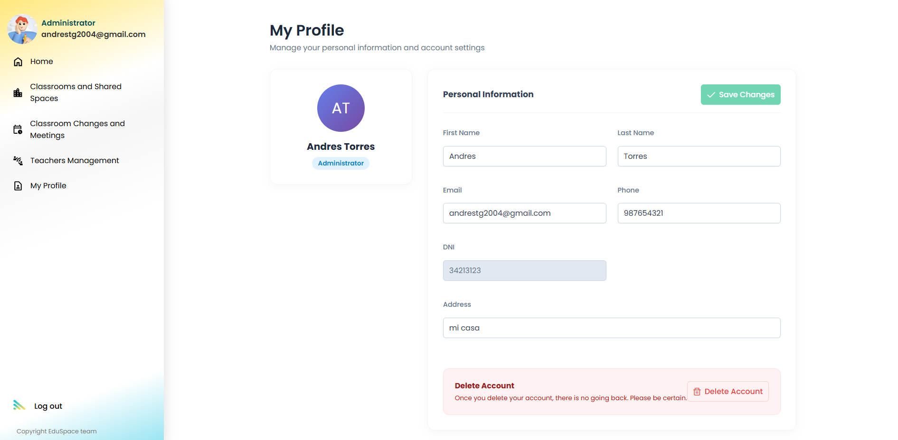

##### Dashboard Admin

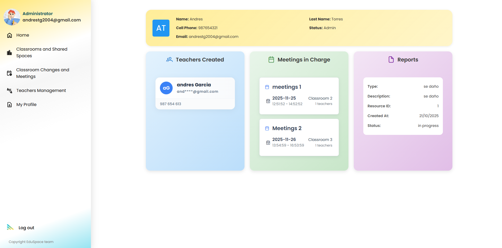

##### Dashboard Profesor

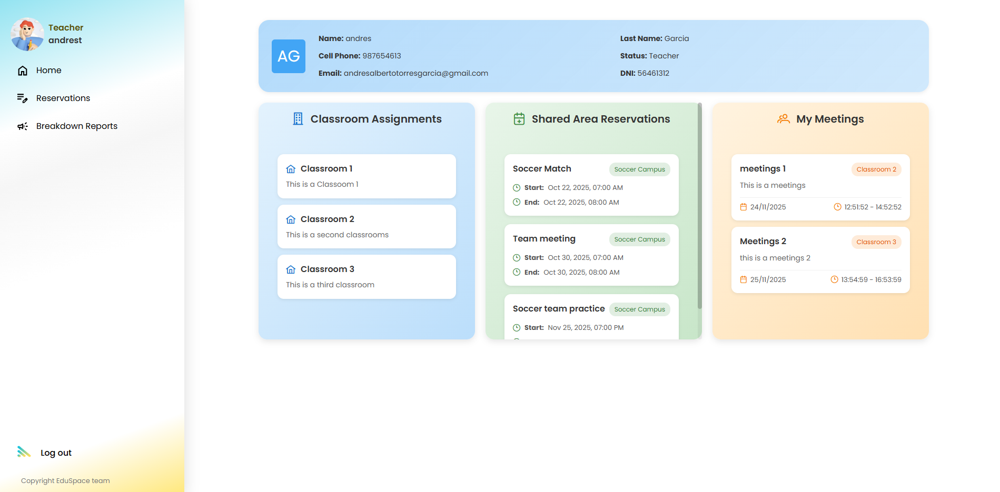

#### 8.3.3.4. Implemented To-Be Native-Mobile Application Evidence

#### 8.3.3.5. Implemented To-Be RESTful API and/or Serverless Backend Evidence

#### Teachers API

[](../assets/chapter8/implement-backend/teachers-profiles.png)

#### Meetings API

[](../assets/chapter8/implement-backend/meetings.png)

#### Administrator Profiles API

[](../assets/chapter8/implement-backend/admin-profile.png)

#### 8.3.3.6. Team Collaboration Insights

### 8.3.4. To-Be Validation Interviews

#### 8.3.4.1. Diseño de Entrevistas.

**Segmento 1: Profesores**

Objetivo: Validar impacto real del dashboard “Mis Reuniones”, olvidos, puntualidad y adopción del módulo nativo.

### A. Validación de Visibilidad – Dashboard “Mis Reuniones”

1. ¿Con qué frecuencia le avisan de reuniones por WhatsApp o correo personal?

2. ¿Alguna vez ha olvidado una reunión por no tener un lugar único donde revisarlas?

3. ¿Con qué frecuencia revisa EduSpace durante su día laboral?

4. ¿Le sería útil tener sus próximas reuniones en el dashboard de la app?

5. ¿Qué información debería mostrarse para ayudarle a preparar sus clases o compromisos?

### B. Olvidos y Conflictos Operativos

6. En el último mes, ¿ha olvidado alguna reunión o ha llegado tarde?

7. ¿Por qué cree que ocurrió? (falta de visibilidad, demasiadas apps, distracciones)

8. ¿Cree que un recordatorio dentro de EduSpace reduciría olvidos o retrasos?  

9. ¿Qué tan probable es que revise un dashboard si ahí aparece todo lo importante?

### C. Uso Actual de Herramientas Externas

10. ¿Qué herramienta usa más para enterarse de reuniones?  

11. ¿Le resulta cómodo depender de WhatsApp, correos y calendarios a la vez? 

12. ¿Preferiría que todo estuviera centralizado dentro de EduSpace?

### D. Adopción Potencial del Módulo de Reuniones

13. Si EduSpace mostrara todas sus reuniones con claridad, ¿lo usaría diariamente?  

14. ¿Qué características harían que definitivamente adopte el módulo nativo?  

15. ¿Qué haría que prefiera seguir usando WhatsApp o correo?

## E. Diseño, accesibilidad y fricción operativa

16. ¿Preferiría que las reuniones se muestren como lista o como tarjetas?

17. ¿Qué tan útil sería ver un color distinto para reuniones urgentes?

18. ¿Le gustaría tener una barra de búsqueda para encontrar reuniones antiguas?

19. ¿Cuánta información debe estar visible sin abrir la reunión?

20. ¿Le gustaría tener etiquetas como “Importante”, “Reunión urgente”, “Coordinación”?

21. ¿Necesita que las reuniones aparezcan ordenadas por hora automáticamente?

**Segmento 2: Administradores**

Objetivo: Validar las hipótesis experimentales sobre CRUD de profesores, módulo de reuniones y dashboards.

### A. Validación del CRUD Completo – “Editar Profesor”

1. ¿Con qué frecuencia comete errores al registrar a un profesor?

2. ¿Qué tipo de errores son más comunes? (DNI, correo, nombre, foto, teléfono)

3. ¿Qué hace actualmente cuando se equivoca en un dato?

4. ¿Cuánto tiempo le toma resolver ese error con el proceso actual?

5. ¿Cómo afectaría su trabajo poder editar un profesor directamente sin contactar soporte?

6. Si pudiera corregir un error en menos de 1 minuto, ¿lo usaría siempre? ¿Por qué?

### B. Validación del CRUD Completo – “Eliminar Profesor”

7. ¿Cuántos profesores suelen darse de baja en un semestre o año?

8. ¿Qué problemas le genera ver profesores inactivos dentro del sistema?

9. ¿Cómo afecta esto su confianza en los datos de EduSpace?

10. ¿Le daría más seguridad poder eliminar usted mismo a un profesor inactivo?

11. ¿Qué tan importante es evitar que ex-empleados mantengan cuentas activas?

### C. Validación del Módulo Nativo de Reuniones

12. ¿Cuántas reuniones coordina normalmente por semana o mes?

13. ¿Qué herramientas utiliza actualmente para organizarlas?

14. ¿Qué problemas enfrenta usando WhatsApp, Google Calendar o Excel?

15. Si pudiera crear reuniones directamente en EduSpace, ¿lo usaría? ¿Por qué?

16. ¿Qué necesitaría que tenga el módulo para dejar de usar WhatsApp?

17. ¿Qué función considera crítica dentro de un módulo de reuniones?

18. ¿Qué escenarios lo harían seguir usando sus herramientas externas?

### D. Validación del Dashboard del Administrador (Resumen de Reuniones)

19. Cuando desea saber cuántas reuniones tiene en el día, ¿dónde lo revisa?

20. ¿Le toma tiempo encontrar esta información entre aplicaciones externas?

21. ¿Le sería útil ver un resumen de reuniones del día en su dashboard de EduSpace?

22. ¿Qué información debería mostrarse para ser realmente útil?

23. ¿Cree que esto le ayudaría a tomar decisiones más rápido o evitar olvidos?

### E. Validación de Gaps y Contexto Real

24. ¿Con qué frecuencia necesita actualizar datos de un profesor ya registrado?

25. ¿Cuánto tiempo pierde esperando que soporte corrija errores de registro?

26. ¿Qué tanto afecta su operación tener datos incorrectos o desactualizados?

27. ¿Qué tan dispuesto estaría a dejar WhatsApp y usar EduSpace como canal principal?

28. ¿Qué tan grave considera la falta de historial y centralización de reuniones?

#### 8.3.4.2. Registro de Entrevistas.

### Segmento: Profesores

| **Nombre y Apellido** | **Edad** | **Distrito** | **Screenshot**                                                            | **URL del video (Microsoft Stream)**                             | **Timing** | **Duración** |
| --------------------- | -------- | ------------ | ------------------------------------------------------------------------- | ---------------------------------------------------------------- | ---------- | ------------ |
| Josep Melgarejo       | 27       | San Miguel   | 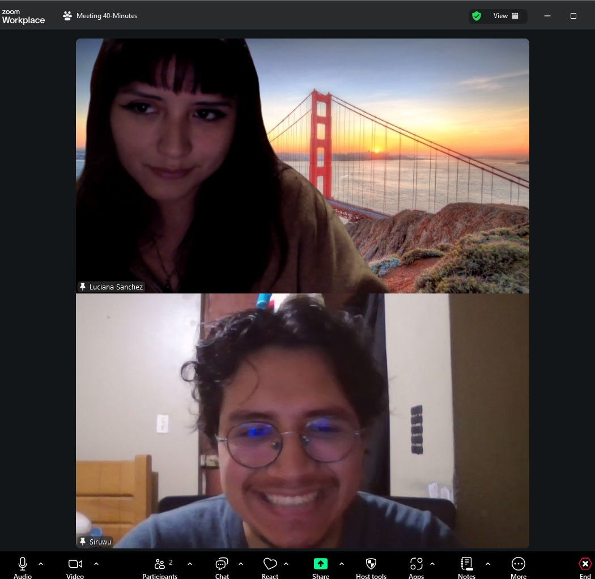     | [Ver entrevista](https://youtu.be/bn_aKf9ONlI)                   | 00:01:15   | 07:15        |
| Kiara Gallardo        | 25       | San Miguel   |    | [Ver entrevista]()                                               | 00:00:00   | 00:00        |
| Angela Olivera        | 24       | San Miguel   |      | [Ver entrevista](https://youtu.be/qicqN21uUM8)                   | 00:01:00   | 09:10        |

---

### Segmento: Administradores

| **Nombre y Apellido** | **Edad** | **Distrito** | **Screenshot**                                                            | **URL del video (Microsoft Stream)**                             | **Timing** | **Duración** |
| --------------------- | -------- | ------------ | ------------------------------------------------------------------------- | ---------------------------------------------------------------- | ---------- | ------------ |
| a       |       | al   |    | [Ver entrevista](https://)                   | 00:00:00   | 00:00        |
| a        |        | Sa   |    | [Ver entrevista](https:/) | 00:00:00   | 00:00        |
| a        |        | Sa   |    | [Ver entrevista](https://) | 00:00:00   | 00:00        |


## 8.4. Experiment Aftermath & Analysis

### 8.4.1. Analysis and Interpretation of Results

En el estudio, las preguntas fueron reformuladas y organizadas con el propósito de obtener respuestas precisas sobre la experiencia de los usuarios con las funcionalidades experimentales de EduSpace, específicamente el módulo nativo de reuniones y el dashboard “Mis Reuniones”.
Este enfoque permitió analizar la utilidad percibida, el nivel de adopción esperado y los problemas actuales que enfrentan profesores y administradores al gestionar reuniones mediante herramientas externas.

## Preguntas formuladas

Para evaluar la experiencia de los usuarios con el prototipo experimental, se aplicaron las siguientes diez preguntas:

1. ¿Le sería útil ver todas sus próximas reuniones directamente en el dashboard de EduSpace?

2. ¿Alguna vez ha olvidado o llegado tarde a una reunión por no tener un lugar centralizado donde revisarlas?

3. ¿Con qué frecuencia depende de herramientas externas como WhatsApp, Google Calendar o correo para enterarse de reuniones?

4. ¿Le resultaría más conveniente que toda la información de reuniones estuviera integrada dentro de EduSpace?

5. ¿Qué tan probable es que utilice un módulo nativo de reuniones si muestra claramente fecha, hora, lugar y asistentes?

6. ¿Cree que un recordatorio dentro de EduSpace reduciría olvidos o retrasos?

7. ¿Qué formato de visualización considera más útil para sus reuniones (lista, tarjetas o calendario)?

8. ¿Considera necesario que las reuniones se organicen automáticamente por fecha y hora?

9. ¿Le gustaría contar con etiquetas como “Urgente” o “Importante” para priorizar reuniones?

10. ¿Qué tan cómodo se sentiría usando EduSpace como su única herramienta para gestionar reuniones institucionales?

Las preguntas fueron aplicadas a una muestra de 25 participantes compuesta por profesores y administradores de instituciones educativas privadas de diversos distritos. A continuación, se explican los resultados obtenidos.

## Análisis de datos de la muestra

- **Utilidad del dashboard:** 

  Los resultados muestran que la mayoría de los participantes considera que incorporar las reuniones en el dashboard de EduSpace sería beneficioso. Entre las 25 respuestas, predominan las opciones “Útil” y “Muy útil”, lo cual indica una valoración positiva hacia la visibilidad centralizada de las reuniones. Por otro lado, un grupo menor manifestó posiciones neutras o de baja utilidad, lo que sugiere que, aunque esta funcionalidad es ampliamente percibida como valiosa, algunos usuarios aún no la consideran indispensable para su flujo de trabajo.

  <div style="text-align: center;"></div>

- **Análisis de Olvidos y Retrasos**
  
  El gráfico muestra que la mayoría de los participantes ha olvidado o llegado tarde a una reunión al menos alguna vez, principalmente por no contar con un espacio centralizado para consultarlas. Aunque un pequeño grupo indicó que nunca ha tenido este problema, la tendencia general evidencia que los olvidos son relativamente frecuentes, lo que refuerza la necesidad de una funcionalidad que unifique la información de reuniones dentro de EduSpace.

  <div style="text-align: center;">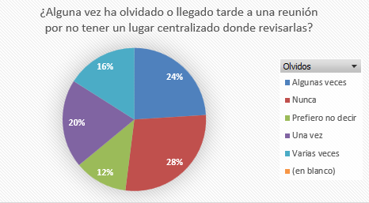</div>

- **Dependencia de herramientas externas**

  El gráfico evidencia que la mayoría de los participantes depende frecuentemente de herramientas externas como WhatsApp, Google Calendar o correo para enterarse de reuniones, destacando las categorías “Casi siempre” y “A veces”. Esto indica que la comunicación institucional está fragmentada y distribuida en múltiples canales, lo que refuerza la necesidad de centralizar esta información dentro de EduSpace.

  <div style="text-align: center;">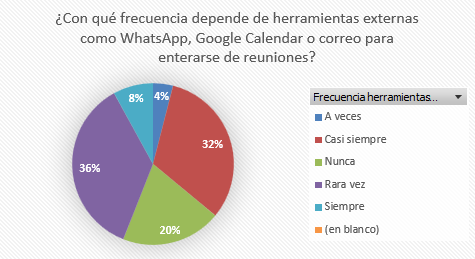</div>

- **Conveniencia de centralizar la información**

  La mayoría de los participantes considera totalmente conveniente que la información de reuniones esté integrada dentro de EduSpace, consolidándose esta opción como la más frecuente. Aunque algunos usuarios indicaron respuestas como “En parte” o “Neutral”, estas representan una proporción menor. El resultado refuerza que la centralización es vista como una mejora clara y necesaria para reducir la dispersión de información entre múltiples aplicaciones externas.

  <div style="text-align: center;">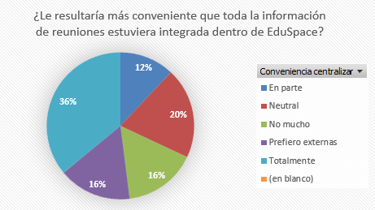</div>

- **Probabilidad de uso del módulo nativo**

  Los resultados indican que la mayoría de los usuarios estaría dispuesta a usar un módulo nativo de reuniones siempre que muestre claramente la información clave (fecha, hora, lugar y asistentes). Las opciones “Muy probable” y “Probable” concentran la mayor parte de las respuestas, mientras que las categorías de baja probabilidad representan una proporción menor. Esto sugiere una alta intención de adopción del módulo propuesto.

  <div style="text-align: center;">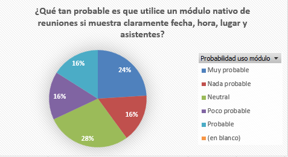</div>

- **Utilidad de los recordatorios dentro de EduSpace**

  La mayoría de los participantes considera que un recordatorio integrado en EduSpace sería poco o nada útil, concentrando estas dos opciones la mayor parte de las respuestas. Aunque algunos usuarios indicaron que podría ayudarles un poco o de forma neutral, estos representan una proporción menor. En conjunto, los resultados sugieren que los recordatorios, por sí solos, no son percibidos como una solución significativa para reducir olvidos o retrasos.

  <div style="text-align: center;">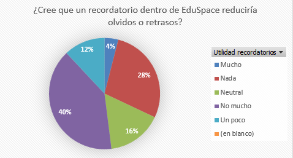</div>

- **Formato preferido para visualizar reuniones**

  El gráfico muestra que la opción “Lista” es claramente la preferida por la mayoría de los participantes, representando casi la mitad de las respuestas. Otras opciones como “Calendario” y “Cualquiera” aparecen en proporciones similares pero menores, mientras que formatos como “Tarjetas” o “Ninguno” tienen una presencia más reducida. En general, los resultados señalan que los usuarios prefieren una vista simple y directa para revisar sus reuniones.

  <div style="text-align: center;">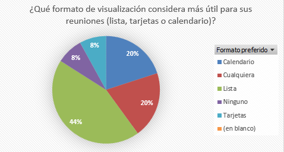</div>

- **Necesidad de ordenar reuniones automáticamente**

  Los resultados muestran una distribución equilibrada, aunque con una ligera inclinación hacia considerar esta función como necesaria o útil, representando una parte importante de las respuestas. Las opciones “Neutral” y “Poco necesario” también tienen presencia relevante, lo que indica que, si bien muchos usuarios valoran el orden automático, otros no lo consideran indispensable. En general, la funcionalidad es vista como beneficiosa, pero no crítica para todos los participantes.

  <div style="text-align: center;">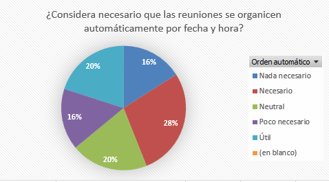</div>

- **Uso de etiquetas para priorizar reuniones**

  El gráfico revela opiniones divididas sobre la utilidad de incorporar etiquetas como “Urgente” o “Importante”. Aunque una parte significativa de los participantes seleccionó “Neutral” o “No mucho”, también existe un grupo relevante que considera esta funcionalidad útil o incluso definitivamente necesaria. En conjunto, los resultados sugieren que las etiquetas son percibidas como un complemento útil, aunque no prioritario para todos los usuarios.

  <div style="text-align: center;">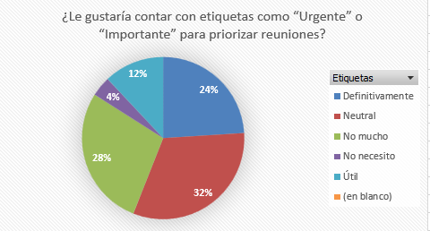</div>

- **Comodidad al usar EduSpace como única herramienta**

  El gráfico muestra una distribución equilibrada respecto a la comodidad de usar EduSpace como la única herramienta para gestionar reuniones. Aunque un porcentaje importante señala sentirse cómodo o muy cómodo, también existe una proporción similar que manifiesta incomodidad o una postura neutral. Esto sugiere que, si bien la plataforma tiene potencial para centralizar la gestión, aún requiere mejoras para generar mayor confianza y comodidad en todos los usuarios.

  <div style="text-align: center;">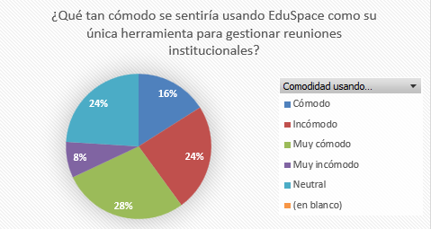</div>

**Recomendaciones de los Usuarios**

Entre los aspectos que los usuarios consideran más relevantes para mejorar la experiencia con EduSpace, destacan:

- La centralización de la información de reuniones dentro de la plataforma.

- La preferencia por vistas simples como la lista, que facilitan la revisión rápida de reuniones.

- La necesidad de orden automático por fecha y hora para agilizar la organización.

- El interés moderado en funcionalidades complementarias como etiquetas o recordatorios.


  <div style="text-align: center;">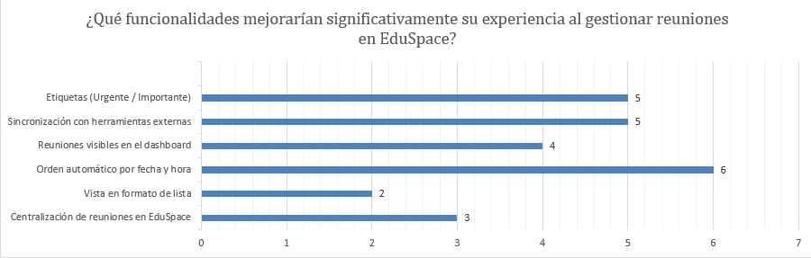</div>

**Conclusión**

Los resultados muestran una clara preferencia por centralizar las reuniones dentro de EduSpace, evitando la dependencia de WhatsApp, correo y otras herramientas externas. Los usuarios consideran útil visualizar sus reuniones en el dashboard, y la mayoría adoptaría un módulo nativo siempre que ofrezca información clara y organizada.

También se observa una fuerte inclinación hacia la vista en formato de lista y el orden automático por fecha y hora, lo que confirma que los usuarios priorizan la simplicidad y la rapidez al revisar sus reuniones. Funcionalidades como etiquetas o recordatorios generan interés moderado, pero no son decisivas.

### 8.4.2. Re-scored and Re-prioritized Question Backlog

## 8.5. Continuous Learning

### 8.5.1. Shareback Session Artifacts: Learning Workflow

<!-- Luciana -->

## 8.6. To-Be Software Platform Pre-launch

### 8.6.1. About-the-Product Intro Video
